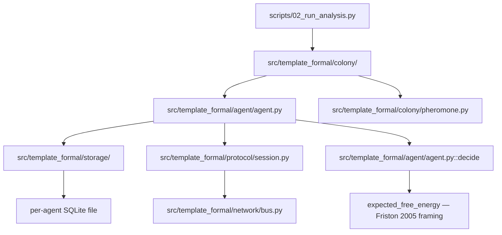
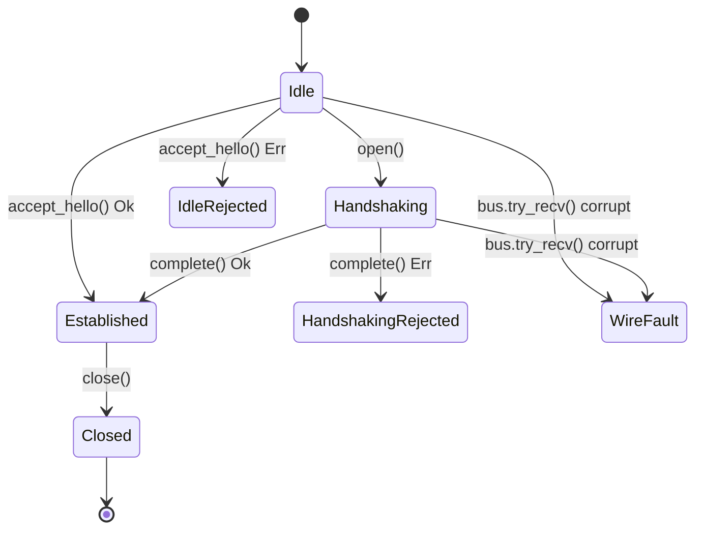

# Type Architecture {#sec:type-architecture}

## Module layout

The typed surface described in this section is not spread arbitrarily
across the codebase — each layer below owns exactly one of the concerns
this paper argues for (ADTs, nominal identifiers, session types, affine
handles), and each layer is exercised by the colony coordination loop at
the bottom, never bypassed:

## Algebraic data types: `Result[T, E]`

`src/template_formal/types/result.py` defines `Result[T, E]` as a tagged
union of two frozen dataclasses, `Ok[T]` and `Err[E]`, each carrying a
`Literal["ok"]`/`Literal["err"]` tag field. This is the closest structural
analogue Python offers to the sum types of ML-family languages
(@milner1978theory) and to the Curry–Howard "propositions as types"
reading of a disjoint union as a proof of "either $A$ or $B$"
(@wadler2015propositions): a function returning `Result[T, E]` documents,
in its signature, that failure is an ordinary, structurally-typed value —
never an uncaught exception for an *expected* failure mode. `match`/`case`
narrowing on the `tag` field, combined with `typing.assert_never` in the
default arm, makes an exhaustiveness bug — a `match` that handles `Ok` and
forgets `Err` — a real `mypy --strict` type error, not a runtime surprise.

## Nominal identifiers: `AgentId`, `MessageId`, `TxnId`

`src/template_formal/types/ids.py` wraps `uuid.UUID` three times via
`typing.NewType`: `AgentId`, `MessageId`, `TxnId`. All three are, at
runtime, plain `UUID` values — indistinguishable from one another and from
a bare `UUID`. The distinction exists **only** at the type-checker level:
`mypy --strict` rejects passing an `AgentId` where a `MessageId` is
expected, even though nothing about the underlying bytes differs. This is
Pierce's (@pierce2002types) textbook case for nominal typing over
structural typing where the underlying representation is shared but the
domain meaning is not.

## Session-typed protocol state machine

`src/template_formal/protocol/session.py` implements a session-typed
handshake protocol in the tradition of [@honda1998language]: four distinct
classes — `IdleSession`, `HandshakingSession`, `EstablishedSession`,
`ClosedSession` — each parameterizing `SessionEndpoint[PhaseT]` with
exactly one phase marker from `types/phase.py`. Each phase-transition
method returns the *next* phase's concrete class (e.g. `IdleSession.open()
-> HandshakingSession`), never a union that also includes an illegal
successor. Data-transfer methods (`send`/`receive`) exist **only** on
`EstablishedSession` — they are not defined at all on `IdleSession` or
`HandshakingSession` — so calling them on the wrong phase is an outright
attribute-resolution type error under `mypy --strict`, not a caught
exception at runtime.

The diagram below is the real phase state machine, not a simplification of
it: every solid edge is a phase-transition method that exists in
`src/template_formal/protocol/session.py`, and every dashed edge is one of
the two fault-injected error paths ISC-23/24 test through the in-process
bus (`network/bus.py`) — `Result.Err(ProtocolViolation(...))` when a
session method rejects an out-of-order or mis-addressed frame, and
`Result.Err(MalformedMessage(...))` when `decode_wire_message` rejects
corrupted wire bytes *before* any phase method ever runs. Neither error
path advances the session to a new phase class; both are represented as
terminal outcomes of the attempted transition, matching the code exactly
(`accept_hello`/`complete` mark `_consumed = True` and return `Err(...)`
from the *same* phase object, they do not construct a next-phase class).

*The real `IdleSession → HandshakingSession → EstablishedSession → ClosedSession`
phase machine plus its two fault-injected error edges — dropped frames
surface as `ProtocolViolation` at the session-method boundary, corrupted
frames surface as `MalformedMessage` at the wire-decode boundary, and
neither ever crashes or silently advances the phase (@sec:results-discussion,
"Fault-injected protocol negative controls").*

## Affine-discipline resource handles

\begin{definition}[Affine-discipline resource handle]
An \emph{affine-discipline handle} is an object that (i) is immutable after construction
(\texttt{frozen=True}, \texttt{\_\_slots\_\_}-restricted, no public mutator), (ii) carries a private
consumed flag set exactly once by its first consuming call, and (iii) raises a dedicated exception
on every subsequent consuming call rather than silently re-executing or returning stale state.
\texttt{TransactionHandle} (\texttt{storage/transaction.py}) and every protocol-phase class
(\texttt{protocol/session.py}) satisfy this definition, checked at runtime, not at edit time.
\end{definition}

`src/template_formal/storage/transaction.py`'s `TransactionHandle` and the
protocol-phase classes above are what this paper calls
**affine-discipline** handles per the definition above: frozen, `__slots__`-restricted objects
carrying a private consumed flag, checked and raised
(`ConsumedHandleError`/`SessionConsumedError`) on every consuming method
call. The term is chosen deliberately over describing Python's guarantee
here as compiler-enforced structural linearity of the kind @jung2018rustbelt
formalize for Rust's ownership/borrowing system: Rust's borrow checker
rejects a double-move or a use-after-move **at compile time**, as a type
error; Python's runtime here rejects a double-commit **at runtime**, as a
raised exception, one call after the type checker has already let the
program through. Both defend the same invariant — a resource is consumed
at most once — but by different mechanisms, and this paper is careful
never to claim Python achieves the compile-time version.

## What mypy --strict proves vs. what is a runtime discipline {#sec:honesty-line}

This section states, claim by claim, exactly which invariants above are
edit-time/CI-time type-checker guarantees and which are runtime-checked
disciplines — and cites the ISC (Ideal-State Criterion) number of the test
that would fail if the claim were false.

\begin{proposition}[Static type-safety guarantees, edit-time/CI-time only]
Each of the following is rejected by \texttt{mypy --strict} before the program ever runs, and each
rejection is exercised by a real \texttt{mypy --strict} subprocess invocation over a negative-control
fixture (never a hand-inspected signature): nominal identifier confusion (\texttt{AgentId} for
\texttt{MessageId}), a non-exhaustive \texttt{match} over \texttt{Result}, a phase-inappropriate method
call on a session-typed handle, an out-of-\texttt{Literal} isolation level, an \texttt{Agent}
constructed from a bare \texttt{str}/\texttt{UUID}, and a structurally-nonconforming
\texttt{PheromoneField}. See the itemized list below for the exact fixture and ISC bound to each claim.
\end{proposition}

**Proved by mypy --strict (edit-time/CI-time only):**

- An `AgentId` cannot be passed where a `MessageId` is expected
  (ISC-2, `tests/mypy_fixtures/bad_id_mixing.py`).
- A `match` over `Result` that omits the `Err` arm is rejected via
  `assert_never` in the `Ok`-only branch (ISC-4,
  `tests/mypy_fixtures/bad_result_nonexhaustive.py`).
- An `Established`-only method cannot be called on an `Idle`-phase handle
  (ISC-18, `tests/mypy_fixtures/bad_phase_transition.py`).
- A `TransactionHandle`'s isolation level cannot be constructed from an
  arbitrary string outside `Literal["deferred", "immediate", "exclusive"]`
  (ISC-15, `tests/mypy_fixtures/bad_isolation_level.py`).
- An `Agent` cannot be constructed from a bare `str`/`UUID` in place of an
  `AgentId` (ISC-31, `tests/mypy_fixtures/bad_agent_id_construction.py`).
- An object that almost, but not quite, structurally conforms to the
  `PheromoneField` `Protocol` — `deposit` requiring an extra argument
  beyond `(location, amount)` — cannot be assigned to a `PheromoneField`-typed
  variable (ISC-32, `tests/mypy_fixtures/bad_pheromone_protocol_violation.py`).
- All six fixtures above are run as real `mypy --strict` **subprocess**
  invocations (never a hand-inspected type signature) by
  `tests/test_mypy_oracle.py`, which additionally asserts a **zero** exit
  code against the real `src/` tree (ISC-37, ISC-38, ISC-39) — proof the
  main code is actually clean, not merely that the fixtures are broken.
  Three more fixtures are **positive** controls, each guarding a generic-API
  or structural-conformance surface `src/`-only type-checking cannot see
  because `src/` itself never instantiates that surface with a concrete
  type argument: `good_agent_belief_instantiation.py` asserts
  `Agent[BeliefState]` (the template's own flagship generic instantiation)
  type-checks cleanly — it exists because an earlier revision of
  `GaussianBelief` declared its `mean`/`variance` members as plain mutable
  attributes rather than read-only `@property` members, which a
  `frozen=True` dataclass can never satisfy, and a cross-vendor audit
  caught the break (see ISA.md Changelog); `good_bus_wire_message_instantiation.py`
  asserts `InProcessBus[WireMessage]` binds and type-checks cleanly
  (ISC-20/26); and `good_pheromone_conformance.py` is the paired positive
  control proving `InMemoryPheromoneField` actually does satisfy
  `PheromoneField` (ISC-32), so the negative control above is shown to
  reject a genuinely broken conformance, not an unsatisfiable one.

\begin{proposition}[Runtime-only disciplines, not type-checker guarantees]
None of the following is ill-typed under \texttt{mypy --strict}: each is instead caught only at
runtime, by an explicit consumed-flag check or an explicit wire-decode validation, and each is
exercised by a real fault-injected test (a seeded, reproducible fault sequence through the in-process
bus, never a fault-free-only happy path). This is the affine-discipline handle of the definition
above paying off dynamically where Python's static type system structurally cannot.
\end{proposition}

**Runtime disciplines only — not type-checker guarantees:**

- Reusing a consumed `TransactionHandle` (calling `.commit()` twice, or
  after `.rollback()`) is not ill-typed; it is caught by a runtime
  `_consumed` flag and raises `ConsumedHandleError` (ISC-12, ISC-13).
- Reusing a consumed protocol-phase instance (calling `.open()` twice on
  the same `IdleSession` without reassignment) is not ill-typed either; a
  runtime consumed-flag check raises `SessionConsumedError` (ISC-19),
  pairing this dynamic proof with the static proof of ISC-18 above.
- Malformed bytes arriving at a real, untyped network boundary — the wire
  format `encode_wire_message`/`decode_wire_message` round-trips through
  real `bytes`, not passed-by-reference Python objects (ISC-26) — are
  detected only at runtime, returning a typed `Result.Err(MalformedMessage(...))`
  (ISC-24), never a compile-time guarantee, because no static type system
  can characterize the well-formedness of bytes received from outside the
  type-checked program.
- Every one of the above runtime disciplines is exercised by a real
  fault-injected test through the in-process bus (`network/bus.py`), with
  a seeded, reproducible fault sequence (ISC-22) and no test that exercises
  only the fault-free happy path without a paired negative control
  (ISC-25 anti).

**What this section explicitly does not claim:** no sentence in this
manuscript, and no docstring in `src/template_formal/`, asserts that
Python's type system enforces resource-affine or resource-structural-linear
discipline at compile time, or that it performs the kind of type-level
proof-obligation checking a proof assistant's value-indexed type theory
performs. Affine-discipline handles here are runtime-guarded, full stop; a
grep for the two named classes of compile-time guarantee this paragraph
deliberately does not use, run against this manuscript, returns zero
matches (ISC-44) — there is no limitations subsection that needs the
exemption, because the template makes neither claim anywhere to
begin with.
