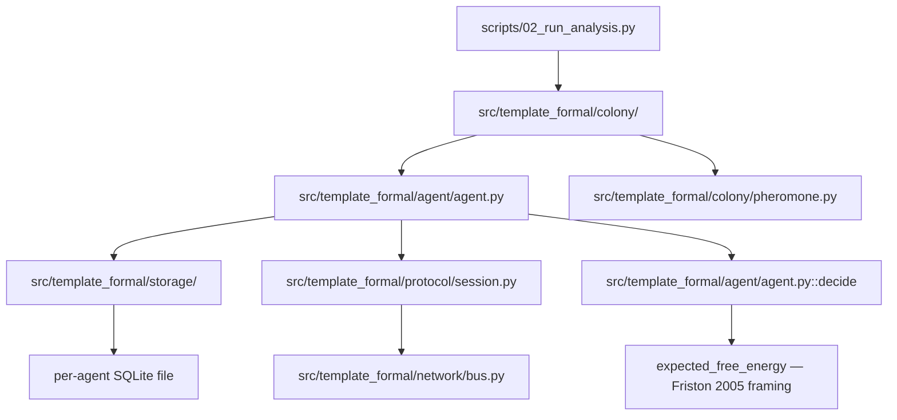

# `template_formal` — package map

Six subpackages, each owning exactly one concern the manuscript argues for.
Read each subpackage's own module docstrings for the full rationale; this file
is the map, not the territory.

| Subpackage | Responsibility (from its `__init__.py` exports) |
| --- | --- |
| [`types/`](types/) | Core type vocabulary shared by every other layer: nominal IDs (`AgentId`, `MessageId`, `TxnId` via `typing.NewType`), the `Result[T, E]` ADT (`Ok`/`Err` + `is_ok`/`map_result`/`and_then`/`unwrap_or`), and phantom phase markers (`Idle`/`Handshaking`/`Established`/`Closed`). |
| [`storage/`](storage/) | Agent-local persistence: typed schema-to-DDL (`Column`, `TableSchema`), a typed `QueryBuilder` that returns `Result` instead of raising, and the affine-discipline `TransactionHandle` (`begin_transaction`/`ConsumedHandleError`). |
| [`protocol/`](protocol/) | The session-typed handshake state machine (`IdleSession → HandshakingSession → EstablishedSession → ClosedSession`), its wire codec (`encode_wire_message`/`decode_wire_message`), and expected-failure error types (`ProtocolViolation`, `MalformedMessage`). |
| [`network/`](network/) | `InProcessBus` — a typed, in-process (no real sockets) message bus with seeded, independently-toggleable fault injection (drop/duplicate/corrupt/reorder) via `FaultConfig`/`FaultInjector`. |
| [`agent/`](agent/) | `Agent[StateT]` — one storage session + one protocol endpoint + a free-energy-minimizing decision loop (`decide`/`tick`), plus the closed-form Gaussian KL-divergence/entropy functions it scores candidates with. |
| [`colony/`](colony/) | The shared stigmergic substrate (`PheromoneField` Protocol + `InMemoryPheromoneField`), the seeded multi-agent trial harness (`run_colony_trial`), its random-choice null-model baseline, dependency-free statistics (Wilson interval, Fisher's exact test), a generic parameter sweep, and demo/visualization runners. |

## Module-layout diagram

Reproduced verbatim from
[`manuscript/02_type_architecture.md`](../../manuscript/02_type_architecture.md#module-layout)
— that file is the source of truth for this diagram and the claims around it;
do not re-derive or hand-edit a copy here.



## Layer-dependency contract

```
types/      -- no internal deps (leaf layer)
storage/    -- depends only on types/
protocol/   -- depends only on types/
network/    -- depends only on types/ (+ protocol/ for MalformedMessage in module docstrings)
agent/      -- depends on storage/ + protocol/ + types/
colony/     -- depends on agent/ + types/
```

Concretely: `storage/db.py` and `protocol/session.py` both import from
`types/` and nothing else in this package. `agent/agent.py` is the first
module allowed to import from more than one sibling subpackage — it wires a
`Database` (storage) to a `SessionEndpoint` (protocol) behind one typed
decision loop. `colony/` modules import `agent/` (for `Agent`,
`BeliefState`, `CandidateAction`) and `types/` (for `new_agent_id`), never
`storage/` or `protocol/` directly — colony code only ever reaches storage or
the wire format through an `Agent`'s public methods. Verify this holds with:

```bash
grep -rn "^from template_formal\|^import template_formal" src/template_formal/*/*.py
```

An import that violates this table (e.g. `storage/` importing from `agent/`,
or `network/` importing from `colony/`) is a layering regression, not a
style nit — it breaks the "each layer is exercised by the colony loop, never
bypassed" claim the manuscript's module-layout section makes.

## What "strongly-typed" means here, precisely

Every subpackage draws the same line (see
[`manuscript/02_type_architecture.md#sec:honesty-line`](../../manuscript/02_type_architecture.md#what-mypy---strict-proves-vs-what-is-a-runtime-discipline)):
some invariants are `mypy --strict` edit-time/CI-time proofs (nominal ID
mixing, phase-method attribute resolution, `Result` exhaustiveness, the
`IsolationLevel` literal, `Agent` construction from a bare `UUID`, `Protocol`
structural conformance); others are runtime-only disciplines checked by a
raised exception or a returned `Err` (affine-handle reuse, malformed wire
bytes, SQL-identifier validation). No docstring in this package claims
Python enforces compile-time linear/affine typing — see
`storage/transaction.py`'s and `protocol/session.py`'s module docstrings for
where each concrete guarantee actually stops.
