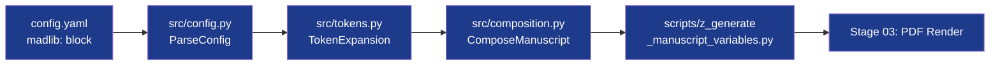

# Architecture — Template Madlib

## Pipeline

## Key modules

- `src/config.py`: Parses the madlib schema from config.yaml
- `src/tokens.py`: Deterministic token selection and expansion
- `src/composition.py`: Manuscript section composition and hydration
- `src/manuscript_variables.py`: Token-to-variable mapping for injection
