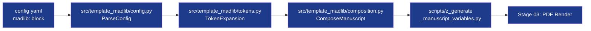

# Architecture — Template Madlib

## Pipeline

```mermaid
flowchart LR
    CONFIG[config.yaml<br/>madlib: block] --> PARSE[src/template_madlib/config.py<br/>ParseConfig]
    PARSE --> TOKENS[src/template_madlib/tokens.py<br/>TokenExpansion]
    TOKENS --> COMPOSE[src/template_madlib/composition.py<br/>ComposeManuscript]
    COMPOSE --> HYD[scripts/z_generate<br/>_manuscript_variables.py]
    HYD --> RENDER[Stage 03: PDF Render]

    classDef c fill:#1e3a8a,color:#fff;
    class CONFIG,PARSE,TOKENS,COMPOSE,HYD,RENDER c;
```

## Key modules

- `src/template_madlib/config.py`: Parses the madlib schema from config.yaml
- `src/template_madlib/tokens.py`: Deterministic token selection and expansion
- `src/template_madlib/composition.py`: Manuscript section composition and hydration
- `src/template_madlib/manuscript_variables.py`: Token-to-variable mapping for injection
