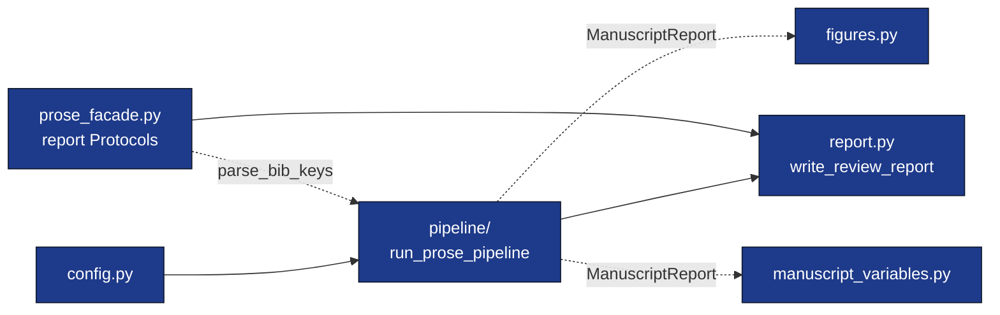

# `template_prose_project/src/`

Domain orchestration: pure, `infrastructure`-free functions. The thin
`scripts/` orchestrators call `infrastructure/prose/` (analysis,
report loading) and `infrastructure/rendering/manuscript_injection`
(token substitution) on `src/`'s behalf.



## Quick start

Programmatic use (the scripts in `scripts/` wire these calls to the
filesystem; `src/` must be importable, e.g. under the project's
`[tool.pytest.ini_options] pythonpath`):

```python
from infrastructure.prose import analyze_manuscript

from src.config import load_project_config
from src.pipeline import run_prose_pipeline
from src.report import write_review_report

config = load_project_config("manuscript/config.yaml")
report = analyze_manuscript(
    "manuscript",
    long_sentence_threshold=config.prose.long_sentence_threshold,
)
artifacts = run_prose_pipeline(config, project_root=".", manuscript_report=report)

write_review_report(
    config.report.output_path,
    title=config.title,
    manuscript_report=artifacts.manuscript_report,
    checks=artifacts.checks,
)
```

## Modules

| Module | Public exports |
|---|---|
| `config.py` | `ProjectConfig`, `ProseAnalysisConfig`, `BibliographyConfig`, `ReportConfig`, `load_project_config`. |
| `pipeline/` | `run_prose_pipeline`, `ProseRunArtifacts`, `CheckResult`, and configured check functions. |
| `figures.py` | `plot_section_word_counts`, `plot_readability_metrics`, `plot_citation_density`, `generate_all_figures`. |
| `manuscript_variables.py` | `ManuscriptVariables`, `load_report_payload`, `compute_variables`, `substitute_in_text`, `write_variables`. |
| `report.py` | `write_review_report`. |
| `prose_facade.py` | `ManuscriptReportLike`, `FileReportLike`, `ProseMetricsLike`, `QualityReportLike`, `StructureReportLike`, `render_outline`, `parse_bib_keys`. |

See [AGENTS.md](AGENTS.md) for invariants and the editing checklist.
