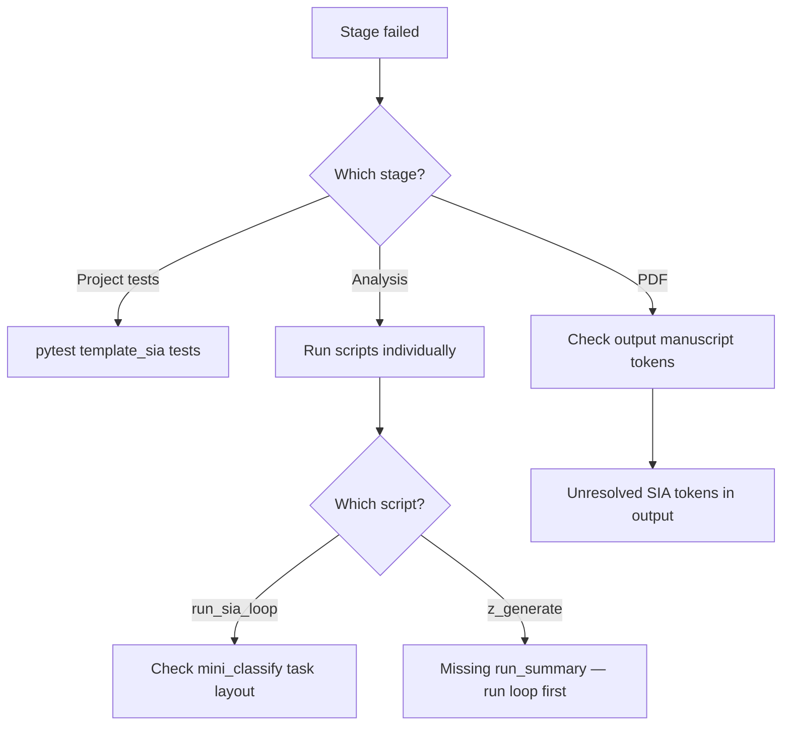

# Troubleshooting — template_sia

## Project tests fail with `unrecognized arguments: --timeout`

Add `pytest-timeout` to project dev dependencies (already in `pyproject.toml`). Run `uv sync --extra dev` inside the project directory.

## `ModuleNotFoundError: No module named 'PIL'`

The variables script must not import `infrastructure.rendering` package init. Use `infrastructure.rendering.manuscript_injection.write_resolved_manuscript_tree` (lazy load of `manuscript_injection.py` only, not the package `__init__.py`).

## `Unknown config key 'sia'`

Expected and harmless when this warning comes from the generic
`infrastructure.core.config` loader validating `manuscript/config.yaml`
directly (e.g. via ad hoc scripts or the shared config CLI). `src/loop_config.py`
reads the `sia:` block itself with a private YAML helper and never registers
the key with `register_project_schema_extension` — no such call exists in
this project. To make the shared loader recognize `sia` and silence the
warning, register the extension (mirroring the pattern in
`template_gold_refinement/tests/test_config.py`): `register_project_schema_extension("template_sia", {"sia": dict})`.

## Analysis: missing `run_summary.json`

Run `uv run python projects/templates/template_sia/scripts/run_sia_loop.py` before `z_generate_manuscript_variables.py`.

## Live mode hangs or fails

- Confirm `ollama serve` is running
- Use `@pytest.mark.requires_ollama` tests locally only
- Keep `target_timeout_sec` bounded in config

## Drift: missing `.gitignore`

Exemplars must ship `projects/templates/template_sia/.gitignore` and appear in root `.gitignore` allowlist negations.
