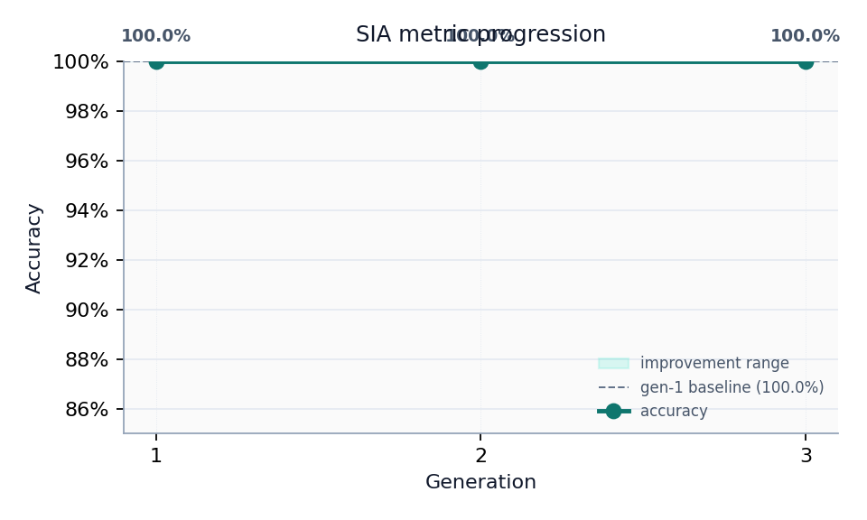
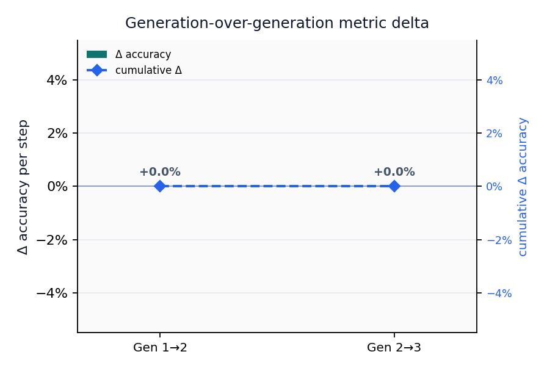

# Results {#sec:results}

@tbl:sia-metrics summarizes fixture-replay metrics for the bundled run.

{{SIA_METRICS_TABLE}}

: SIA generation metrics (fixture replay). {#tbl:sia-metrics}

Metric delta (final − first generation): {{SIA_METRIC_DELTA}}.

Final injected token: {{SIA_FINAL_METRIC_NAME}}={{SIA_FINAL_METRIC_VALUE}} (n={{SIA_FINAL_N_SAMPLES}}).

{#fig:sia-metric-progression width=85%}

## Threshold robustness control

The recorded target agents genuinely apply the proposed thresholds 0.5, 0.3,
and 0.25. All three lie inside this toy dataset's clean separation gap and
therefore score 1.0. The zero generation-over-generation delta is an important
negative result: the harness records feedback and code variation without
fabricating an improvement signal where the evaluation cannot distinguish one.

{#fig:sia-improvement-delta width=80%}
