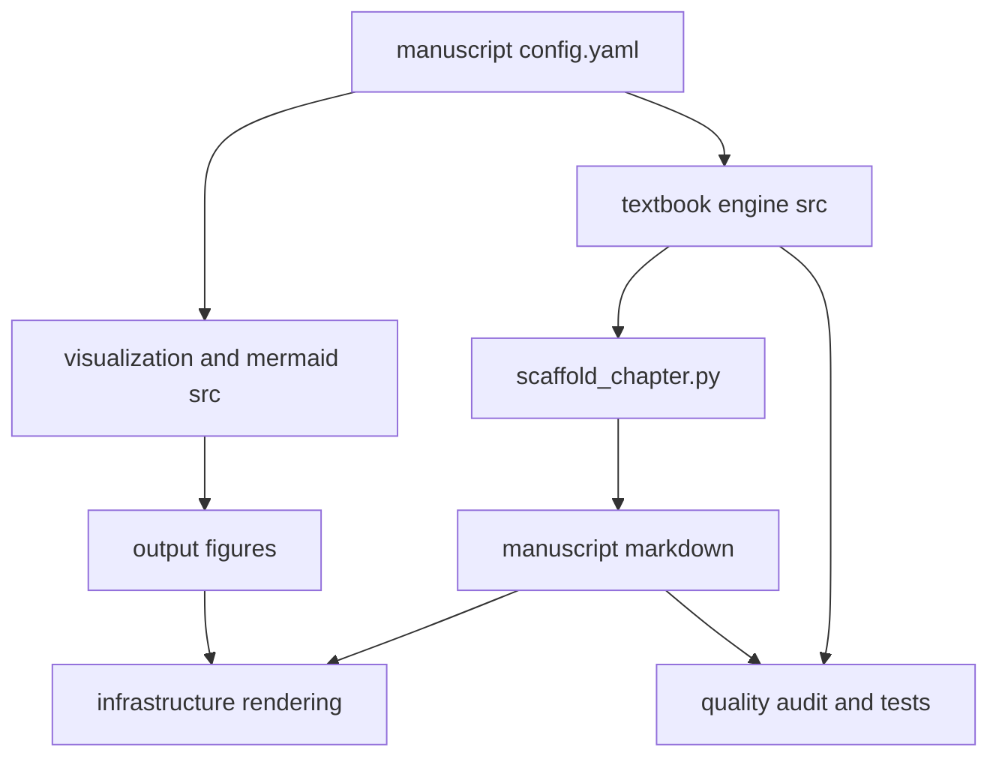

# Architecture

`template_textbook` is one project in a two-layer research-template monorepo.
**Layer 1** is the generic, reusable `infrastructure/` at the repository root
(rendering, validation, the pipeline runner). **Layer 2** is this project:
everything domain-specific lives under
`projects/templates/template_textbook/`. The unifying rule is the
**thin-orchestrator pattern** — business logic lives only in `src/`; scripts
coordinate I/O and call tested functions.

## The single source of truth

[`manuscript/config.yaml`](../manuscript/config.yaml) declares the entire book:
its parts, the chapters inside each part (in order), the labs and question banks
that mirror those chapters, the reference appendices, and the page/typography
settings. Nothing downstream hard-codes the structure — the table of contents,
chapter auto-numbering, figure filenames, lab/question wiring, and the
manuscript-integrity tests all read this one file.

To grow the book you edit `config.yaml` (add a part or a chapter), then run
[`scripts/scaffold_chapter.py`](../scripts/scaffold_chapter.py) to materialise
any missing stub files in the correct shape. To skip a chapter without deleting
it, add `enabled: false` to its entry.

## The `src/textbook` engine

```
src/textbook/
  constants.py   # the structural contract (see below)
  config.py      # load_config, iter_chapters, validate_config, ChapterRef
  toc.py         # build_toc, chapter_number, section/lab/question labels
  content.py     # scaffold_chapter / scaffold_lab / scaffold_question_bank,
                 # validate_chapter, count_stub_markers, count_words
  models.py      # the worked formalisms (logistic_growth, saturating_response,
                 # exponential_decay, half_life, linear_fit,
                 # descriptive_statistics, normalize_unit_interval)
```

- **`constants.py`** encodes the contract every chapter must satisfy:
  `CITATION_KEYS` (10 keys), `GLOSSARY_ANCHORS` (15 anchors),
  `REQUIRED_SECTION_HEADINGS`, `REQUIRED_TOKENS`, and `STUB_MARKERS`. These are
  the names the tests assert against, so they are the contract, not prose about
  the contract.
- **`config.py`** parses `config.yaml` into `ChapterRef` objects and validates
  it. `iter_chapters()` yields chapters in book order (skipping disabled ones by
  default).
- **`toc.py`** turns the config into numbered table-of-contents entries and
  derives the `{#sec:...}`, lab, and question labels — so numbering is computed,
  never typed.
- **`content.py`** is the meta-template engine. `scaffold_chapter()` emits a
  contract-satisfying stub (all required headings, tokens, a figure, an
  equation, a table, a mermaid block, glossary links, and citations);
  `validate_chapter()` returns the list of contract violations for a chapter's
  text; `count_stub_markers()` / `count_words()` report fill progress.
- **`models.py`** holds the worked formalisms the book teaches and that the
  figures plot — tested numerical functions, not toy code in scripts.

## Visualization and diagrams

- [`src/visualization/plots.py`](../src/visualization/plots.py) produces every
  matplotlib figure deterministically: four **worked** figures (driven by
  `models.py`) plus one **placeholder** per chapter, named `<part_id>_<stem>.png`
  to match the `` path the scaffolded
  chapters already reference.
- [`src/mermaid/`](../src/mermaid) reads
  [`diagram_specs.yaml`](../src/mermaid/diagram_specs.yaml) and emits Mermaid
  sources, rendering them to PNG when `mmdc` is available and falling back to
  `.mmd` files otherwise.

See the [visualization guide](visualization_guide.md) for details.

## Scripts are thin orchestrators

Everything in [`scripts/`](../scripts) imports from `src/` and only handles I/O,
argument parsing, and printing output paths for the pipeline manifest:

- `generate_figures.py` → `visualization.plots.generate_all_figures`
- `generate_diagrams.py` → `mermaid.diagrams.generate_all_diagrams`
- `analysis.py` → numerical demonstrations from `textbook.models`
- `scaffold_chapter.py` → `textbook.content` (author tool; not in the render path)
- `audit_textbook_quality.py` → `textbook.content` / `textbook.config` (gate)

`config.yaml`'s `analysis.scripts` lists only the **build-producing** scripts
(`generate_figures.py`, `generate_diagrams.py`, `analysis.py`) so a render is
reproducible and non-mutating; the maintenance scripts stay callable by hand.

## Output layout

Build products land under the project's `output/` directory and are disposable:

```
output/
  figures/    # <part_id>_<stem>.png + the four worked figures, from plots.py
  data/       # numerical artifacts emitted by analysis.py
```

Nothing in `output/` is committed; it is regenerated from `src/` + `config.yaml`
on every run.

## Data flow



The config feeds the engine and the generators; the engine scaffolds the
manuscript and computes numbering; the generators produce the figures; the
manuscript plus figures render to the final book; and the engine plus tests gate
the whole thing.
