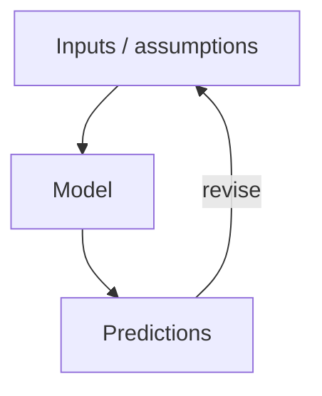

# Syntax Reference

A concise, copy-pasteable reference for the authoring syntax used in this
manuscript. Every element below is rendered by Pandoc with the `pandoc-crossref`
filter. For the rules governing *where* these must appear, see [`AGENTS.md`](AGENTS.md).

## Figures

Reference a generated PNG, give it a label, and add an alt-text comment:

```markdown
# In a chapter (manuscript/<part>/<chapter>.md) use two `..` to reach output/figures/:
{#fig:part_0_orientation width=90%}
# (A top-level manuscript/*.md file would use a single `..`.)

<!-- alt: One-sentence description of the figure for accessibility. -->
```

Refer to it in prose with `[@fig:part_0_orientation]`.

## Tables

A captioned, labelled table uses a leading `: caption {#tbl:...}` line and
`booktabs`-friendly pipe syntax:

```markdown
: Parameters of the worked model. {#tbl:part_0_orientation_parameters}

| Symbol | Meaning        | Units    |
| ------ | -------------- | -------- |
| $r$    | intrinsic rate | 1/time   |
| $K$    | carrying capacity | quantity |
```

Refer to it with `[@tbl:part_0_orientation_parameters]`.

## Equations

A display equation gets a `{#eq:...}` label on the same line as the closing `$$`:

```markdown
$$ N(t) = \frac{K}{1 + \left(\dfrac{K - N_0}{N_0}\right) e^{-rt}} $$ {#eq:part_0_orientation_model}
```

Refer to it with `[@eq:part_0_orientation_model]`. The maths is implemented and
tested in `textbook.models` — do not recompute it by hand.

## Mermaid Diagrams

Inline diagrams use a fenced `mermaid` block:

````markdown

````

The renderer turns these into PNGs (with a `.mmd` fallback). Diagram sources can
also be declared in `src/mermaid/diagram_specs.yaml`.

## Cross-References

Use `pandoc-crossref` reference syntax — never type a number:

```markdown
See [@fig:part_0_orientation], [@tbl:part_0_orientation_parameters],
[@eq:part_0_orientation_model], and [@sec:part_0_orientation].
```

| Element  | Define with  | Reference with |
| -------- | ------------ | -------------- |
| Section  | `{#sec:...}` | `[@sec:...]`   |
| Figure   | `{#fig:...}` | `[@fig:...]`   |
| Table    | `{#tbl:...}` | `[@tbl:...]`   |
| Equation | `{#eq:...}`  | `[@eq:...]`    |

## Citations

```markdown
A single citation [@lee2021systems]; multiple [@kim2020data; @brown2017principles].
```

Every key must resolve in [`references.bib`](references.bib).

## Glossary Links

Link the first use of a defined term to its glossary anchor:

```markdown
The [**regulation**](#gl:regulation) of a [**system**](#gl:system) variable.
```

Valid anchors are listed in [`AGENTS.md`](AGENTS.md) and defined in
[`glossary.md`](glossary.md).

## Stub Markers

Mark every author-specific gap so the quality audit can count it:

```markdown
<!-- STUB: one-sentence thesis for this chapter. -->
1. <!-- STUB: objective --> TODO: state the first learning objective.
> **Opening Vignette: TKTK — a motivating story**
```

The three recognised markers are `<!-- STUB -->`, `TODO:`, and `TKTK`. A finished
chapter contains none.
