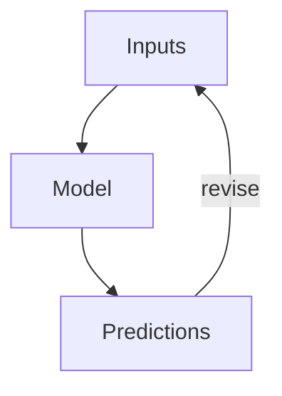
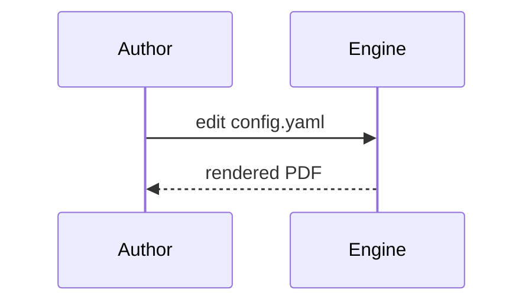
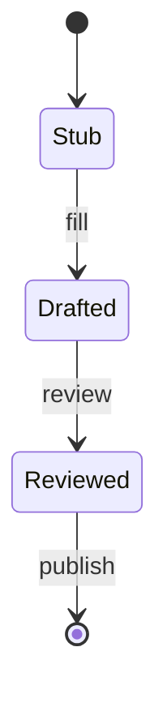
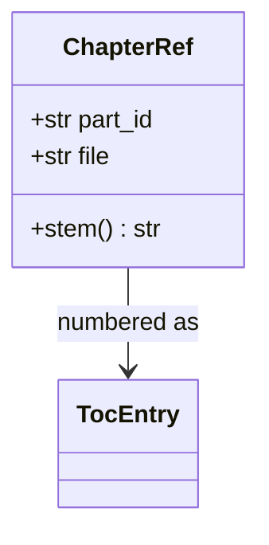
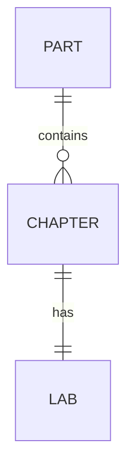

# Appendix — Format Gallery {#sec:appendix_format_gallery}

This appendix is a **kitchen-sink demonstration**: a working example of every
content primitive this template supports. Copy any block into a chapter and
adapt it. Each example is real and renders through the standard pipeline; figures
are produced deterministically by `src/visualization/` and embedded from
`../figures/`. <!-- STUB: trim to the subset your book actually uses. -->

> **How to read this appendix.** Headings group primitives by kind: text, lists,
> callouts, tables, math, figures, diagrams, code, cross-references, media, and
> pedagogy blocks. The Markdown source is the example — view it next to the
> rendered output.

---

## 1. Text and inline formatting

Plain paragraph text wraps and flows normally. Inline styles: **bold**,
*italic*, ***bold italic***, `inline code`, ~~strikethrough~~, H~2~O with a
subscript, E = mc^2^ with a superscript, and a footnote.[^demo]

[^demo]: Footnotes collect at the end of the document (or page, in PDF). Use them
for asides that would interrupt the sentence.

You can hard-break a line  
with two trailing spaces, or separate paragraphs with a blank line. Escape
literal Markdown with a backslash: \*not italic\*.

---

## 2. Lists

Unordered, with nesting:

- First item
- Second item
  - Nested item
  - Another nested item
    - Third level
- Third item

Ordered:

1. Step one
2. Step two
   1. Sub-step a
   2. Sub-step b
3. Step three

Task list (renders as checkboxes in many targets):

- [x] Scaffold the chapter
- [x] Generate figures
- [ ] Fill the prose
- [ ] Write the assessment answers

Definition list:

Parameter
:   A fixed quantity that configures a model (see [**parameter**](#gl:parameter)).

Variable
:   A quantity that changes across states (see [**variable**](#gl:variable)).

---

## 3. Block quotes and callouts

A plain block quote:

> "Form follows function." Use quotes for epigraphs and primary-source extracts.

Portable callouts (a bold label inside a block quote — renders in every target):

> **Note.** A neutral aside that adds context.

> **Tip.** A practical suggestion the reader can act on.

> **Warning.** A caveat, common error, or safety note.

> **Example.** A short worked illustration inline in the text.

> **Definition.** A precise statement of a term, often paired with a glossary
> entry such as [**equilibrium**](#gl:equilibrium).

Pandoc fenced-div callout (richer styling where supported; falls back gracefully):

::: {.callout-note}
This is a Pandoc fenced `div`. If your render profile styles `.callout-note`, it
appears as a boxed admonition; otherwise it renders as a normal block.
:::

---

## 4. Tables

A simple table with column alignment and a cross-referencable caption
([@tbl:gallery_alignment]):

: Column alignment — left, centre, right. {#tbl:gallery_alignment}

| Left      |  Centre  |    Right |
| :-------- | :------: | -------: |
| alpha     |    1     |     10.0 |
| beta      |    22    |      2.5 |
| gamma     |   333    |    0.125 |

A multi-line / grid table (cells may contain longer wrapped text):

+----------------+--------------------------------+----------------+
| Symbol         | Meaning                        | Typical range  |
+================+================================+================+
| $r$            | intrinsic rate of change       | 0.1 – 2.0      |
+----------------+--------------------------------+----------------+
| $K$            | carrying capacity / saturation | problem-       |
|                | level the system approaches    | dependent      |
+----------------+--------------------------------+----------------+

---

## 5. Mathematics and units

Inline math: the half-life is $t_{1/2} = \ln 2 / \lambda$.

A numbered display equation, cross-referenced as [@eq:gallery_logistic]:

$$ N(t) = \frac{K}{1 + \left(\dfrac{K - N_0}{N_0}\right) e^{-rt}} $$ {#eq:gallery_logistic}

Multi-line aligned derivation:

$$
\begin{aligned}
\frac{dN}{dt} &= rN\left(1 - \frac{N}{K}\right) \\
              &= rN - \frac{r}{K}N^2 .
\end{aligned}
$$

A matrix and a piecewise definition:

$$
\mathbf{A} = \begin{bmatrix} a_{11} & a_{12} \\ a_{21} & a_{22} \end{bmatrix},
\qquad
f(x) = \begin{cases} 0 & x < 0 \\ 1 & x \ge 0 . \end{cases}
$$

Physical quantities with units, written in math mode so they render in **every**
target (PDF, HTML, slides): a rate of $0.5\ \mathrm{s^{-1}}$, a length of
$2.0\ \mathrm{m}$, and a concentration of $1.5\ \mathrm{mol\,L^{-1}}$. (For
PDF-only builds you may instead use `siunitx` macros such as `\SI{0.5}{\per\second}`,
which the preamble loads — but math-mode units are the portable choice.)

---

## 6. Figures

A single figure with caption, label, and alt text, cross-referenced as
[@fig:gallery_line]:

{#fig:gallery_line width=80%}

<!-- alt: Line plot with three sinusoidal curves of increasing frequency. -->

Two figures side by side (Pandoc fenced div; falls back to stacked):

::: {layout-ncol=2}
{#fig:gallery_bar width=48%}

{#fig:gallery_pie width=48%}
:::

A multi-panel composite ([@fig:gallery_multipanel]):

{#fig:gallery_multipanel width=85%}

The full plot-type gallery lives in `output/figures/gallery/` and includes:
line, scatter-with-fit, bar, grouped bar, horizontal bar, histogram, box,
violin, heatmap, contour, quiver field, step, stacked area, error bars, log-log,
pie, annotated, and multi-panel. <!-- STUB: embed the ones your chapters use. -->

---

## 7. Diagrams (Mermaid)

The pipeline renders fenced `mermaid` blocks to figures (and falls back to the
`.mmd` source if the Mermaid CLI is absent). One worked example of each kind the
builders in `src/mermaid/diagrams.py` support:

Flowchart:



Sequence:



State:



Class:



Entity-relationship:



Pie, Gantt, mindmap, timeline, quadrant, and user-journey diagrams are also
supported — see `src/mermaid/diagram_specs.yaml` for a worked spec of each.

---

## 8. Code

Inline code: call `textbook.models.logistic_growth(t, r=..., ...)`.

A fenced code block with a language (syntax-highlighted) and a caption
([@lst:gallery_code]):

```{#lst:gallery_code .python caption="Calling the tested computational backbone."}
from textbook import models
import numpy as np

t = np.linspace(0, 10, 100)
n = models.logistic_growth(t, r=0.8, carrying_capacity=100.0, initial=5.0)
print(n[-1])  # -> approaches the carrying capacity
```

A shell example:

```bash
uv run python scripts/generate_figures.py
uv run --extra dev python -m pytest tests/ --cov=src
```

---

## 9. Cross-references and citations

Cross-references resolve by label: figure [@fig:gallery_line], table
[@tbl:gallery_alignment], equation [@eq:gallery_logistic], and section
[@sec:appendix_formalisms]. Never hand-number — Pandoc fills these in.

Citations resolve against `references.bib`: a single source [@smith2020foundations],
multiple sources [@doe2019methods; @lee2021systems], and an in-text form —
@garcia2022dynamics showed the effect first. A locator narrows the reference
[@patel2018models, pp. 12–14].

---

## 10. Media and data

Embedded raster image (any PNG/JPG works the same way as a figure):

{#fig:gallery_media width=60%}

Audio and video embed in HTML targets (PDF shows the caption + link). Syntax:

```markdown

{width=70%}
```

A downloadable data file lives at
[`assets/data/sample_dataset.csv`](../assets/data/sample_dataset.csv); its
contents as a table:

: Sample dataset (mirrors `assets/data/sample_dataset.csv`). {#tbl:gallery_data}

| condition      | replicate | measurement | standard_error |
| -------------- | --------: | ----------: | -------------: |
| control        |         1 |        2.10 |           0.20 |
| control        |         2 |        2.30 |           0.18 |
| treatment_low  |         1 |        3.60 |           0.25 |
| treatment_high |         1 |        4.80 |           0.35 |

The error-bar figure [@fig:gallery_errorbar] visualises this kind of data:

{#fig:gallery_errorbar width=70%}

---

## 11. Pedagogical blocks

These are the reusable teaching elements chapters draw on.

> **Learning objective.** After this section a reader can identify which Markdown
> primitive to use for a given purpose. <!-- STUB: make objectives measurable. -->

> **Worked example.** Given $r = 0.8$, $K = 100$, $N_0 = 5$, evaluate $N(10)$ via
> [@eq:gallery_logistic] using `textbook.models.logistic_growth`. The result
> approaches $K$. <!-- STUB: show the full numeric work. -->

> **Try it.** Change $r$ to $1.5$ and predict, then check, how the curve shifts.
> <!-- STUB: provide the expected answer in the question bank. -->

> **Key terms.** [**model**](#gl:model), [**parameter**](#gl:parameter),
> [**state**](#gl:state).

> **Summary.** This appendix demonstrated text, lists, callouts, tables, math and
> units, figures, diagrams, code, cross-references, media, and pedagogy blocks —
> the complete primitive set. <!-- STUB: keep this in sync as you add primitives. -->

---

## 12. Miscellany

A horizontal rule separates major shifts in topic (three or more dashes):

---

Raw inline HTML is supported only inside `<details>`, `<aside>`, or `<callout>`
per project style; everything else uses Markdown. Unicode renders directly:
α, β, γ, Δ, ∑, ∞, ≈, →. For PDF math, prefer LaTeX (`$\alpha$`) over raw Unicode
in equations.
