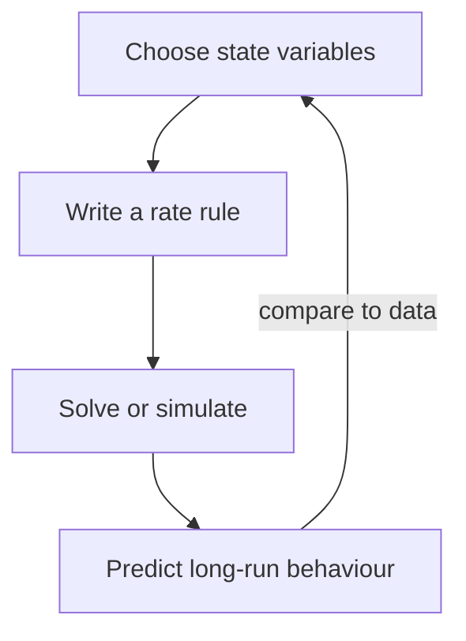

# First Principles {#sec:part_I_first_principles}

{#fig:part_I_first_principles width=85%}

<!-- alt: Three S-shaped curves rising from a small initial value and levelling
off at a horizontal asymptote labelled K = 100; steeper curves correspond to
larger growth rates. -->

<!-- chapter-metadata-badge -->
> Level 1/3 · 25 min read · 40 min lecture · Prerequisites: none

> **This chapter is a worked reference.** It is filled to completion to show what
> a finished chapter looks like. The other chapters in this template ship as
> structurally-complete stubs (marked with stub comments and TODO notes); fill
> them the same way.

## Learning Objectives

By the end of this chapter you should be able to:

1. Explain what it means to model a [**system**](#gl:system) as a small set of
   [**state**](#gl:state) variables and a rule for how they change.
2. Distinguish a [**parameter**](#gl:parameter) from a [**variable**](#gl:variable),
   and identify each in a worked model.
3. Derive and interpret the logistic growth law and predict its long-run
   behaviour toward an [**equilibrium**](#gl:equilibrium).
4. Compute model values with the tested function
   `textbook.models.logistic_growth` rather than re-deriving arithmetic by hand.

<!-- curriculum-scaffold-start -->
### Study Blueprint

- **Big idea:** A great deal of change in the world is captured by a handful of
  variables and a single rule relating their rates — the *first principle* of
  quantitative modelling.
- **Core concepts:** [**system**](#gl:system), [**state**](#gl:state),
  [**parameter**](#gl:parameter), [**equilibrium**](#gl:equilibrium).
- **Quantitative lens:** the logistic law in [@eq:part_I_first_principles_model].
- **Data skill:** read an S-curve and estimate its carrying capacity by eye, then
  confirm numerically.
- **Common misconception to repair:** "exponential" and "logistic" are not the
  same — unbounded growth is an early-time approximation, not the rule.
- **Primary lab:** [@sec:lab_part_I_first_principles].
- **Question bank:** [@sec:q_part_I_first_principles].
- **Bridge to computation:** `textbook.models.logistic_growth`.
<!-- curriculum-scaffold-end -->

---

> **Opening Vignette: Counting before you explain.**
>
> A population biologist watches a colony double, then double again, then —
> unexpectedly — slow. A start-up tracks users that grow the same way before the
> market saturates. A chemist measures a reaction that races, then crawls as
> substrate runs low. Three unrelated fields, one shape. The job of a first model
> is not to capture everything; it is to capture *that shape* with as few moving
> parts as possible.

---

## From a system to a model

A **model** is a deliberate simplification. We choose a small number of
[**state**](#gl:state) variables — here, a single quantity $N(t)$ — and write a
rule for how the state changes. The art is leaving things out: a first model that
fits on one line teaches more than a faithful one that fills a page.

The variables are what change; the [**parameter**](#gl:parameter)s are what we
hold fixed while we reason. In the growth model below, $N$ is the variable, while
the rate $r$ and the carrying capacity $K$ are parameters. Confusing the two is
the most common beginner error: if you find yourself "solving for $K$ over time,"
you have mislabelled a parameter as a variable.

## A first quantitative law

Unbounded (exponential) growth assumes nothing ever pushes back. Real systems
saturate. The simplest law that grows fast when small and levels off when large
is the **logistic** equation, written as a rate of change in
[@eq:part_I_first_principles_rate] and in closed form in
[@eq:part_I_first_principles_model]:

$$ \frac{dN}{dt} = rN\left(1 - \frac{N}{K}\right) $$ {#eq:part_I_first_principles_rate}

$$ N(t) = \frac{K}{1 + \left(\dfrac{K - N_0}{N_0}\right) e^{-rt}} $$ {#eq:part_I_first_principles_model}

Read [@eq:part_I_first_principles_rate] aloud: the rate of change is proportional
to how much there is ($rN$) *times* how much room remains ($1 - N/K$). When $N$ is
small the second factor is near $1$ and growth is nearly exponential; as $N$
approaches $K$ the factor approaches $0$ and growth stalls. The parameters are
collected in [@tbl:part_I_first_principles_parameters].

: Parameters of the logistic model. Variables change over time; parameters are
held fixed while reasoning. {#tbl:part_I_first_principles_parameters}

| Symbol | Name              | Role      | Example value          |
| ------ | ----------------- | --------- | ---------------------- |
| $N(t)$ | quantity          | variable  | computed               |
| $r$    | intrinsic rate    | parameter | $0.8\ \mathrm{s^{-1}}$ |
| $K$    | carrying capacity | parameter | $100$ units            |
| $N_0$  | initial value     | parameter | $5$ units              |

## Worked example

Take $r = 0.8$, $K = 100$, and $N_0 = 5$. Rather than evaluate the exponential by
hand, call the tested backbone:

```python
import numpy as np
from textbook import models

t = np.array([0.0, 2.0, 5.0, 10.0])
N = models.logistic_growth(t, r=0.8, carrying_capacity=100.0, initial=5.0)
# N -> [ 5.00, 20.68, 74.18, 99.37 ]
```

The trajectory starts at $N(0) = 5.00$, reaches $N(2) = 20.68$, passes the
steep middle near $t = 5$ with $N(5) = 74.18$, and by $t = 10$ has all but
arrived at $N(10) = 99.37$ — within one part in a hundred of the carrying
capacity. This is the S-curve plotted in [@fig:part_I_first_principles]: an early
near-exponential rise, an inflection, and a long approach to the asymptote.

The long-run behaviour is exact, not approximate. Because $r > 0$, the term
$e^{-rt} \to 0$, so $N(t) \to K$. The proof is one line and is recorded as
Theorem 1 in [@sec:appendix_formalisms]; the same fact is asserted numerically by
the test suite, so the prose and the code cannot silently disagree.

## How the pieces connect



This loop — choose, write, solve, predict, compare — is the first principle the
rest of the book elaborates. Foundational treatments of model-building include
[@brown2017principles] and [@patel2018models].

## Summary

A model trades completeness for clarity: a few [**state**](#gl:state) variables
and one rule. The logistic law adds a single idea — finite room — to exponential
growth, and that idea changes the long-run behaviour from unbounded increase to a
stable [**equilibrium**](#gl:equilibrium) at the carrying capacity $K$. Compute
with the tested `logistic_growth` function so your worked numbers are reproducible
and correct by construction.

## Key Terms

[**system**](#gl:system), [**model**](#gl:model), [**state**](#gl:state),
[**parameter**](#gl:parameter), [**equilibrium**](#gl:equilibrium).

## Further Reading

- @brown2017principles — a readable introduction to reasoning from first
  principles; start with its opening chapter on what a model is for.
- @patel2018models — a broader survey of model families; use it to see where the
  logistic law sits among alternatives.

## Practice

- **Lab:** [@sec:lab_part_I_first_principles] — measure an S-curve and estimate
  its parameters.
- **Question bank:** [@sec:q_part_I_first_principles] — recall through synthesis.
