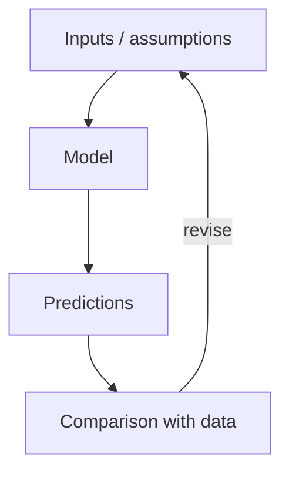

# Regulation and Control {#sec:part_II_regulation_and_control}

{#fig:part_II_regulation_and_control width=90%}

<!-- alt: Placeholder overview schematic for the chapter "Regulation and Control". TODO: write descriptive alt text once the real figure exists. -->

<!-- chapter-metadata-badge -->
> Level 1/3 · 30 min read · 45 min lecture · Prerequisites: none

## Learning Objectives

By the end of this chapter you should be able to:

1. <!-- STUB: objective --> TODO: state the first measurable learning objective.
2. <!-- STUB: objective --> TODO: state the second learning objective.
3. <!-- STUB: objective --> TODO: state the third learning objective.

<!-- curriculum-scaffold-start -->
### Study Blueprint

- **Big idea:** <!-- STUB: one-sentence thesis for this chapter. -->
- **Core concepts:** [**network**](#gl:network), [**dynamics**](#gl:dynamics), [**emergence**](#gl:emergence).
- **Quantitative lens:** the worked formalism in [@eq:part_II_regulation_and_control_model].
- **Data skill:** <!-- STUB: which data move the reader practises here. -->
- **Common misconception to repair:** <!-- STUB. -->
- **Primary lab:** [@sec:lab_part_II_regulation_and_control].
- **Question bank:** [@sec:q_part_II_regulation_and_control].
- **Bridge to computation:** `textbook.models`.
<!-- curriculum-scaffold-end -->

---

> **Opening Vignette: TKTK — a motivating story**
>
> <!-- STUB: open with a concrete, specific example that makes the reader care. > Two to four sentences. Cite a primary source [@patel2018models]. -->

---

## Orientation

<!-- STUB: 2-4 paragraphs introducing the chapter. --> This section introduces
the central ideas of *Regulation and Control*. Foundational treatments include
[@wilson2021analysis; @taylor2019theory]. Key terms such as [**network**](#gl:network), [**dynamics**](#gl:dynamics), [**emergence**](#gl:emergence) are defined in the glossary.

## A Worked Formalism

The recurring quantitative model for this chapter is shown in [@eq:part_II_regulation_and_control_model]:

$$ N(t) = \frac{K}{1 + \left(\dfrac{K - N_0}{N_0}\right) e^{-rt}} $$ {#eq:part_II_regulation_and_control_model}

It is implemented and tested in `textbook.models.logistic_growth`; never retype
the maths in prose or scripts — call the tested function. The parameters appear
in [@tbl:part_II_regulation_and_control_parameters].

: Parameters of the worked model for this chapter. {#tbl:part_II_regulation_and_control_parameters}

| Symbol | Meaning | Units |
| ------ | ------- | ----- |
| $r$ | intrinsic rate | 1/time |
| $K$ | carrying capacity | quantity |
| $N_0$ | initial value | quantity |

A concept map of how the pieces fit together:

> **Note**
>
> <!-- STUB: an aside, caveat, or historical note. -->

## Going Deeper

<!-- STUB: the substantive body of the chapter. Expand freely — figures,
tables, equations, and subsections may repeat as needed. --> See the overview in
[@fig:part_II_regulation_and_control] and revisit the objectives above as you read. Further evidence:
[@wilson2021analysis; @taylor2019theory].

## Summary

<!-- STUB: 3-5 sentence recap of the chapter's load-bearing claims. -->

## Key Terms

[**parameter**](#gl:parameter), [**variable**](#gl:variable), [**equilibrium**](#gl:equilibrium), [**feedback**](#gl:feedback).

## Further Reading

- <!-- STUB: annotated pointer --> TODO: one-line annotation [@smith2020foundations].

## Practice

- **Lab:** [@sec:lab_part_II_regulation_and_control]
- **Question bank:** [@sec:q_part_II_regulation_and_control]
