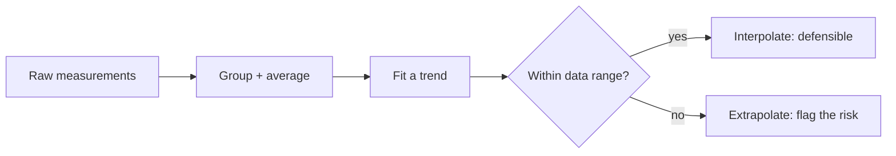

# Case Studies {#sec:part_III_case_studies}

{#fig:part_III_case_studies width=75%}

<!-- alt: A plot of six conditions on the x-axis against a measured response on
the y-axis, each point carrying a vertical standard-error bar; the response rises
from the control group through the two treatment levels. -->

<!-- chapter-metadata-badge -->
> Level 2/3 · 30 min read · 45 min lecture · Prerequisites: First Principles

> **This chapter is a worked reference** in a different style from
> [@sec:part_I_first_principles]: where that chapter *derives* a model, this one
> *applies* one to a small dataset. The remaining chapters ship as stubs.

## Learning Objectives

By the end of this chapter you should be able to:

1. Frame a real question as a comparison between a [**system**](#gl:system) under
   control and treatment conditions.
2. Summarise grouped [**observable**](#gl:observable) data with means and a
   measure of spread, and read an error-bar figure.
3. Fit a simple dose–response trend with `textbook.models.linear_fit` and state
   what its slope and $R^2$ mean.
4. Distinguish a defensible interpolation from an unjustified extrapolation.

<!-- curriculum-scaffold-start -->
### Study Blueprint

- **Big idea:** A case study turns a general [**model**](#gl:model) into a
  decision about a specific dataset — and into an honest statement of its limits.
- **Core concepts:** [**observable**](#gl:observable), [**gradient**](#gl:gradient),
  [**threshold**](#gl:threshold).
- **Quantitative lens:** a linear dose–response fit, [@eq:part_III_case_studies_fit].
- **Data skill:** group, average, and fit; then sanity-check the fit against the
  raw numbers in [@tbl:part_III_case_studies_data].
- **Common misconception to repair:** a high $R^2$ on three points is not strong
  evidence — it is an invitation to collect more.
- **Primary lab:** [@sec:lab_part_III_case_studies].
- **Question bank:** [@sec:q_part_III_case_studies].
- **Bridge to computation:** `textbook.models.linear_fit`, `descriptive_statistics`.
<!-- curriculum-scaffold-end -->

---

> **Opening Vignette: From a spreadsheet to a decision.**
>
> A team runs a small pilot: a control condition and two treatment levels, two
> replicates each. The numbers land in a spreadsheet. The question is not "are
> they different?" — they obviously are — but "by how much, how confidently, and
> what should we predict next?" A case study is the discipline of answering those
> three questions without overreaching.

---

## The data

The pilot produced six measurements across three conditions, recorded in
`assets/data/sample_dataset.csv` and reproduced in
[@tbl:part_III_case_studies_data].

: The pilot dataset: two replicates per condition. {#tbl:part_III_case_studies_data}

| Condition        | Replicate | Measurement | Standard error |
| ---------------- | --------: | ----------: | -------------: |
| control          |         1 |        2.10 |           0.20 |
| control          |         2 |        2.30 |           0.18 |
| treatment (low)  |         1 |        3.60 |           0.25 |
| treatment (low)  |         2 |        3.40 |           0.22 |
| treatment (high) |         1 |        4.80 |           0.35 |
| treatment (high) |         2 |        5.10 |           0.30 |

Grouping and averaging — the first move in almost every case study — gives means
of $2.20$ (control), $3.50$ (low), and $4.95$ (high). Across all six points the
mean is $3.55$ with a standard deviation of $1.13$
(`textbook.models.descriptive_statistics`). The error-bar view is
[@fig:part_III_case_studies].

## Fitting a trend

Encode the dose as $0, 1, 2$ for control, low, and high, and fit a line with
`textbook.models.linear_fit`:

```python
import numpy as np
from textbook import models

dose = np.array([0.0, 1.0, 2.0])
response = np.array([2.20, 3.50, 4.95])   # condition means
fit = models.linear_fit(dose, response)
# fit.slope ≈ 1.375, fit.intercept ≈ 2.175, fit.r_squared ≈ 0.999
```

The fitted relationship in [@eq:part_III_case_studies_fit] is

$$ \widehat{y}(d) = 1.375\,d + 2.175 $$ {#eq:part_III_case_studies_fit}

with $R^2 = 0.999$. The slope says each dose step adds about $1.4$ units of
response; the intercept, $2.175$, is close to the measured control mean of
$2.20$, a reassuring internal check.

## Interpolation versus extrapolation

Using [@eq:part_III_case_studies_fit] to estimate the response at an
*intermediate* dose is reasonable: the model interpolates within the range it was
fit on. Using it to predict a *much higher* dose — say $d = 3$, giving
$\widehat{y} = 6.3$ — is an **extrapolation** the data cannot support. Real
dose–response curves usually saturate (recall the
[**threshold**](#gl:threshold) behaviour of the saturating response in
[@sec:part_I_first_principles]); a straight line will overpredict once the system
approaches its ceiling.



> **Warning.** A linear fit through three averaged points reports $R^2 = 0.999$,
> but that number describes how well the line passes through three dots — not how
> well it predicts the next experiment. Treat it as a reason to collect more data,
> not as a conclusion. Foundational guidance on this trap appears in
> [@kim2020data] and [@wilson2021analysis].

## Summary

A case study moves from raw [**observable**](#gl:observable)s to a summary, a
fitted trend, and — crucially — an honest boundary around what the trend can
claim. Here, averaging and a `linear_fit` recovered a clean dose–response slope of
about $1.4$ units per step with an intercept that matched the control, but the
same fit must not be pushed beyond the measured range. The reusable move is:
summarise, fit, then state the limits.

## Key Terms

[**observable**](#gl:observable), [**gradient**](#gl:gradient),
[**threshold**](#gl:threshold), [**model**](#gl:model).

## Further Reading

- @kim2020data — practical guidance on summarising and visualising small datasets
  before fitting anything.
- @wilson2021analysis — on the difference between a good fit and a good prediction.

## Practice

- **Lab:** [@sec:lab_part_III_case_studies] — re-run the grouping and fit, then
  add a fourth condition and watch the fit change.
- **Question bank:** [@sec:q_part_III_case_studies] — recall through synthesis.
