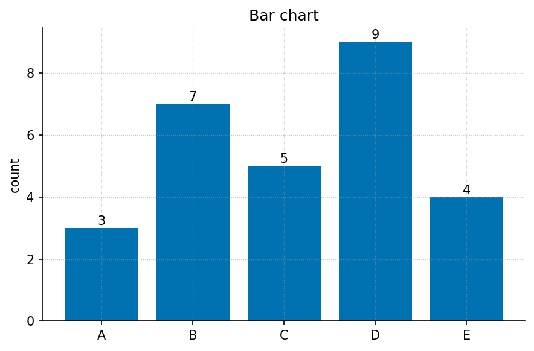
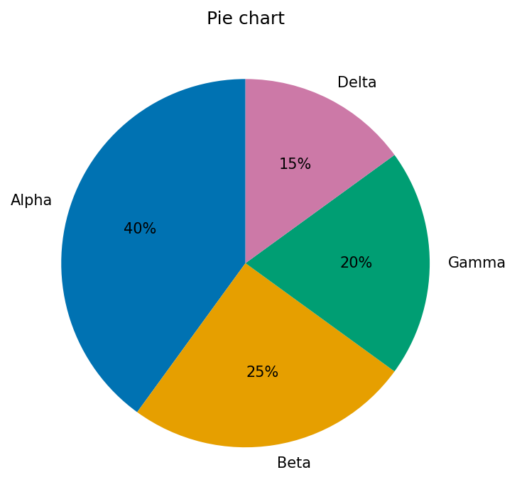
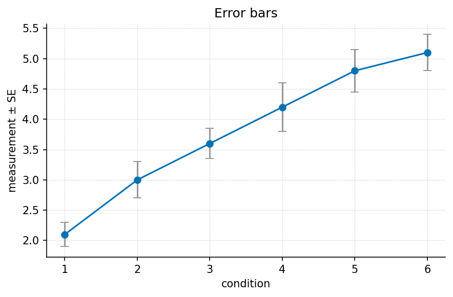

# Front Matter

<!-- This file is the first front-matter document rendered (see
`manuscript/config.yaml` → `front_matter.files`). It carries the dedication,
an explanation of what this template is, a reader navigation guide, and a short
note on how the book is generated. Replace the STUB content with your own. -->

## Dedication

<!-- STUB: dedication --> *TKTK — dedicate this book to whom you choose. One or
two lines is conventional. Delete this comment and the placeholder once written.*

---

## About This Template

This is **not a finished book**. It is a *scaffold* — a complete, internally
consistent skeleton for a book-length technical work, with every structural
element in place and every author-specific passage left as a marked **stub** for
you to fill.

The whole book is **data-driven from a single source of truth**,
[`config.yaml`](config.yaml). That file declares the parts, the chapters inside
each part, the front matter, the appendices, and the labs and question banks. The
table of contents, chapter numbering, figure numbering, and the
manuscript-integrity tests all read from it. You grow the book by editing
`config.yaml` and then materialising any missing files — you never hand-number a
chapter, figure, equation, or table.

What is already provided for you:

- **Twelve chapters** across four parts, each a valid chapter shell with a
  labelled heading, a figure, a metadata badge, a Study Blueprint, Learning
  Objectives, a worked formalism (equation + parameter table), an inline Mermaid
  diagram, and Summary / Key Terms / Further Reading / Practice sections.
- **A matching lab and question bank** for every chapter, under
  [`labs/`](labs/) and [`questions/`](questions/).
- **A tested computational backbone** in `src/` — the worked equations are real,
  tested Python functions (`textbook.models`), and figures are generated
  deterministically. Chapter prose *calls* these functions rather than retyping
  the mathematics.
- **A test gate** (`tests/test_manuscript_integrity.py` plus
  `scripts/audit_textbook_quality.py`) that checks the structural contract holds
  as you write.

Everywhere author-specific content belongs, you will find a stub marker:
`<!-- STUB -->`, `TODO:`, or `TKTK`. The quality audit counts these, so your
progress toward a finished book is measurable. See
[Appendix A — Authoring Guide](appendices/appendix_authoring_guide.md) and
[`AGENTS.md`](AGENTS.md) for the full filling workflow.

---

## How to Read This Book

The book is organised into four parts that build on one another. A first-time
reader should move through them in order; an instructor can assign parts
independently.

- **Part 0 — Orientation and Methods.** Where the field sits, the core methods
  and tools, and the quantitative foundations the rest of the book assumes. Start
  here even if you are experienced; it fixes notation and conventions.
- **Part I — Fundamentals.** First principles, the building blocks, and how
  structure and form arise. The conceptual bedrock.
- **Part II — Core Systems.** A systems overview, dynamics and change, and
  regulation and control. The working theory.
- **Part III — Applications and Synthesis.** Applied models, case studies, and
  frontiers with open problems. Where the ideas meet practice and the edge of
  what is known.

Each chapter ends with a **Practice** section pointing to its **lab** (a guided,
hands-on exercise) and its **question bank** (self-check questions). Work the lab
after reading; use the question bank to confirm you can recall and apply the
material. New terms are linked to the [Master Glossary](glossary.md) the first
time they appear.

---

## Methodology: How This Book Is Generated

This manuscript is rendered, not typeset by hand. The pipeline reads
[`config.yaml`](config.yaml), runs the analysis scripts that produce figures and
diagrams, assembles the Markdown sections in declared order, and renders a PDF
through Pandoc with `pandoc-crossref` resolving every cross-reference and
citation.

To build the book from the repository root:

```bash
uv run python scripts/pipeline/stage_02_analysis.py --project templates/template_textbook
uv run python scripts/pipeline/stage_03_render.py    --project templates/template_textbook
```

or run the full pipeline with `./run.sh`. See [`README.md`](README.md) for the
manuscript directory layout and [`SYNTAX.md`](SYNTAX.md) for the exact authoring
syntax.

<!-- STUB: add a copyright line, ISBN, and edition statement here at
publication time. The licence and edition are declared in config.yaml. -->


```{=latex}
\newpage
```


# Preface

<!-- This is a STUB preface. It is structurally complete but deliberately
generic: replace the placeholder prose with your own voice, motivation, and
specifics. Keep the section shape (purpose, audience, how to use the book) — the
manuscript-integrity tests and the quality audit expect a preface to exist. -->

## Why This Book Exists

<!-- STUB: purpose --> *TKTK — state, in two or three paragraphs, the problem
this book solves and why it is worth a reader's time. What gap in the existing
literature does it fill? What will a reader be able to do after finishing it that
they could not do before?*

This template is domain-neutral by design. Wherever the sample chapters speak of
"systems", "dynamics", or "regulation", substitute the concepts of your own
field. The structure — orientation, fundamentals, core systems, applications —
generalises across most technical subjects; the content is yours to supply.

## Who This Book Is For

<!-- STUB: audience --> *TKTK — describe the intended reader. Assumed background?
A prerequisite course or a specific level of mathematical maturity? Whether the
book suits self-study, a one-semester course, or a reference shelf.*

The book assumes the quantitative foundations laid out in **Part 0** and nothing
more. A reader comfortable with that material can follow every chapter.

## How to Use the Labs and Question Banks

Each chapter is paired with two companion documents:

- **A lab** (under [`labs/`](labs/)) — a guided, hands-on exercise that puts the
  chapter's worked formalism to work. Labs are meant to be *done*, not just read:
  run the tested functions in `textbook.models`, vary the parameters, and observe
  how the predictions change. Work the lab immediately after reading the chapter,
  while the ideas are fresh.
- **A question bank** (under [`questions/`](questions/)) — self-check questions
  that confirm you can recall and apply the chapter's load-bearing claims. Use it
  as a diagnostic: a question you cannot answer points you back to a specific
  section.

Instructors can assign the lab as homework and draw exam or quiz items from the
question bank. Because both are generated from the same `config.yaml` as the
chapters, they stay in lockstep with the manuscript as it grows.

## A Note on Reproducibility

<!-- STUB --> Every equation in this book is implemented as a tested function and
every figure is generated deterministically from code. Nothing in the prose is
computed by hand. If you build the book yourself you will get byte-identical
figures and numbers — see [`README.md`](README.md) for the build commands.

<!-- STUB: sign off with your name, place, and date once the book is written. -->
*— The Author, TKTK (place), TKTK (date)*


```{=latex}
\newpage
```


# Part 0: Orientation and Methods {#sec:part_0_intro}

<!-- STUB: write a 1-2 paragraph introduction to Part 0. -->
This part covers **orientation and methods**. It contains the following chapters:

- *Orientation to the Field* — [@sec:part_0_orientation]
- *Core Methods and Tools* — [@sec:part_0_core_methods]
- *Quantitative Foundations* — [@sec:part_0_quantitative_foundations]

> **How to use this part.** <!-- STUB: orient the reader; note prerequisites and how the chapters build on each other. -->


```{=latex}
\newpage
```


# Orientation to the Field {#sec:part_0_orientation}

{#fig:part_0_orientation width=90%}

<!-- alt: Placeholder overview schematic for the chapter "Orientation to the Field". TODO: write descriptive alt text once the real figure exists. -->

<!-- chapter-metadata-badge -->
> Level 1/3 · 30 min read · 45 min lecture · Prerequisites: none

## Learning Objectives

By the end of this chapter you should be able to:

1. <!-- STUB: objective --> TODO: state the first measurable learning objective.
2. <!-- STUB: objective --> TODO: state the second learning objective.
3. <!-- STUB: objective --> TODO: state the third learning objective.

<!-- curriculum-scaffold-start -->
### Study Blueprint

- **Big idea:** <!-- STUB: one-sentence thesis for this chapter. -->
- **Core concepts:** [**regulation**](#gl:regulation), [**boundary**](#gl:boundary), [**state**](#gl:state).
- **Quantitative lens:** the worked formalism in [@eq:part_0_orientation_model].
- **Data skill:** <!-- STUB: which data move the reader practises here. -->
- **Common misconception to repair:** <!-- STUB. -->
- **Primary lab:** [@sec:lab_part_0_orientation].
- **Question bank:** [@sec:q_part_0_orientation].
- **Bridge to computation:** `textbook.models`.
<!-- curriculum-scaffold-end -->

---

> **Opening Vignette: TKTK — a motivating story**
>
> <!-- STUB: open with a concrete, specific example that makes the reader care. > Two to four sentences. Cite a primary source [@lee2021systems]. -->

---

## Orientation

<!-- STUB: 2-4 paragraphs introducing the chapter. --> This section introduces
the central ideas of *Orientation to the Field*. Foundational treatments include
[@kim2020data; @brown2017principles]. Key terms such as [**regulation**](#gl:regulation), [**boundary**](#gl:boundary), [**state**](#gl:state) are defined in the glossary.

## A Worked Formalism

The recurring quantitative model for this chapter is shown in [@eq:part_0_orientation_model]:

$$ N(t) = \frac{K}{1 + \left(\dfrac{K - N_0}{N_0}\right) e^{-rt}} $$ {#eq:part_0_orientation_model}

It is implemented and tested in `textbook.models.logistic_growth`; never retype
the maths in prose or scripts — call the tested function. The parameters appear
in [@tbl:part_0_orientation_parameters].

: Parameters of the worked model for this chapter. {#tbl:part_0_orientation_parameters}

| Symbol | Meaning | Units |
| ------ | ------- | ----- |
| $r$ | intrinsic rate | 1/time |
| $K$ | carrying capacity | quantity |
| $N_0$ | initial value | quantity |

A concept map of how the pieces fit together:


\begin{figure}[htbp]
\centering
\begin{verbatim}
graph TD
  A[Inputs / assumptions] --> B[Model]
  B --> C[Predictions]
  C --> D[Comparison with data]
  D -->|revise| A
\end{verbatim}
\caption{Mermaid diagram}
\end{figure}


> **Note**
>
> <!-- STUB: an aside, caveat, or historical note. -->

## Going Deeper

<!-- STUB: the substantive body of the chapter. Expand freely — figures,
tables, equations, and subsections may repeat as needed. --> See the overview in
[@fig:part_0_orientation] and revisit the objectives above as you read. Further evidence:
[@kim2020data; @brown2017principles].

## Summary

<!-- STUB: 3-5 sentence recap of the chapter's load-bearing claims. -->

## Key Terms

[**feedback**](#gl:feedback), [**gradient**](#gl:gradient), [**threshold**](#gl:threshold), [**network**](#gl:network).

## Further Reading

- <!-- STUB: annotated pointer --> TODO: one-line annotation [@wilson2021analysis].

## Practice

- **Lab:** [@sec:lab_part_0_orientation]
- **Question bank:** [@sec:q_part_0_orientation]


```{=latex}
\newpage
```


# Core Methods and Tools {#sec:part_0_core_methods}

{#fig:part_0_core_methods width=90%}

<!-- alt: Placeholder overview schematic for the chapter "Core Methods and Tools". TODO: write descriptive alt text once the real figure exists. -->

<!-- chapter-metadata-badge -->
> Level 1/3 · 30 min read · 45 min lecture · Prerequisites: none

## Learning Objectives

By the end of this chapter you should be able to:

1. <!-- STUB: objective --> TODO: state the first measurable learning objective.
2. <!-- STUB: objective --> TODO: state the second learning objective.
3. <!-- STUB: objective --> TODO: state the third learning objective.

<!-- curriculum-scaffold-start -->
### Study Blueprint

- **Big idea:** <!-- STUB: one-sentence thesis for this chapter. -->
- **Core concepts:** [**model**](#gl:model), [**parameter**](#gl:parameter), [**variable**](#gl:variable).
- **Quantitative lens:** the worked formalism in [@eq:part_0_core_methods_model].
- **Data skill:** <!-- STUB: which data move the reader practises here. -->
- **Common misconception to repair:** <!-- STUB. -->
- **Primary lab:** [@sec:lab_part_0_core_methods].
- **Question bank:** [@sec:q_part_0_core_methods].
- **Bridge to computation:** `textbook.models`.
<!-- curriculum-scaffold-end -->

---

> **Opening Vignette: TKTK — a motivating story**
>
> <!-- STUB: open with a concrete, specific example that makes the reader care. > Two to four sentences. Cite a primary source [@lee2021systems]. -->

---

## Orientation

<!-- STUB: 2-4 paragraphs introducing the chapter. --> This section introduces
the central ideas of *Core Methods and Tools*. Foundational treatments include
[@kim2020data; @brown2017principles]. Key terms such as [**model**](#gl:model), [**parameter**](#gl:parameter), [**variable**](#gl:variable) are defined in the glossary.

## A Worked Formalism

The recurring quantitative model for this chapter is shown in [@eq:part_0_core_methods_model]:

$$ N(t) = \frac{K}{1 + \left(\dfrac{K - N_0}{N_0}\right) e^{-rt}} $$ {#eq:part_0_core_methods_model}

It is implemented and tested in `textbook.models.logistic_growth`; never retype
the maths in prose or scripts — call the tested function. The parameters appear
in [@tbl:part_0_core_methods_parameters].

: Parameters of the worked model for this chapter. {#tbl:part_0_core_methods_parameters}

| Symbol | Meaning | Units |
| ------ | ------- | ----- |
| $r$ | intrinsic rate | 1/time |
| $K$ | carrying capacity | quantity |
| $N_0$ | initial value | quantity |

A concept map of how the pieces fit together:


\begin{figure}[htbp]
\centering
\begin{verbatim}
graph TD
  A[Inputs / assumptions] --> B[Model]
  B --> C[Predictions]
  C --> D[Comparison with data]
  D -->|revise| A
\end{verbatim}
\caption{Mermaid diagram}
\end{figure}


> **Note**
>
> <!-- STUB: an aside, caveat, or historical note. -->

## Going Deeper

<!-- STUB: the substantive body of the chapter. Expand freely — figures,
tables, equations, and subsections may repeat as needed. --> See the overview in
[@fig:part_0_core_methods] and revisit the objectives above as you read. Further evidence:
[@kim2020data; @brown2017principles].

## Summary

<!-- STUB: 3-5 sentence recap of the chapter's load-bearing claims. -->

## Key Terms

[**emergence**](#gl:emergence), [**regulation**](#gl:regulation), [**boundary**](#gl:boundary), [**state**](#gl:state).

## Further Reading

- <!-- STUB: annotated pointer --> TODO: one-line annotation [@wilson2021analysis].

## Practice

- **Lab:** [@sec:lab_part_0_core_methods]
- **Question bank:** [@sec:q_part_0_core_methods]


```{=latex}
\newpage
```


# Quantitative Foundations {#sec:part_0_quantitative_foundations}

{#fig:part_0_quantitative_foundations width=90%}

<!-- alt: Placeholder overview schematic for the chapter "Quantitative Foundations". TODO: write descriptive alt text once the real figure exists. -->

<!-- chapter-metadata-badge -->
> Level 1/3 · 30 min read · 45 min lecture · Prerequisites: none

## Learning Objectives

By the end of this chapter you should be able to:

1. <!-- STUB: objective --> TODO: state the first measurable learning objective.
2. <!-- STUB: objective --> TODO: state the second learning objective.
3. <!-- STUB: objective --> TODO: state the third learning objective.

<!-- curriculum-scaffold-start -->
### Study Blueprint

- **Big idea:** <!-- STUB: one-sentence thesis for this chapter. -->
- **Core concepts:** [**feedback**](#gl:feedback), [**gradient**](#gl:gradient), [**threshold**](#gl:threshold).
- **Quantitative lens:** the worked formalism in [@eq:part_0_quantitative_foundations_model].
- **Data skill:** <!-- STUB: which data move the reader practises here. -->
- **Common misconception to repair:** <!-- STUB. -->
- **Primary lab:** [@sec:lab_part_0_quantitative_foundations].
- **Question bank:** [@sec:q_part_0_quantitative_foundations].
- **Bridge to computation:** `textbook.models`.
<!-- curriculum-scaffold-end -->

---

> **Opening Vignette: TKTK — a motivating story**
>
> <!-- STUB: open with a concrete, specific example that makes the reader care. > Two to four sentences. Cite a primary source [@kim2020data]. -->

---

## Orientation

<!-- STUB: 2-4 paragraphs introducing the chapter. --> This section introduces
the central ideas of *Quantitative Foundations*. Foundational treatments include
[@smith2020foundations; @doe2019methods]. Key terms such as [**feedback**](#gl:feedback), [**gradient**](#gl:gradient), [**threshold**](#gl:threshold) are defined in the glossary.

## A Worked Formalism

The recurring quantitative model for this chapter is shown in [@eq:part_0_quantitative_foundations_model]:

$$ N(t) = \frac{K}{1 + \left(\dfrac{K - N_0}{N_0}\right) e^{-rt}} $$ {#eq:part_0_quantitative_foundations_model}

It is implemented and tested in `textbook.models.logistic_growth`; never retype
the maths in prose or scripts — call the tested function. The parameters appear
in [@tbl:part_0_quantitative_foundations_parameters].

: Parameters of the worked model for this chapter. {#tbl:part_0_quantitative_foundations_parameters}

| Symbol | Meaning | Units |
| ------ | ------- | ----- |
| $r$ | intrinsic rate | 1/time |
| $K$ | carrying capacity | quantity |
| $N_0$ | initial value | quantity |

A concept map of how the pieces fit together:


\begin{figure}[htbp]
\centering
\begin{verbatim}
graph TD
  A[Inputs / assumptions] --> B[Model]
  B --> C[Predictions]
  C --> D[Comparison with data]
  D -->|revise| A
\end{verbatim}
\caption{Mermaid diagram}
\end{figure}


> **Note**
>
> <!-- STUB: an aside, caveat, or historical note. -->

## Going Deeper

<!-- STUB: the substantive body of the chapter. Expand freely — figures,
tables, equations, and subsections may repeat as needed. --> See the overview in
[@fig:part_0_quantitative_foundations] and revisit the objectives above as you read. Further evidence:
[@smith2020foundations; @doe2019methods].

## Summary

<!-- STUB: 3-5 sentence recap of the chapter's load-bearing claims. -->

## Key Terms

[**observable**](#gl:observable), [**system**](#gl:system), [**model**](#gl:model), [**parameter**](#gl:parameter).

## Further Reading

- <!-- STUB: annotated pointer --> TODO: one-line annotation [@lee2021systems].

## Practice

- **Lab:** [@sec:lab_part_0_quantitative_foundations]
- **Question bank:** [@sec:q_part_0_quantitative_foundations]


```{=latex}
\newpage
```


# Part I: Fundamentals {#sec:part_I_intro}

<!-- STUB: write a 1-2 paragraph introduction to Part I. -->
This part covers **fundamentals**. It contains the following chapters:

- *First Principles* — [@sec:part_I_first_principles]
- *Building Blocks* — [@sec:part_I_building_blocks]
- *Structure and Form* — [@sec:part_I_structure_and_form]

> **How to use this part.** <!-- STUB: orient the reader; note prerequisites and how the chapters build on each other. -->


```{=latex}
\newpage
```


# First Principles {#sec:part_I_first_principles}

{#fig:part_I_first_principles width=85%}

<!-- alt: Three S-shaped curves rising from a small initial value and levelling
off at a horizontal asymptote labelled K = 100; steeper curves correspond to
larger growth rates. -->

<!-- chapter-metadata-badge -->
> Level 1/3 · 25 min read · 40 min lecture · Prerequisites: none

> **This chapter is a worked reference.** It is filled to completion to show what
> a finished chapter looks like. The other chapters in this template ship as
> structurally-complete stubs (marked with stub comments and TODO notes); fill
> them the same way.

## Learning Objectives

By the end of this chapter you should be able to:

1. Explain what it means to model a [**system**](#gl:system) as a small set of
   [**state**](#gl:state) variables and a rule for how they change.
2. Distinguish a [**parameter**](#gl:parameter) from a [**variable**](#gl:variable),
   and identify each in a worked model.
3. Derive and interpret the logistic growth law and predict its long-run
   behaviour toward an [**equilibrium**](#gl:equilibrium).
4. Compute model values with the tested function
   `textbook.models.logistic_growth` rather than re-deriving arithmetic by hand.

<!-- curriculum-scaffold-start -->
### Study Blueprint

- **Big idea:** A great deal of change in the world is captured by a handful of
  variables and a single rule relating their rates — the *first principle* of
  quantitative modelling.
- **Core concepts:** [**system**](#gl:system), [**state**](#gl:state),
  [**parameter**](#gl:parameter), [**equilibrium**](#gl:equilibrium).
- **Quantitative lens:** the logistic law in [@eq:part_I_first_principles_model].
- **Data skill:** read an S-curve and estimate its carrying capacity by eye, then
  confirm numerically.
- **Common misconception to repair:** "exponential" and "logistic" are not the
  same — unbounded growth is an early-time approximation, not the rule.
- **Primary lab:** [@sec:lab_part_I_first_principles].
- **Question bank:** [@sec:q_part_I_first_principles].
- **Bridge to computation:** `textbook.models.logistic_growth`.
<!-- curriculum-scaffold-end -->

---

> **Opening Vignette: Counting before you explain.**
>
> A population biologist watches a colony double, then double again, then —
> unexpectedly — slow. A start-up tracks users that grow the same way before the
> market saturates. A chemist measures a reaction that races, then crawls as
> substrate runs low. Three unrelated fields, one shape. The job of a first model
> is not to capture everything; it is to capture *that shape* with as few moving
> parts as possible.

---

## From a system to a model

A **model** is a deliberate simplification. We choose a small number of
[**state**](#gl:state) variables — here, a single quantity $N(t)$ — and write a
rule for how the state changes. The art is leaving things out: a first model that
fits on one line teaches more than a faithful one that fills a page.

The variables are what change; the [**parameter**](#gl:parameter)s are what we
hold fixed while we reason. In the growth model below, $N$ is the variable, while
the rate $r$ and the carrying capacity $K$ are parameters. Confusing the two is
the most common beginner error: if you find yourself "solving for $K$ over time,"
you have mislabelled a parameter as a variable.

## A first quantitative law

Unbounded (exponential) growth assumes nothing ever pushes back. Real systems
saturate. The simplest law that grows fast when small and levels off when large
is the **logistic** equation, written as a rate of change in
[@eq:part_I_first_principles_rate] and in closed form in
[@eq:part_I_first_principles_model]:

$$ \frac{dN}{dt} = rN\left(1 - \frac{N}{K}\right) $$ {#eq:part_I_first_principles_rate}

$$ N(t) = \frac{K}{1 + \left(\dfrac{K - N_0}{N_0}\right) e^{-rt}} $$ {#eq:part_I_first_principles_model}

Read [@eq:part_I_first_principles_rate] aloud: the rate of change is proportional
to how much there is ($rN$) *times* how much room remains ($1 - N/K$). When $N$ is
small the second factor is near $1$ and growth is nearly exponential; as $N$
approaches $K$ the factor approaches $0$ and growth stalls. The parameters are
collected in [@tbl:part_I_first_principles_parameters].

: Parameters of the logistic model. Variables change over time; parameters are
held fixed while reasoning. {#tbl:part_I_first_principles_parameters}

| Symbol | Name              | Role      | Example value          |
| ------ | ----------------- | --------- | ---------------------- |
| $N(t)$ | quantity          | variable  | computed               |
| $r$    | intrinsic rate    | parameter | $0.8\ \mathrm{s^{-1}}$ |
| $K$    | carrying capacity | parameter | $100$ units            |
| $N_0$  | initial value     | parameter | $5$ units              |

## Worked example

Take $r = 0.8$, $K = 100$, and $N_0 = 5$. Rather than evaluate the exponential by
hand, call the tested backbone:

```python
import numpy as np
from textbook import models

t = np.array([0.0, 2.0, 5.0, 10.0])
N = models.logistic_growth(t, r=0.8, carrying_capacity=100.0, initial=5.0)
# N -> [ 5.00, 20.68, 74.18, 99.37 ]
```

The trajectory starts at $N(0) = 5.00$, reaches $N(2) = 20.68$, passes the
steep middle near $t = 5$ with $N(5) = 74.18$, and by $t = 10$ has all but
arrived at $N(10) = 99.37$ — within one part in a hundred of the carrying
capacity. This is the S-curve plotted in [@fig:part_I_first_principles]: an early
near-exponential rise, an inflection, and a long approach to the asymptote.

The long-run behaviour is exact, not approximate. Because $r > 0$, the term
$e^{-rt} \to 0$, so $N(t) \to K$. The proof is one line and is recorded as
Theorem 1 in [@sec:appendix_formalisms]; the same fact is asserted numerically by
the test suite, so the prose and the code cannot silently disagree.

## How the pieces connect


\begin{figure}[htbp]
\centering
\begin{verbatim}
graph TD
  A[Choose state variables] --> B[Write a rate rule]
  B --> C[Solve or simulate]
  C --> D[Predict long-run behaviour]
  D -->|compare to data| A
\end{verbatim}
\caption{Mermaid diagram}
\end{figure}


This loop — choose, write, solve, predict, compare — is the first principle the
rest of the book elaborates. Foundational treatments of model-building include
[@brown2017principles] and [@patel2018models].

## Summary

A model trades completeness for clarity: a few [**state**](#gl:state) variables
and one rule. The logistic law adds a single idea — finite room — to exponential
growth, and that idea changes the long-run behaviour from unbounded increase to a
stable [**equilibrium**](#gl:equilibrium) at the carrying capacity $K$. Compute
with the tested `logistic_growth` function so your worked numbers are reproducible
and correct by construction.

## Key Terms

[**system**](#gl:system), [**model**](#gl:model), [**state**](#gl:state),
[**parameter**](#gl:parameter), [**equilibrium**](#gl:equilibrium).

## Further Reading

- @brown2017principles — a readable introduction to reasoning from first
  principles; start with its opening chapter on what a model is for.
- @patel2018models — a broader survey of model families; use it to see where the
  logistic law sits among alternatives.

## Practice

- **Lab:** [@sec:lab_part_I_first_principles] — measure an S-curve and estimate
  its parameters.
- **Question bank:** [@sec:q_part_I_first_principles] — recall through synthesis.


```{=latex}
\newpage
```


# Building Blocks {#sec:part_I_building_blocks}

{#fig:part_I_building_blocks width=90%}

<!-- alt: Placeholder overview schematic for the chapter "Building Blocks". TODO: write descriptive alt text once the real figure exists. -->

<!-- chapter-metadata-badge -->
> Level 1/3 · 30 min read · 45 min lecture · Prerequisites: none

## Learning Objectives

By the end of this chapter you should be able to:

1. <!-- STUB: objective --> TODO: state the first measurable learning objective.
2. <!-- STUB: objective --> TODO: state the second learning objective.
3. <!-- STUB: objective --> TODO: state the third learning objective.

<!-- curriculum-scaffold-start -->
### Study Blueprint

- **Big idea:** <!-- STUB: one-sentence thesis for this chapter. -->
- **Core concepts:** [**equilibrium**](#gl:equilibrium), [**feedback**](#gl:feedback), [**gradient**](#gl:gradient).
- **Quantitative lens:** the worked formalism in [@eq:part_I_building_blocks_model].
- **Data skill:** <!-- STUB: which data move the reader practises here. -->
- **Common misconception to repair:** <!-- STUB. -->
- **Primary lab:** [@sec:lab_part_I_building_blocks].
- **Question bank:** [@sec:q_part_I_building_blocks].
- **Bridge to computation:** `textbook.models`.
<!-- curriculum-scaffold-end -->

---

> **Opening Vignette: TKTK — a motivating story**
>
> <!-- STUB: open with a concrete, specific example that makes the reader care. > Two to four sentences. Cite a primary source [@nguyen2023synthesis]. -->

---

## Orientation

<!-- STUB: 2-4 paragraphs introducing the chapter. --> This section introduces
the central ideas of *Building Blocks*. Foundational treatments include
[@taylor2019theory; @smith2020foundations]. Key terms such as [**equilibrium**](#gl:equilibrium), [**feedback**](#gl:feedback), [**gradient**](#gl:gradient) are defined in the glossary.

## A Worked Formalism

The recurring quantitative model for this chapter is shown in [@eq:part_I_building_blocks_model]:

$$ N(t) = \frac{K}{1 + \left(\dfrac{K - N_0}{N_0}\right) e^{-rt}} $$ {#eq:part_I_building_blocks_model}

It is implemented and tested in `textbook.models.logistic_growth`; never retype
the maths in prose or scripts — call the tested function. The parameters appear
in [@tbl:part_I_building_blocks_parameters].

: Parameters of the worked model for this chapter. {#tbl:part_I_building_blocks_parameters}

| Symbol | Meaning | Units |
| ------ | ------- | ----- |
| $r$ | intrinsic rate | 1/time |
| $K$ | carrying capacity | quantity |
| $N_0$ | initial value | quantity |

A concept map of how the pieces fit together:


\begin{figure}[htbp]
\centering
\begin{verbatim}
graph TD
  A[Inputs / assumptions] --> B[Model]
  B --> C[Predictions]
  C --> D[Comparison with data]
  D -->|revise| A
\end{verbatim}
\caption{Mermaid diagram}
\end{figure}


> **Note**
>
> <!-- STUB: an aside, caveat, or historical note. -->

## Going Deeper

<!-- STUB: the substantive body of the chapter. Expand freely — figures,
tables, equations, and subsections may repeat as needed. --> See the overview in
[@fig:part_I_building_blocks] and revisit the objectives above as you read. Further evidence:
[@taylor2019theory; @smith2020foundations].

## Summary

<!-- STUB: 3-5 sentence recap of the chapter's load-bearing claims. -->

## Key Terms

[**state**](#gl:state), [**observable**](#gl:observable), [**system**](#gl:system), [**model**](#gl:model).

## Further Reading

- <!-- STUB: annotated pointer --> TODO: one-line annotation [@doe2019methods].

## Practice

- **Lab:** [@sec:lab_part_I_building_blocks]
- **Question bank:** [@sec:q_part_I_building_blocks]


```{=latex}
\newpage
```


# Structure and Form {#sec:part_I_structure_and_form}

{#fig:part_I_structure_and_form width=90%}

<!-- alt: Placeholder overview schematic for the chapter "Structure and Form". TODO: write descriptive alt text once the real figure exists. -->

<!-- chapter-metadata-badge -->
> Level 1/3 · 30 min read · 45 min lecture · Prerequisites: none

## Learning Objectives

By the end of this chapter you should be able to:

1. <!-- STUB: objective --> TODO: state the first measurable learning objective.
2. <!-- STUB: objective --> TODO: state the second learning objective.
3. <!-- STUB: objective --> TODO: state the third learning objective.

<!-- curriculum-scaffold-start -->
### Study Blueprint

- **Big idea:** <!-- STUB: one-sentence thesis for this chapter. -->
- **Core concepts:** [**threshold**](#gl:threshold), [**network**](#gl:network), [**dynamics**](#gl:dynamics).
- **Quantitative lens:** the worked formalism in [@eq:part_I_structure_and_form_model].
- **Data skill:** <!-- STUB: which data move the reader practises here. -->
- **Common misconception to repair:** <!-- STUB. -->
- **Primary lab:** [@sec:lab_part_I_structure_and_form].
- **Question bank:** [@sec:q_part_I_structure_and_form].
- **Bridge to computation:** `textbook.models`.
<!-- curriculum-scaffold-end -->

---

> **Opening Vignette: TKTK — a motivating story**
>
> <!-- STUB: open with a concrete, specific example that makes the reader care. > Two to four sentences. Cite a primary source [@wilson2021analysis]. -->

---

## Orientation

<!-- STUB: 2-4 paragraphs introducing the chapter. --> This section introduces
the central ideas of *Structure and Form*. Foundational treatments include
[@lee2021systems; @garcia2022dynamics]. Key terms such as [**threshold**](#gl:threshold), [**network**](#gl:network), [**dynamics**](#gl:dynamics) are defined in the glossary.

## A Worked Formalism

The recurring quantitative model for this chapter is shown in [@eq:part_I_structure_and_form_model]:

$$ N(t) = \frac{K}{1 + \left(\dfrac{K - N_0}{N_0}\right) e^{-rt}} $$ {#eq:part_I_structure_and_form_model}

It is implemented and tested in `textbook.models.logistic_growth`; never retype
the maths in prose or scripts — call the tested function. The parameters appear
in [@tbl:part_I_structure_and_form_parameters].

: Parameters of the worked model for this chapter. {#tbl:part_I_structure_and_form_parameters}

| Symbol | Meaning | Units |
| ------ | ------- | ----- |
| $r$ | intrinsic rate | 1/time |
| $K$ | carrying capacity | quantity |
| $N_0$ | initial value | quantity |

A concept map of how the pieces fit together:


\begin{figure}[htbp]
\centering
\begin{verbatim}
graph TD
  A[Inputs / assumptions] --> B[Model]
  B --> C[Predictions]
  C --> D[Comparison with data]
  D -->|revise| A
\end{verbatim}
\caption{Mermaid diagram}
\end{figure}


> **Note**
>
> <!-- STUB: an aside, caveat, or historical note. -->

## Going Deeper

<!-- STUB: the substantive body of the chapter. Expand freely — figures,
tables, equations, and subsections may repeat as needed. --> See the overview in
[@fig:part_I_structure_and_form] and revisit the objectives above as you read. Further evidence:
[@lee2021systems; @garcia2022dynamics].

## Summary

<!-- STUB: 3-5 sentence recap of the chapter's load-bearing claims. -->

## Key Terms

[**model**](#gl:model), [**parameter**](#gl:parameter), [**variable**](#gl:variable), [**equilibrium**](#gl:equilibrium).

## Further Reading

- <!-- STUB: annotated pointer --> TODO: one-line annotation [@patel2018models].

## Practice

- **Lab:** [@sec:lab_part_I_structure_and_form]
- **Question bank:** [@sec:q_part_I_structure_and_form]


```{=latex}
\newpage
```


# Part II: Core Systems {#sec:part_II_intro}

<!-- STUB: write a 1-2 paragraph introduction to Part II. -->
This part covers **core systems**. It contains the following chapters:

- *Systems Overview* — [@sec:part_II_systems_overview]
- *Dynamics and Change* — [@sec:part_II_dynamics_and_change]
- *Regulation and Control* — [@sec:part_II_regulation_and_control]

> **How to use this part.** <!-- STUB: orient the reader; note prerequisites and how the chapters build on each other. -->


```{=latex}
\newpage
```


# Systems Overview {#sec:part_II_systems_overview}

{#fig:part_II_systems_overview width=90%}

<!-- alt: Placeholder overview schematic for the chapter "Systems Overview". TODO: write descriptive alt text once the real figure exists. -->

<!-- chapter-metadata-badge -->
> Level 1/3 · 30 min read · 45 min lecture · Prerequisites: none

## Learning Objectives

By the end of this chapter you should be able to:

1. <!-- STUB: objective --> TODO: state the first measurable learning objective.
2. <!-- STUB: objective --> TODO: state the second learning objective.
3. <!-- STUB: objective --> TODO: state the third learning objective.

<!-- curriculum-scaffold-start -->
### Study Blueprint

- **Big idea:** <!-- STUB: one-sentence thesis for this chapter. -->
- **Core concepts:** [**equilibrium**](#gl:equilibrium), [**feedback**](#gl:feedback), [**gradient**](#gl:gradient).
- **Quantitative lens:** the worked formalism in [@eq:part_II_systems_overview_model].
- **Data skill:** <!-- STUB: which data move the reader practises here. -->
- **Common misconception to repair:** <!-- STUB. -->
- **Primary lab:** [@sec:lab_part_II_systems_overview].
- **Question bank:** [@sec:q_part_II_systems_overview].
- **Bridge to computation:** `textbook.models`.
<!-- curriculum-scaffold-end -->

---

> **Opening Vignette: TKTK — a motivating story**
>
> <!-- STUB: open with a concrete, specific example that makes the reader care. > Two to four sentences. Cite a primary source [@smith2020foundations]. -->

---

## Orientation

<!-- STUB: 2-4 paragraphs introducing the chapter. --> This section introduces
the central ideas of *Systems Overview*. Foundational treatments include
[@patel2018models; @nguyen2023synthesis]. Key terms such as [**equilibrium**](#gl:equilibrium), [**feedback**](#gl:feedback), [**gradient**](#gl:gradient) are defined in the glossary.

## A Worked Formalism

The recurring quantitative model for this chapter is shown in [@eq:part_II_systems_overview_model]:

$$ N(t) = \frac{K}{1 + \left(\dfrac{K - N_0}{N_0}\right) e^{-rt}} $$ {#eq:part_II_systems_overview_model}

It is implemented and tested in `textbook.models.logistic_growth`; never retype
the maths in prose or scripts — call the tested function. The parameters appear
in [@tbl:part_II_systems_overview_parameters].

: Parameters of the worked model for this chapter. {#tbl:part_II_systems_overview_parameters}

| Symbol | Meaning | Units |
| ------ | ------- | ----- |
| $r$ | intrinsic rate | 1/time |
| $K$ | carrying capacity | quantity |
| $N_0$ | initial value | quantity |

A concept map of how the pieces fit together:


\begin{figure}[htbp]
\centering
\begin{verbatim}
graph TD
  A[Inputs / assumptions] --> B[Model]
  B --> C[Predictions]
  C --> D[Comparison with data]
  D -->|revise| A
\end{verbatim}
\caption{Mermaid diagram}
\end{figure}


> **Note**
>
> <!-- STUB: an aside, caveat, or historical note. -->

## Going Deeper

<!-- STUB: the substantive body of the chapter. Expand freely — figures,
tables, equations, and subsections may repeat as needed. --> See the overview in
[@fig:part_II_systems_overview] and revisit the objectives above as you read. Further evidence:
[@patel2018models; @nguyen2023synthesis].

## Summary

<!-- STUB: 3-5 sentence recap of the chapter's load-bearing claims. -->

## Key Terms

[**state**](#gl:state), [**observable**](#gl:observable), [**system**](#gl:system), [**model**](#gl:model).

## Further Reading

- <!-- STUB: annotated pointer --> TODO: one-line annotation [@kim2020data].

## Practice

- **Lab:** [@sec:lab_part_II_systems_overview]
- **Question bank:** [@sec:q_part_II_systems_overview]


```{=latex}
\newpage
```


# Dynamics and Change {#sec:part_II_dynamics_and_change}

{#fig:part_II_dynamics_and_change width=90%}

<!-- alt: Placeholder overview schematic for the chapter "Dynamics and Change". TODO: write descriptive alt text once the real figure exists. -->

<!-- chapter-metadata-badge -->
> Level 1/3 · 30 min read · 45 min lecture · Prerequisites: none

## Learning Objectives

By the end of this chapter you should be able to:

1. <!-- STUB: objective --> TODO: state the first measurable learning objective.
2. <!-- STUB: objective --> TODO: state the second learning objective.
3. <!-- STUB: objective --> TODO: state the third learning objective.

<!-- curriculum-scaffold-start -->
### Study Blueprint

- **Big idea:** <!-- STUB: one-sentence thesis for this chapter. -->
- **Core concepts:** [**parameter**](#gl:parameter), [**variable**](#gl:variable), [**equilibrium**](#gl:equilibrium).
- **Quantitative lens:** the worked formalism in [@eq:part_II_dynamics_and_change_model].
- **Data skill:** <!-- STUB: which data move the reader practises here. -->
- **Common misconception to repair:** <!-- STUB. -->
- **Primary lab:** [@sec:lab_part_II_dynamics_and_change].
- **Question bank:** [@sec:q_part_II_dynamics_and_change].
- **Bridge to computation:** `textbook.models`.
<!-- curriculum-scaffold-end -->

---

> **Opening Vignette: TKTK — a motivating story**
>
> <!-- STUB: open with a concrete, specific example that makes the reader care. > Two to four sentences. Cite a primary source [@garcia2022dynamics]. -->

---

## Orientation

<!-- STUB: 2-4 paragraphs introducing the chapter. --> This section introduces
the central ideas of *Dynamics and Change*. Foundational treatments include
[@brown2017principles; @wilson2021analysis]. Key terms such as [**parameter**](#gl:parameter), [**variable**](#gl:variable), [**equilibrium**](#gl:equilibrium) are defined in the glossary.

## A Worked Formalism

The recurring quantitative model for this chapter is shown in [@eq:part_II_dynamics_and_change_model]:

$$ N(t) = \frac{K}{1 + \left(\dfrac{K - N_0}{N_0}\right) e^{-rt}} $$ {#eq:part_II_dynamics_and_change_model}

It is implemented and tested in `textbook.models.logistic_growth`; never retype
the maths in prose or scripts — call the tested function. The parameters appear
in [@tbl:part_II_dynamics_and_change_parameters].

: Parameters of the worked model for this chapter. {#tbl:part_II_dynamics_and_change_parameters}

| Symbol | Meaning | Units |
| ------ | ------- | ----- |
| $r$ | intrinsic rate | 1/time |
| $K$ | carrying capacity | quantity |
| $N_0$ | initial value | quantity |

A concept map of how the pieces fit together:


\begin{figure}[htbp]
\centering
\begin{verbatim}
graph TD
  A[Inputs / assumptions] --> B[Model]
  B --> C[Predictions]
  C --> D[Comparison with data]
  D -->|revise| A
\end{verbatim}
\caption{Mermaid diagram}
\end{figure}


> **Note**
>
> <!-- STUB: an aside, caveat, or historical note. -->

## Going Deeper

<!-- STUB: the substantive body of the chapter. Expand freely — figures,
tables, equations, and subsections may repeat as needed. --> See the overview in
[@fig:part_II_dynamics_and_change] and revisit the objectives above as you read. Further evidence:
[@brown2017principles; @wilson2021analysis].

## Summary

<!-- STUB: 3-5 sentence recap of the chapter's load-bearing claims. -->

## Key Terms

[**regulation**](#gl:regulation), [**boundary**](#gl:boundary), [**state**](#gl:state), [**observable**](#gl:observable).

## Further Reading

- <!-- STUB: annotated pointer --> TODO: one-line annotation [@taylor2019theory].

## Practice

- **Lab:** [@sec:lab_part_II_dynamics_and_change]
- **Question bank:** [@sec:q_part_II_dynamics_and_change]


```{=latex}
\newpage
```


# Regulation and Control {#sec:part_II_regulation_and_control}

{#fig:part_II_regulation_and_control width=90%}

<!-- alt: Placeholder overview schematic for the chapter "Regulation and Control". TODO: write descriptive alt text once the real figure exists. -->

<!-- chapter-metadata-badge -->
> Level 1/3 · 30 min read · 45 min lecture · Prerequisites: none

## Learning Objectives

By the end of this chapter you should be able to:

1. <!-- STUB: objective --> TODO: state the first measurable learning objective.
2. <!-- STUB: objective --> TODO: state the second learning objective.
3. <!-- STUB: objective --> TODO: state the third learning objective.

<!-- curriculum-scaffold-start -->
### Study Blueprint

- **Big idea:** <!-- STUB: one-sentence thesis for this chapter. -->
- **Core concepts:** [**network**](#gl:network), [**dynamics**](#gl:dynamics), [**emergence**](#gl:emergence).
- **Quantitative lens:** the worked formalism in [@eq:part_II_regulation_and_control_model].
- **Data skill:** <!-- STUB: which data move the reader practises here. -->
- **Common misconception to repair:** <!-- STUB. -->
- **Primary lab:** [@sec:lab_part_II_regulation_and_control].
- **Question bank:** [@sec:q_part_II_regulation_and_control].
- **Bridge to computation:** `textbook.models`.
<!-- curriculum-scaffold-end -->

---

> **Opening Vignette: TKTK — a motivating story**
>
> <!-- STUB: open with a concrete, specific example that makes the reader care. > Two to four sentences. Cite a primary source [@patel2018models]. -->

---

## Orientation

<!-- STUB: 2-4 paragraphs introducing the chapter. --> This section introduces
the central ideas of *Regulation and Control*. Foundational treatments include
[@wilson2021analysis; @taylor2019theory]. Key terms such as [**network**](#gl:network), [**dynamics**](#gl:dynamics), [**emergence**](#gl:emergence) are defined in the glossary.

## A Worked Formalism

The recurring quantitative model for this chapter is shown in [@eq:part_II_regulation_and_control_model]:

$$ N(t) = \frac{K}{1 + \left(\dfrac{K - N_0}{N_0}\right) e^{-rt}} $$ {#eq:part_II_regulation_and_control_model}

It is implemented and tested in `textbook.models.logistic_growth`; never retype
the maths in prose or scripts — call the tested function. The parameters appear
in [@tbl:part_II_regulation_and_control_parameters].

: Parameters of the worked model for this chapter. {#tbl:part_II_regulation_and_control_parameters}

| Symbol | Meaning | Units |
| ------ | ------- | ----- |
| $r$ | intrinsic rate | 1/time |
| $K$ | carrying capacity | quantity |
| $N_0$ | initial value | quantity |

A concept map of how the pieces fit together:


\begin{figure}[htbp]
\centering
\begin{verbatim}
graph TD
  A[Inputs / assumptions] --> B[Model]
  B --> C[Predictions]
  C --> D[Comparison with data]
  D -->|revise| A
\end{verbatim}
\caption{Mermaid diagram}
\end{figure}


> **Note**
>
> <!-- STUB: an aside, caveat, or historical note. -->

## Going Deeper

<!-- STUB: the substantive body of the chapter. Expand freely — figures,
tables, equations, and subsections may repeat as needed. --> See the overview in
[@fig:part_II_regulation_and_control] and revisit the objectives above as you read. Further evidence:
[@wilson2021analysis; @taylor2019theory].

## Summary

<!-- STUB: 3-5 sentence recap of the chapter's load-bearing claims. -->

## Key Terms

[**parameter**](#gl:parameter), [**variable**](#gl:variable), [**equilibrium**](#gl:equilibrium), [**feedback**](#gl:feedback).

## Further Reading

- <!-- STUB: annotated pointer --> TODO: one-line annotation [@smith2020foundations].

## Practice

- **Lab:** [@sec:lab_part_II_regulation_and_control]
- **Question bank:** [@sec:q_part_II_regulation_and_control]


```{=latex}
\newpage
```


# Part III: Applications and Synthesis {#sec:part_III_intro}

<!-- STUB: write a 1-2 paragraph introduction to Part III. -->
This part covers **applications and synthesis**. It contains the following chapters:

- *Applied Models* — [@sec:part_III_applied_models]
- *Case Studies* — [@sec:part_III_case_studies]
- *Frontiers and Open Problems* — [@sec:part_III_frontiers]

> **How to use this part.** <!-- STUB: orient the reader; note prerequisites and how the chapters build on each other. -->


```{=latex}
\newpage
```


# Applied Models {#sec:part_III_applied_models}

{#fig:part_III_applied_models width=90%}

<!-- alt: Placeholder overview schematic for the chapter "Applied Models". TODO: write descriptive alt text once the real figure exists. -->

<!-- chapter-metadata-badge -->
> Level 1/3 · 30 min read · 45 min lecture · Prerequisites: none

## Learning Objectives

By the end of this chapter you should be able to:

1. <!-- STUB: objective --> TODO: state the first measurable learning objective.
2. <!-- STUB: objective --> TODO: state the second learning objective.
3. <!-- STUB: objective --> TODO: state the third learning objective.

<!-- curriculum-scaffold-start -->
### Study Blueprint

- **Big idea:** <!-- STUB: one-sentence thesis for this chapter. -->
- **Core concepts:** [**equilibrium**](#gl:equilibrium), [**feedback**](#gl:feedback), [**gradient**](#gl:gradient).
- **Quantitative lens:** the worked formalism in [@eq:part_III_applied_models_model].
- **Data skill:** <!-- STUB: which data move the reader practises here. -->
- **Common misconception to repair:** <!-- STUB. -->
- **Primary lab:** [@sec:lab_part_III_applied_models].
- **Question bank:** [@sec:q_part_III_applied_models].
- **Bridge to computation:** `textbook.models`.
<!-- curriculum-scaffold-end -->

---

> **Opening Vignette: TKTK — a motivating story**
>
> <!-- STUB: open with a concrete, specific example that makes the reader care. > Two to four sentences. Cite a primary source [@smith2020foundations]. -->

---

## Orientation

<!-- STUB: 2-4 paragraphs introducing the chapter. --> This section introduces
the central ideas of *Applied Models*. Foundational treatments include
[@patel2018models; @nguyen2023synthesis]. Key terms such as [**equilibrium**](#gl:equilibrium), [**feedback**](#gl:feedback), [**gradient**](#gl:gradient) are defined in the glossary.

## A Worked Formalism

The recurring quantitative model for this chapter is shown in [@eq:part_III_applied_models_model]:

$$ N(t) = \frac{K}{1 + \left(\dfrac{K - N_0}{N_0}\right) e^{-rt}} $$ {#eq:part_III_applied_models_model}

It is implemented and tested in `textbook.models.logistic_growth`; never retype
the maths in prose or scripts — call the tested function. The parameters appear
in [@tbl:part_III_applied_models_parameters].

: Parameters of the worked model for this chapter. {#tbl:part_III_applied_models_parameters}

| Symbol | Meaning | Units |
| ------ | ------- | ----- |
| $r$ | intrinsic rate | 1/time |
| $K$ | carrying capacity | quantity |
| $N_0$ | initial value | quantity |

A concept map of how the pieces fit together:


\begin{figure}[htbp]
\centering
\begin{verbatim}
graph TD
  A[Inputs / assumptions] --> B[Model]
  B --> C[Predictions]
  C --> D[Comparison with data]
  D -->|revise| A
\end{verbatim}
\caption{Mermaid diagram}
\end{figure}


> **Note**
>
> <!-- STUB: an aside, caveat, or historical note. -->

## Going Deeper

<!-- STUB: the substantive body of the chapter. Expand freely — figures,
tables, equations, and subsections may repeat as needed. --> See the overview in
[@fig:part_III_applied_models] and revisit the objectives above as you read. Further evidence:
[@patel2018models; @nguyen2023synthesis].

## Summary

<!-- STUB: 3-5 sentence recap of the chapter's load-bearing claims. -->

## Key Terms

[**state**](#gl:state), [**observable**](#gl:observable), [**system**](#gl:system), [**model**](#gl:model).

## Further Reading

- <!-- STUB: annotated pointer --> TODO: one-line annotation [@kim2020data].

## Practice

- **Lab:** [@sec:lab_part_III_applied_models]
- **Question bank:** [@sec:q_part_III_applied_models]


```{=latex}
\newpage
```


# Case Studies {#sec:part_III_case_studies}

{#fig:part_III_case_studies width=75%}

<!-- alt: A plot of six conditions on the x-axis against a measured response on
the y-axis, each point carrying a vertical standard-error bar; the response rises
monotonically across the six conditions. -->

<!-- chapter-metadata-badge -->
> Level 2/3 · 30 min read · 45 min lecture · Prerequisites: First Principles

> **This chapter is a worked reference** in a different style from
> [@sec:part_I_first_principles]: where that chapter *derives* a model, this one
> *applies* one to a small dataset. The remaining chapters ship as stubs.

## Learning Objectives

By the end of this chapter you should be able to:

1. Frame a real question as a comparison between a [**system**](#gl:system) under
   control and treatment conditions.
2. Summarise grouped [**observable**](#gl:observable) data with means and a
   measure of spread, and read an error-bar figure.
3. Fit a simple dose–response trend with `textbook.models.linear_fit` and state
   what its slope and $R^2$ mean.
4. Distinguish a defensible interpolation from an unjustified extrapolation.

<!-- curriculum-scaffold-start -->
### Study Blueprint

- **Big idea:** A case study turns a general [**model**](#gl:model) into a
  decision about a specific dataset — and into an honest statement of its limits.
- **Core concepts:** [**observable**](#gl:observable), [**gradient**](#gl:gradient),
  [**threshold**](#gl:threshold).
- **Quantitative lens:** a linear dose–response fit, [@eq:part_III_case_studies_fit].
- **Data skill:** group, average, and fit; then sanity-check the fit against the
  raw numbers in [@tbl:part_III_case_studies_data].
- **Common misconception to repair:** a high $R^2$ on three points is not strong
  evidence — it is an invitation to collect more.
- **Primary lab:** [@sec:lab_part_III_case_studies].
- **Question bank:** [@sec:q_part_III_case_studies].
- **Bridge to computation:** `textbook.models.linear_fit`, `descriptive_statistics`.
<!-- curriculum-scaffold-end -->

---

> **Opening Vignette: From a spreadsheet to a decision.**
>
> A team runs a small pilot: a control condition and two treatment levels, two
> replicates each. The numbers land in a spreadsheet. The question is not "are
> they different?" — they obviously are — but "by how much, how confidently, and
> what should we predict next?" A case study is the discipline of answering those
> three questions without overreaching.

---

## The data

The pilot produced six measurements across three conditions, recorded in
`assets/data/sample_dataset.csv` and reproduced in
[@tbl:part_III_case_studies_data].

: The pilot dataset: two replicates per condition. {#tbl:part_III_case_studies_data}

| Condition        | Replicate | Measurement | Standard error |
| ---------------- | --------: | ----------: | -------------: |
| control          |         1 |        2.10 |           0.20 |
| control          |         2 |        2.30 |           0.18 |
| treatment (low)  |         1 |        3.60 |           0.25 |
| treatment (low)  |         2 |        3.40 |           0.22 |
| treatment (high) |         1 |        4.80 |           0.35 |
| treatment (high) |         2 |        5.10 |           0.30 |

Grouping and averaging — the first move in almost every case study — gives means
of $2.20$ (control), $3.50$ (low), and $4.95$ (high). Across all six points the
mean is $3.55$ with a standard deviation of $1.13$
(`textbook.models.descriptive_statistics`). The error-bar view is
[@fig:part_III_case_studies].

## Fitting a trend

Encode the dose as $0, 1, 2$ for control, low, and high, and fit a line with
`textbook.models.linear_fit`:

```python
import numpy as np
from textbook import models

dose = np.array([0.0, 1.0, 2.0])
response = np.array([2.20, 3.50, 4.95])   # condition means
fit = models.linear_fit(dose, response)
# fit.slope ≈ 1.375, fit.intercept ≈ 2.175, fit.r_squared ≈ 0.999
```

The fitted relationship in [@eq:part_III_case_studies_fit] is

$$ \widehat{y}(d) = 1.375\,d + 2.175 $$ {#eq:part_III_case_studies_fit}

with $R^2 = 0.999$. The slope says each dose step adds about $1.4$ units of
response; the intercept, $2.175$, is close to the measured control mean of
$2.20$, a reassuring internal check.

## Interpolation versus extrapolation

Using [@eq:part_III_case_studies_fit] to estimate the response at an
*intermediate* dose is reasonable: the model interpolates within the range it was
fit on. Using it to predict a *much higher* dose — say $d = 3$, giving
$\widehat{y} = 6.3$ — is an **extrapolation** the data cannot support. Real
dose–response curves usually saturate (recall the
[**threshold**](#gl:threshold) behaviour of the saturating response in
[@sec:part_I_first_principles]); a straight line will overpredict once the system
approaches its ceiling.


\begin{figure}[htbp]
\centering
\begin{verbatim}
graph LR
  A[Raw measurements] --> B[Group + average]
  B --> C[Fit a trend]
  C --> D{Within data range?}
  D -->|yes| E[Interpolate: defensible]
  D -->|no| F[Extrapolate: flag the risk]
\end{verbatim}
\caption{Mermaid diagram}
\end{figure}


> **Warning.** A linear fit through three averaged points reports $R^2 = 0.999$,
> but that number describes how well the line passes through three dots — not how
> well it predicts the next experiment. Treat it as a reason to collect more data,
> not as a conclusion. Foundational guidance on this trap appears in
> [@kim2020data] and [@wilson2021analysis].

## Summary

A case study moves from raw [**observable**](#gl:observable)s to a summary, a
fitted trend, and — crucially — an honest boundary around what the trend can
claim. Here, averaging and a `linear_fit` recovered a clean dose–response slope of
about $1.4$ units per step with an intercept that matched the control, but the
same fit must not be pushed beyond the measured range. The reusable move is:
summarise, fit, then state the limits.

## Key Terms

[**observable**](#gl:observable), [**gradient**](#gl:gradient),
[**threshold**](#gl:threshold), [**model**](#gl:model).

## Further Reading

- @kim2020data — practical guidance on summarising and visualising small datasets
  before fitting anything.
- @wilson2021analysis — on the difference between a good fit and a good prediction.

## Practice

- **Lab:** [@sec:lab_part_III_case_studies] — re-run the grouping and fit, then
  add a fourth condition and watch the fit change.
- **Question bank:** [@sec:q_part_III_case_studies] — recall through synthesis.


```{=latex}
\newpage
```


# Frontiers and Open Problems {#sec:part_III_frontiers}

{#fig:part_III_frontiers width=90%}

<!-- alt: Placeholder overview schematic for the chapter "Frontiers and Open Problems". TODO: write descriptive alt text once the real figure exists. -->

<!-- chapter-metadata-badge -->
> Level 1/3 · 30 min read · 45 min lecture · Prerequisites: none

## Learning Objectives

By the end of this chapter you should be able to:

1. <!-- STUB: objective --> TODO: state the first measurable learning objective.
2. <!-- STUB: objective --> TODO: state the second learning objective.
3. <!-- STUB: objective --> TODO: state the third learning objective.

<!-- curriculum-scaffold-start -->
### Study Blueprint

- **Big idea:** <!-- STUB: one-sentence thesis for this chapter. -->
- **Core concepts:** [**state**](#gl:state), [**observable**](#gl:observable), [**system**](#gl:system).
- **Quantitative lens:** the worked formalism in [@eq:part_III_frontiers_model].
- **Data skill:** <!-- STUB: which data move the reader practises here. -->
- **Common misconception to repair:** <!-- STUB. -->
- **Primary lab:** [@sec:lab_part_III_frontiers].
- **Question bank:** [@sec:q_part_III_frontiers].
- **Bridge to computation:** `textbook.models`.
<!-- curriculum-scaffold-end -->

---

> **Opening Vignette: TKTK — a motivating story**
>
> <!-- STUB: open with a concrete, specific example that makes the reader care. > Two to four sentences. Cite a primary source [@patel2018models]. -->

---

## Orientation

<!-- STUB: 2-4 paragraphs introducing the chapter. --> This section introduces
the central ideas of *Frontiers and Open Problems*. Foundational treatments include
[@wilson2021analysis; @taylor2019theory]. Key terms such as [**state**](#gl:state), [**observable**](#gl:observable), [**system**](#gl:system) are defined in the glossary.

## A Worked Formalism

The recurring quantitative model for this chapter is shown in [@eq:part_III_frontiers_model]:

$$ N(t) = \frac{K}{1 + \left(\dfrac{K - N_0}{N_0}\right) e^{-rt}} $$ {#eq:part_III_frontiers_model}

It is implemented and tested in `textbook.models.logistic_growth`; never retype
the maths in prose or scripts — call the tested function. The parameters appear
in [@tbl:part_III_frontiers_parameters].

: Parameters of the worked model for this chapter. {#tbl:part_III_frontiers_parameters}

| Symbol | Meaning | Units |
| ------ | ------- | ----- |
| $r$ | intrinsic rate | 1/time |
| $K$ | carrying capacity | quantity |
| $N_0$ | initial value | quantity |

A concept map of how the pieces fit together:


\begin{figure}[htbp]
\centering
\begin{verbatim}
graph TD
  A[Inputs / assumptions] --> B[Model]
  B --> C[Predictions]
  C --> D[Comparison with data]
  D -->|revise| A
\end{verbatim}
\caption{Mermaid diagram}
\end{figure}


> **Note**
>
> <!-- STUB: an aside, caveat, or historical note. -->

## Going Deeper

<!-- STUB: the substantive body of the chapter. Expand freely — figures,
tables, equations, and subsections may repeat as needed. --> See the overview in
[@fig:part_III_frontiers] and revisit the objectives above as you read. Further evidence:
[@wilson2021analysis; @taylor2019theory].

## Summary

<!-- STUB: 3-5 sentence recap of the chapter's load-bearing claims. -->

## Key Terms

[**threshold**](#gl:threshold), [**network**](#gl:network), [**dynamics**](#gl:dynamics), [**emergence**](#gl:emergence).

## Further Reading

- <!-- STUB: annotated pointer --> TODO: one-line annotation [@smith2020foundations].

## Practice

- **Lab:** [@sec:lab_part_III_frontiers]
- **Question bank:** [@sec:q_part_III_frontiers]


```{=latex}
\newpage
```


# Lab — Orientation to the Field {#sec:lab_part_0_orientation}

<!-- chapter-metadata-badge -->
> Lab · 60 min · Materials: notebook, calculator (or `textbook.models`)

## Objectives

<!-- STUB: what the learner will be able to do after this lab. -->

## Background

Linked chapter: [@sec:part_0_orientation]. <!-- STUB: bridge the chapter
concepts to the hands-on activity. -->

## Procedure

1. <!-- STUB --> TODO: first step.
2. <!-- STUB --> TODO: second step.

## Analysis

<!-- STUB --> Summarise results with `textbook.models.descriptive_statistics`.

## Computational Workflow

```python
from textbook.models import logistic_growth
# TODO: parameterise and plot the model for this lab's scenario.
```

## Reflection

<!-- STUB: 2-3 reflective prompts. -->


```{=latex}
\newpage
```


# Lab — Core Methods and Tools {#sec:lab_part_0_core_methods}

<!-- chapter-metadata-badge -->
> Lab · 60 min · Materials: notebook, calculator (or `textbook.models`)

## Objectives

<!-- STUB: what the learner will be able to do after this lab. -->

## Background

Linked chapter: [@sec:part_0_core_methods]. <!-- STUB: bridge the chapter
concepts to the hands-on activity. -->

## Procedure

1. <!-- STUB --> TODO: first step.
2. <!-- STUB --> TODO: second step.

## Analysis

<!-- STUB --> Summarise results with `textbook.models.descriptive_statistics`.

## Computational Workflow

```python
from textbook.models import logistic_growth
# TODO: parameterise and plot the model for this lab's scenario.
```

## Reflection

<!-- STUB: 2-3 reflective prompts. -->


```{=latex}
\newpage
```


# Lab — Quantitative Foundations {#sec:lab_part_0_quantitative_foundations}

<!-- chapter-metadata-badge -->
> Lab · 60 min · Materials: notebook, calculator (or `textbook.models`)

## Objectives

<!-- STUB: what the learner will be able to do after this lab. -->

## Background

Linked chapter: [@sec:part_0_quantitative_foundations]. <!-- STUB: bridge the chapter
concepts to the hands-on activity. -->

## Procedure

1. <!-- STUB --> TODO: first step.
2. <!-- STUB --> TODO: second step.

## Analysis

<!-- STUB --> Summarise results with `textbook.models.descriptive_statistics`.

## Computational Workflow

```python
from textbook.models import logistic_growth
# TODO: parameterise and plot the model for this lab's scenario.
```

## Reflection

<!-- STUB: 2-3 reflective prompts. -->


```{=latex}
\newpage
```


# Lab — First Principles {#sec:lab_part_I_first_principles}

<!-- chapter-metadata-badge -->
> Lab · 60 min · Materials: a computer with the project installed (`uv sync`), or
> graph paper and a calculator

## Objectives

After this lab you will be able to (1) generate a logistic trajectory for chosen
parameters, (2) read its carrying capacity and half-rise time from a plot, and
(3) recover the growth rate from data with a simple fit.

## Background

This lab makes the chapter concrete: see [@sec:part_I_first_principles] for the
logistic law and the meaning of $r$, $K$, and $N_0$. You will produce the same
S-curve shown in [@fig:part_I_first_principles] and then work backwards from
numbers to parameters.

## Procedure

1. Install the project: `uv sync`. Confirm the tests pass:
   `uv run --extra dev python -m pytest tests/test_models.py -q`.
2. Generate a trajectory for $r = 0.8$, $K = 100$, $N_0 = 5$ at
   $t = 0, 1, 2, \dots, 12$ using the computational workflow below.
3. Plot $N$ against $t$. Mark the value the curve approaches and the time at
   which $N$ first exceeds $K/2 = 50$.
4. Repeat for $r = 0.4$ and $r = 1.2$, keeping $K$ and $N_0$ fixed. Overlay the
   three curves.

## Analysis

Summarise each trajectory with
`textbook.models.descriptive_statistics(N)` and tabulate the maximum value and
the time-to-half-capacity for each $r$. Describe, in one sentence, how increasing
$r$ changes the curve without changing where it ends.

## Computational Workflow

```python
import numpy as np
from textbook import models

t = np.arange(0, 13, 1.0)
for r in (0.4, 0.8, 1.2):
    N = models.logistic_growth(t, r=r, carrying_capacity=100.0, initial=5.0)
    t_half = t[np.argmax(N > 50)]
    print(f"r={r}: N(12)={N[-1]:.1f}, first t with N>50 is t={t_half:.0f}")
    print("  stats:", models.descriptive_statistics(N))
```

## Reflection

1. Two of your three curves end at almost the same value. Which parameter sets
   that value, and why is it independent of $r$?
2. A colleague claims the population "will keep growing forever." Using
   [@eq:part_I_first_principles_model], explain in one sentence why it will not.
3. If your measured data rose past $K$ and then fell back, what would that tell
   you about the adequacy of the logistic model for that system?


```{=latex}
\newpage
```


# Lab — Building Blocks {#sec:lab_part_I_building_blocks}

<!-- chapter-metadata-badge -->
> Lab · 60 min · Materials: notebook, calculator (or `textbook.models`)

## Objectives

<!-- STUB: what the learner will be able to do after this lab. -->

## Background

Linked chapter: [@sec:part_I_building_blocks]. <!-- STUB: bridge the chapter
concepts to the hands-on activity. -->

## Procedure

1. <!-- STUB --> TODO: first step.
2. <!-- STUB --> TODO: second step.

## Analysis

<!-- STUB --> Summarise results with `textbook.models.descriptive_statistics`.

## Computational Workflow

```python
from textbook.models import logistic_growth
# TODO: parameterise and plot the model for this lab's scenario.
```

## Reflection

<!-- STUB: 2-3 reflective prompts. -->


```{=latex}
\newpage
```


# Lab — Structure and Form {#sec:lab_part_I_structure_and_form}

<!-- chapter-metadata-badge -->
> Lab · 60 min · Materials: notebook, calculator (or `textbook.models`)

## Objectives

<!-- STUB: what the learner will be able to do after this lab. -->

## Background

Linked chapter: [@sec:part_I_structure_and_form]. <!-- STUB: bridge the chapter
concepts to the hands-on activity. -->

## Procedure

1. <!-- STUB --> TODO: first step.
2. <!-- STUB --> TODO: second step.

## Analysis

<!-- STUB --> Summarise results with `textbook.models.descriptive_statistics`.

## Computational Workflow

```python
from textbook.models import logistic_growth
# TODO: parameterise and plot the model for this lab's scenario.
```

## Reflection

<!-- STUB: 2-3 reflective prompts. -->


```{=latex}
\newpage
```


# Lab — Systems Overview {#sec:lab_part_II_systems_overview}

<!-- chapter-metadata-badge -->
> Lab · 60 min · Materials: notebook, calculator (or `textbook.models`)

## Objectives

<!-- STUB: what the learner will be able to do after this lab. -->

## Background

Linked chapter: [@sec:part_II_systems_overview]. <!-- STUB: bridge the chapter
concepts to the hands-on activity. -->

## Procedure

1. <!-- STUB --> TODO: first step.
2. <!-- STUB --> TODO: second step.

## Analysis

<!-- STUB --> Summarise results with `textbook.models.descriptive_statistics`.

## Computational Workflow

```python
from textbook.models import logistic_growth
# TODO: parameterise and plot the model for this lab's scenario.
```

## Reflection

<!-- STUB: 2-3 reflective prompts. -->


```{=latex}
\newpage
```


# Lab — Dynamics and Change {#sec:lab_part_II_dynamics_and_change}

<!-- chapter-metadata-badge -->
> Lab · 60 min · Materials: notebook, calculator (or `textbook.models`)

## Objectives

<!-- STUB: what the learner will be able to do after this lab. -->

## Background

Linked chapter: [@sec:part_II_dynamics_and_change]. <!-- STUB: bridge the chapter
concepts to the hands-on activity. -->

## Procedure

1. <!-- STUB --> TODO: first step.
2. <!-- STUB --> TODO: second step.

## Analysis

<!-- STUB --> Summarise results with `textbook.models.descriptive_statistics`.

## Computational Workflow

```python
from textbook.models import logistic_growth
# TODO: parameterise and plot the model for this lab's scenario.
```

## Reflection

<!-- STUB: 2-3 reflective prompts. -->


```{=latex}
\newpage
```


# Lab — Regulation and Control {#sec:lab_part_II_regulation_and_control}

<!-- chapter-metadata-badge -->
> Lab · 60 min · Materials: notebook, calculator (or `textbook.models`)

## Objectives

<!-- STUB: what the learner will be able to do after this lab. -->

## Background

Linked chapter: [@sec:part_II_regulation_and_control]. <!-- STUB: bridge the chapter
concepts to the hands-on activity. -->

## Procedure

1. <!-- STUB --> TODO: first step.
2. <!-- STUB --> TODO: second step.

## Analysis

<!-- STUB --> Summarise results with `textbook.models.descriptive_statistics`.

## Computational Workflow

```python
from textbook.models import logistic_growth
# TODO: parameterise and plot the model for this lab's scenario.
```

## Reflection

<!-- STUB: 2-3 reflective prompts. -->


```{=latex}
\newpage
```


# Lab — Applied Models {#sec:lab_part_III_applied_models}

<!-- chapter-metadata-badge -->
> Lab · 60 min · Materials: notebook, calculator (or `textbook.models`)

## Objectives

<!-- STUB: what the learner will be able to do after this lab. -->

## Background

Linked chapter: [@sec:part_III_applied_models]. <!-- STUB: bridge the chapter
concepts to the hands-on activity. -->

## Procedure

1. <!-- STUB --> TODO: first step.
2. <!-- STUB --> TODO: second step.

## Analysis

<!-- STUB --> Summarise results with `textbook.models.descriptive_statistics`.

## Computational Workflow

```python
from textbook.models import logistic_growth
# TODO: parameterise and plot the model for this lab's scenario.
```

## Reflection

<!-- STUB: 2-3 reflective prompts. -->


```{=latex}
\newpage
```


# Lab — Case Studies {#sec:lab_part_III_case_studies}

<!-- chapter-metadata-badge -->
> Lab · 75 min · Materials: the project installed (`uv sync`),
> `assets/data/sample_dataset.csv`

## Objectives

After this lab you will be able to (1) load grouped data, (2) compute per-group
means and an overall summary, (3) fit a dose–response trend, and (4) state where
the fit may and may not be trusted.

## Background

This lab operationalises [@sec:part_III_case_studies]. You will reproduce the
chapter's numbers (group means $2.20$, $3.50$, $4.95$; fitted slope $\approx
1.375$) and then probe the fit's limits by adding a condition.

## Procedure

1. Read `assets/data/sample_dataset.csv` into three groups (control, low, high).
2. Compute each group's mean and the overall summary with
   `textbook.models.descriptive_statistics`.
3. Encode dose as $0, 1, 2$ and fit a line with `textbook.models.linear_fit`.
   Confirm slope $\approx 1.375$, intercept $\approx 2.175$, $R^2 \approx 0.999$.
4. Add a hypothetical fourth condition (dose `3`) with a *saturating* response —
   use the fixture value `5.3` rather than the line's `6.3` prediction — refit,
   and compare the new slope and $R^2$.

## Analysis

Tabulate the slope, intercept, and $R^2$ for the three-point and four-point fits.
In two sentences, explain why the four-point fit's slope falls and what that
implies about extrapolating the original line.

## Computational Workflow

```python
import csv
import numpy as np
from textbook import models

rows = list(csv.DictReader(open("manuscript/assets/data/sample_dataset.csv")))
groups: dict[str, list[float]] = {}
for r in rows:
    groups.setdefault(r["condition"], []).append(float(r["measurement"]))

means = {k: float(np.mean(v)) for k, v in groups.items()}
dose = np.array([0.0, 1.0, 2.0])
response = np.array([means["control"], means["treatment_low"], means["treatment_high"]])
print(models.linear_fit(dose, response))
```

## Reflection

1. The intercept of the fit was close to the control mean. Why is that a useful
   internal consistency check?
2. Your four-point fit changed the slope. Which is the more honest summary of the
   system, and what would you measure next to decide?
3. When is a straight-line dose–response model adequate, and when does the
   saturating model from [@sec:part_I_first_principles] become necessary?


```{=latex}
\newpage
```


# Lab — Frontiers and Open Problems {#sec:lab_part_III_frontiers}

<!-- chapter-metadata-badge -->
> Lab · 60 min · Materials: notebook, calculator (or `textbook.models`)

## Objectives

<!-- STUB: what the learner will be able to do after this lab. -->

## Background

Linked chapter: [@sec:part_III_frontiers]. <!-- STUB: bridge the chapter
concepts to the hands-on activity. -->

## Procedure

1. <!-- STUB --> TODO: first step.
2. <!-- STUB --> TODO: second step.

## Analysis

<!-- STUB --> Summarise results with `textbook.models.descriptive_statistics`.

## Computational Workflow

```python
from textbook.models import logistic_growth
# TODO: parameterise and plot the model for this lab's scenario.
```

## Reflection

<!-- STUB: 2-3 reflective prompts. -->


```{=latex}
\newpage
```


# Question Bank — Orientation to the Field {#sec:q_part_0_orientation}

Linked chapter: [@sec:part_0_orientation].

## Recall

1. <!-- STUB: question --> TODO. *(Answer: <!-- STUB -->)*
2. <!-- STUB: question --> TODO. *(Answer: <!-- STUB -->)*

## Application

3. <!-- STUB: question --> TODO. *(Answer: <!-- STUB -->)*
4. <!-- STUB: question --> TODO. *(Answer: <!-- STUB -->)*

## Synthesis

5. <!-- STUB: question --> TODO. *(Answer: <!-- STUB -->)*


```{=latex}
\newpage
```


# Question Bank — Core Methods and Tools {#sec:q_part_0_core_methods}

Linked chapter: [@sec:part_0_core_methods].

## Recall

1. <!-- STUB: question --> TODO. *(Answer: <!-- STUB -->)*
2. <!-- STUB: question --> TODO. *(Answer: <!-- STUB -->)*

## Application

3. <!-- STUB: question --> TODO. *(Answer: <!-- STUB -->)*
4. <!-- STUB: question --> TODO. *(Answer: <!-- STUB -->)*

## Synthesis

5. <!-- STUB: question --> TODO. *(Answer: <!-- STUB -->)*


```{=latex}
\newpage
```


# Question Bank — Quantitative Foundations {#sec:q_part_0_quantitative_foundations}

Linked chapter: [@sec:part_0_quantitative_foundations].

## Recall

1. <!-- STUB: question --> TODO. *(Answer: <!-- STUB -->)*
2. <!-- STUB: question --> TODO. *(Answer: <!-- STUB -->)*

## Application

3. <!-- STUB: question --> TODO. *(Answer: <!-- STUB -->)*
4. <!-- STUB: question --> TODO. *(Answer: <!-- STUB -->)*

## Synthesis

5. <!-- STUB: question --> TODO. *(Answer: <!-- STUB -->)*


```{=latex}
\newpage
```


# Question Bank — First Principles {#sec:q_part_I_first_principles}

Linked chapter: [@sec:part_I_first_principles]. Answers follow each question in
italics; in a print build, move them to an answer key if you prefer.

## Recall

1. In the logistic model $N(t)$, which symbols are parameters and which is the
   variable?
   *(Answer: $r$, $K$, and $N_0$ are parameters held fixed; $N(t)$ is the variable
   that changes with time $t$.)*
2. What value does a logistic trajectory approach as $t \to \infty$ when $r > 0$?
   *(Answer: the carrying capacity $K$.)*

## Application

3. With $r = 0.8$, $K = 100$, $N_0 = 5$, the chapter reports $N(5) = 74.18$ and
   $N(10) = 99.37$. Roughly what fraction of the carrying capacity remains
   unfilled at $t = 10$?
   *(Answer: about $0.63\%$ — $N(10)$ is within one part in a hundred of $K$.)*
4. Doubling $r$ from $0.4$ to $0.8$ changes the curve in what way, and what does
   it leave unchanged?
   *(Answer: the curve rises and reaches the neighbourhood of $K$ sooner — a
   steeper S — but the final level $K$ is unchanged because $K$ is a separate
   parameter.)*

## Synthesis

5. A dataset grows nearly exponentially at first, then levels off, but the plateau
   sits well below the resources you believe are available. Propose one
   modification to the logistic model that could explain a lower-than-expected
   plateau, and name the parameter it would change.
   *(Answer: any mechanism that effectively lowers the carrying capacity —
   competition, a toxin, or a resource cap — would reduce $K$; the plateau tracks
   $K$, not the nominal resource supply. Accept reasoned alternatives.)*


```{=latex}
\newpage
```


# Question Bank — Building Blocks {#sec:q_part_I_building_blocks}

Linked chapter: [@sec:part_I_building_blocks].

## Recall

1. <!-- STUB: question --> TODO. *(Answer: <!-- STUB -->)*
2. <!-- STUB: question --> TODO. *(Answer: <!-- STUB -->)*

## Application

3. <!-- STUB: question --> TODO. *(Answer: <!-- STUB -->)*
4. <!-- STUB: question --> TODO. *(Answer: <!-- STUB -->)*

## Synthesis

5. <!-- STUB: question --> TODO. *(Answer: <!-- STUB -->)*


```{=latex}
\newpage
```


# Question Bank — Structure and Form {#sec:q_part_I_structure_and_form}

Linked chapter: [@sec:part_I_structure_and_form].

## Recall

1. <!-- STUB: question --> TODO. *(Answer: <!-- STUB -->)*
2. <!-- STUB: question --> TODO. *(Answer: <!-- STUB -->)*

## Application

3. <!-- STUB: question --> TODO. *(Answer: <!-- STUB -->)*
4. <!-- STUB: question --> TODO. *(Answer: <!-- STUB -->)*

## Synthesis

5. <!-- STUB: question --> TODO. *(Answer: <!-- STUB -->)*


```{=latex}
\newpage
```


# Question Bank — Systems Overview {#sec:q_part_II_systems_overview}

Linked chapter: [@sec:part_II_systems_overview].

## Recall

1. <!-- STUB: question --> TODO. *(Answer: <!-- STUB -->)*
2. <!-- STUB: question --> TODO. *(Answer: <!-- STUB -->)*

## Application

3. <!-- STUB: question --> TODO. *(Answer: <!-- STUB -->)*
4. <!-- STUB: question --> TODO. *(Answer: <!-- STUB -->)*

## Synthesis

5. <!-- STUB: question --> TODO. *(Answer: <!-- STUB -->)*


```{=latex}
\newpage
```


# Question Bank — Dynamics and Change {#sec:q_part_II_dynamics_and_change}

Linked chapter: [@sec:part_II_dynamics_and_change].

## Recall

1. <!-- STUB: question --> TODO. *(Answer: <!-- STUB -->)*
2. <!-- STUB: question --> TODO. *(Answer: <!-- STUB -->)*

## Application

3. <!-- STUB: question --> TODO. *(Answer: <!-- STUB -->)*
4. <!-- STUB: question --> TODO. *(Answer: <!-- STUB -->)*

## Synthesis

5. <!-- STUB: question --> TODO. *(Answer: <!-- STUB -->)*


```{=latex}
\newpage
```


# Question Bank — Regulation and Control {#sec:q_part_II_regulation_and_control}

Linked chapter: [@sec:part_II_regulation_and_control].

## Recall

1. <!-- STUB: question --> TODO. *(Answer: <!-- STUB -->)*
2. <!-- STUB: question --> TODO. *(Answer: <!-- STUB -->)*

## Application

3. <!-- STUB: question --> TODO. *(Answer: <!-- STUB -->)*
4. <!-- STUB: question --> TODO. *(Answer: <!-- STUB -->)*

## Synthesis

5. <!-- STUB: question --> TODO. *(Answer: <!-- STUB -->)*


```{=latex}
\newpage
```


# Question Bank — Applied Models {#sec:q_part_III_applied_models}

Linked chapter: [@sec:part_III_applied_models].

## Recall

1. <!-- STUB: question --> TODO. *(Answer: <!-- STUB -->)*
2. <!-- STUB: question --> TODO. *(Answer: <!-- STUB -->)*

## Application

3. <!-- STUB: question --> TODO. *(Answer: <!-- STUB -->)*
4. <!-- STUB: question --> TODO. *(Answer: <!-- STUB -->)*

## Synthesis

5. <!-- STUB: question --> TODO. *(Answer: <!-- STUB -->)*


```{=latex}
\newpage
```


# Question Bank — Case Studies {#sec:q_part_III_case_studies}

Linked chapter: [@sec:part_III_case_studies]. Answers follow each question in
italics.

## Recall

1. What two summary numbers does the chapter report for each condition group, and
   which function computes them?
   *(Answer: the per-group mean — e.g. $2.20$, $3.50$, $4.95$ — plus an overall
   spread from `textbook.models.descriptive_statistics`, which returns mean, std,
   min, max, and count.)*
2. What do the slope and intercept of the fitted line
   [@eq:part_III_case_studies_fit] represent?
   *(Answer: the slope ($\approx 1.375$) is the response added per dose step; the
   intercept ($\approx 2.175$) is the predicted response at dose $0$, which should
   match the control mean.)*

## Application

3. The intercept ($2.175$) is close to the control mean ($2.20$). Why is this a
   useful check rather than a coincidence to ignore?
   *(Answer: a fit whose dose-$0$ prediction matches the measured control is
   internally consistent; a large mismatch would signal a coding error or a poor
   model.)*
4. The line predicts $\widehat{y}(3) = 6.3$. Why should this prediction be
   flagged?
   *(Answer: dose $3$ is outside the measured range $[0, 2]$ — it is an
   extrapolation, and real dose–response curves usually saturate, so a line will
   overpredict.)*

## Synthesis

5. With only three averaged points the fit reports $R^2 = 0.999$. Explain why this
   is weak evidence and describe one experiment that would strengthen — or
   overturn — the linear conclusion.
   *(Answer: $R^2$ near $1$ on three points mostly reflects that a line can pass
   through three dots; it says little about prediction. Collecting more doses,
   especially higher ones, would reveal curvature/saturation and test whether the
   linear model generalises. Accept reasoned alternatives.)*


```{=latex}
\newpage
```


# Question Bank — Frontiers and Open Problems {#sec:q_part_III_frontiers}

Linked chapter: [@sec:part_III_frontiers].

## Recall

1. <!-- STUB: question --> TODO. *(Answer: <!-- STUB -->)*
2. <!-- STUB: question --> TODO. *(Answer: <!-- STUB -->)*

## Application

3. <!-- STUB: question --> TODO. *(Answer: <!-- STUB -->)*
4. <!-- STUB: question --> TODO. *(Answer: <!-- STUB -->)*

## Synthesis

5. <!-- STUB: question --> TODO. *(Answer: <!-- STUB -->)*


```{=latex}
\newpage
```


# Appendix A — Authoring Guide: Filling the Stubs {#sec:appendix_authoring_guide}

<!-- chapter-metadata-badge -->
> Reference appendix · For authors and contributors · Read this first.

This is the most important file in the template. It explains how to turn the
empty scaffold into a finished book by **filling stubs** and **growing**
structure from a single source of truth. Read it once end-to-end, then keep it
open while you work.

## The Big Idea: One Source of Truth

The book is **data-driven from [`config.yaml`](../config.yaml)**. The list of
parts, chapters, labs, question banks, and reference appendices lives there and
nowhere else. The Python engine in `src/textbook/` reads that file and the
scaffolding scripts in `scripts/` materialise the matching markdown files. You
never hand-number a chapter, figure, equation, or section — pandoc-crossref does
that at render time from the labels you write.

The flow is always the same:

```text
edit config.yaml  ->  scaffold_chapter.py  ->  fill <!-- STUB --> blocks
      ->  add figures / glossary terms / references  ->  audit + tests
```

## Step 1 — Decide the Structure in `config.yaml`

Open [`config.yaml`](../config.yaml). To add or rename a chapter, edit the
`parts:` tree (each chapter has a `stem` and a `title`); to add a lab or
question bank, add an entry under `appendices.labs` / `appendices.questions`
for the matching part. The stem drives every downstream name:

- chapter file → `manuscript/<part>/<NN>_<stem>.md`, label `{#sec:<part>_<stem>}`
- lab file → `manuscript/labs/<part>/lab_<stem>.md`, label `{#sec:lab_<part>_<stem>}`
- question bank → `manuscript/questions/<part>/q_<stem>.md`, label `{#sec:q_<part>_<stem>}`

Keep stems short, lowercase, and `snake_case`. Do not invent a numbering scheme;
the table of contents and labels are derived in `src/textbook/toc.py`.

## Step 2 — Materialise the Stubs

Run the scaffolder. It only **creates files that are missing**, so it is safe to
re-run after every config change:

```bash
uv run python scripts/scaffold_chapter.py
```

This writes a chapter (or lab, or question bank) pre-populated with every
required structural element as `<!-- STUB -->` markers. Your job is to replace
the stubs with real prose, never to delete the structure.

## Step 3 — Fill the Content Contract

Every chapter must carry these elements (enforced by `validate_chapter` in
`src/textbook/content.py` and by the integrity tests). Fill each, keep the
markers' surrounding structure:

- a labelled H1: `# Title {#sec:<part>_<stem>}`
- a metadata badge line: `<!-- chapter-metadata-badge -->`
- a Study Blueprint: `<!-- curriculum-scaffold-start -->`
- **Learning Objectives**
- one figure with alt text and a crossref label `{#fig:...}`
- a worked formalism: an equation `{#eq:...}` plus a parameter table `{#tbl:...}`
- an inline ` ```mermaid ` diagram
- **Summary**, **Key Terms**, **Further Reading**, **Practice** sections

Cross-reference syntax is pandoc-crossref: `[@fig:..]`, `[@tbl:..]`, `[@eq:..]`,
`[@sec:..]`. Stub markers the audit counts are `<!-- STUB -->`, `TODO:`, and
`TKTK` — drive these to zero as the chapter matures.

## Step 4 — Add a Figure

Figures are deterministic matplotlib output. Each chapter expects a placeholder
named `<part_id>_<stem>.png`. To make it real, add or edit a function in
[`src/visualization/plots.py`](../../src/visualization/plots.py) (the four worked
figures show the pattern), then regenerate:

```bash
uv run python scripts/generate_figures.py
```

For diagrams, edit `src/mermaid/diagram_specs.yaml` and run
`scripts/generate_diagrams.py` (PNG, or `.mmd` fallback). Reference the figure in
prose with `[@fig:<part>_<stem>]` and give it alt text.

## Step 5 — Add a Glossary Term

Glossary anchors are a **closed contract**. To add a term you must update **both**:

1. `GLOSSARY_ANCHORS` in [`src/textbook/constants.py`](../../src/textbook/constants.py)
2. the matching entry in [`glossary.md`](../glossary.md)

Link a term in prose as `[**term**](#gl:<anchor>)`. The current anchors are
`system, model, parameter, variable, equilibrium, feedback, gradient, threshold,
network, dynamics, emergence, regulation, boundary, state, observable`.

## Step 6 — Add a Reference

Citations are `[@key]` and must resolve in [`references.bib`](../references.bib).
Add a BibTeX entry, then cite it. Keep `CITATION_KEYS` in `constants.py` in sync
if you add a key that the structural contract should track.

## Step 7 — Audit and Test

Two gates decide whether the book is healthy:

```bash
# Quality gate: counts stubs, checks the content contract per file
uv run python scripts/audit_textbook_quality.py

# Full test suite (engine + manuscript integrity)
uv run --extra dev python -m pytest
```

`tests/test_manuscript_integrity.py` verifies that every chapter satisfies the
content contract, that labels are unique, that citations resolve, and that
glossary links point at real anchors. Green tests with remaining stubs mean the
**structure** is correct but the **content** is unfinished — that is the normal
state of a freshly scaffolded chapter.

## Growing the Book

To add a whole new chapter end-to-end:

1. add its `stem`/`title` under the right part in `config.yaml`;
2. add matching lab and question-bank entries under `appendices`;
3. run `scripts/scaffold_chapter.py`;
4. fill the stubs (Steps 3–6);
5. run the audit and tests until the contract passes.

<!-- STUB: project-specific authoring notes — house style, citation policy,
figure conventions — go here once you adopt the template. -->

See also: [Appendix B — Notation](appendix_notation.md),
[Appendix C — Mathematical Review](appendix_math_review.md), and the
[appendices README](README.md).


```{=latex}
\newpage
```


# Appendix B — Notation and Symbols {#sec:appendix_notation}

<!-- chapter-metadata-badge -->
> Reference appendix · Symbol glossary for the worked models.

This appendix lists the symbols used by the worked formalisms in
[`src/textbook/models.py`](../../src/textbook/models.py). Keep it in sync with the
parameter tables (`{#tbl:...}`) in the chapters: every symbol that appears in an
equation `{#eq:...}` should have a row here.

## Conventions

- Scalars are italic lowercase (e.g. *r*, *t*); sets and spaces are uppercase.
- Subscript `0` denotes an initial value (e.g. *N*₀ at *t* = 0).
- Units are stated in SI / metric unless a chapter declares otherwise.

## Symbol Table

| Symbol | Name | Appears in | Units | Notes |
| --- | --- | --- | --- | --- |
| *t* | time / independent variable | all dynamic models | s (or chapter unit) | <!-- STUB --> |
| *N* | state quantity / population | `logistic_growth` | dimensionless | <!-- STUB --> |
| *N*₀ | initial state | `logistic_growth`, `exponential_decay` | dimensionless | <!-- STUB --> |
| *r* | intrinsic growth rate | `logistic_growth` | 1/time | <!-- STUB --> |
| *K* | carrying capacity | `logistic_growth` | dimensionless | <!-- STUB --> |
| *λ* (lambda) | decay constant | `exponential_decay`, `half_life` | 1/time | <!-- STUB --> |
| *t*½ | half-life | `half_life` | time | <!-- STUB --> |
| *V*max | maximum response | `saturating_response` | response unit | <!-- STUB --> |
| *K*ₘ | half-saturation constant | `saturating_response` | input unit | <!-- STUB --> |
| *x*, *y* | paired observations | `linear_fit` | data unit | <!-- STUB --> |
| *m*, *b* | slope, intercept | `linear_fit` | derived | <!-- STUB --> |
| *μ*, *σ* | mean, standard deviation | `descriptive_statistics` | data unit | <!-- STUB --> |

<!-- STUB: add project-specific symbols and any reused Greek letters here. -->

See also: [Appendix C — Mathematical Review](appendix_math_review.md).


```{=latex}
\newpage
```


# Appendix C — Mathematical Review {#sec:appendix_math_review}

<!-- chapter-metadata-badge -->
> Reference appendix · Just-enough mathematics for the worked models.

A brief refresher on the mathematics the book relies on. Each section ties
directly to a function in [`src/textbook/models.py`](../../src/textbook/models.py)
so you can move from formula to tested code without a gap. Replace the stubs with
the depth your audience needs.

## Functions and Variables

<!-- STUB --> A function maps an input to an output; here state quantities
depend on a [**variable**](../glossary.md#gl:variable) such as time, tuned by
[**parameters**](../glossary.md#gl:parameter). See `normalize_unit_interval` for
rescaling inputs to [0, 1].

## Growth and Decay

<!-- STUB --> Logistic growth (`logistic_growth`) rises then saturates at the
carrying capacity *K*; exponential decay (`exponential_decay`) falls by a fixed
fraction per unit time, summarised by the half-life *t*½ (`half_life`). These are
the canonical examples of [**dynamics**](../glossary.md#gl:dynamics).

## Saturating Responses

<!-- STUB --> The saturating (Michaelis–Menten-style) response
(`saturating_response`) climbs toward *V*max with half-maximum at *K*ₘ — a
recurring shape whenever a resource or signal becomes limiting near a
[**threshold**](../glossary.md#gl:threshold).

## Linear Fits

<!-- STUB --> Least-squares fitting (`linear_fit`) returns a slope *m* and
intercept *b* for paired data, the simplest way to summarise a trend before
reaching for a richer [**model**](../glossary.md#gl:model).

## Basic Statistics

<!-- STUB --> Descriptive statistics (`descriptive_statistics`) report the mean
*μ* and standard deviation *σ* — the first numbers to compute on any
[**observable**](../glossary.md#gl:observable) before inference.

<!-- STUB: add worked numeric examples or exercises tied to each function. -->

See also: [Appendix B — Notation](appendix_notation.md) and the
[Authoring Guide](appendix_authoring_guide.md).


```{=latex}
\newpage
```


# Appendix — Formalisms {#sec:appendix_formalisms}

A worked example of every **formal** element a technical book uses: definitions,
theorems with proofs, lemmas, algorithms in pseudocode, step-by-step
derivations, systems of numbered equations, and dimensioned quantities. Each maps
to a tested function in `src/textbook/models.py`, so the prose and the code stay
in agreement. <!-- STUB: replace these generic statements with your field's. -->

> **Convention.** Theorem-like environments below use a portable bold-label
> block-quote form that renders in every target. If your render profile loads
> `amsthm` (the preamble does), you may instead use native LaTeX `theorem`,
> `lemma`, `definition`, and `proof` environments.

---

## 1. Definitions

> **Definition 1 (Equilibrium).** A state $N^{*}$ of a dynamical system
> $\dot N = f(N)$ is an *equilibrium* if $f(N^{*}) = 0$. See
> [**equilibrium**](#gl:equilibrium).

> **Definition 2 (Carrying capacity).** For logistic dynamics, the *carrying
> capacity* $K$ is the non-zero equilibrium toward which trajectories converge.

---

## 2. A theorem with proof

> **Theorem 1 (Logistic limit).** For the logistic model in
> [@eq:formalisms_logistic] with $r > 0$ and $0 < N_0 \le K$, the trajectory
> satisfies $\lim_{t \to \infty} N(t) = K$.

$$ N(t) = \frac{K}{1 + A e^{-rt}}, \qquad A = \frac{K - N_0}{N_0} . $$ {#eq:formalisms_logistic}

*Proof.* Because $r > 0$, the term $e^{-rt} \to 0$ as $t \to \infty$. Hence the
denominator $1 + A e^{-rt} \to 1$, and therefore $N(t) \to K/1 = K$. The
constant $A \ge 0$ follows from $0 < N_0 \le K$, so $N(t)$ is increasing and the
limit is approached from below. $\qquad\blacksquare$

This is exactly the asymptotic behaviour the test
`tests/test_models.py::test_logistic_growth_starts_at_initial_and_approaches_capacity`
verifies numerically — the proof and the test assert the same fact.

---

## 3. A lemma

> **Lemma 1 (Half-life).** For exponential decay $y(t) = y_0 e^{-\lambda t}$ with
> $\lambda > 0$, the time at which $y$ falls to half its initial value is
> $t_{1/2} = \ln 2 / \lambda$, independent of $y_0$.

*Proof.* Set $y(t_{1/2}) = y_0/2$. Then $e^{-\lambda t_{1/2}} = 1/2$, so
$-\lambda t_{1/2} = -\ln 2$, giving $t_{1/2} = \ln 2 / \lambda$. The result does
not depend on $y_0$. $\qquad\blacksquare$

Implemented as `textbook.models.half_life`.

---

## 4. Algorithms (pseudocode)

Where the preamble provides an algorithm package, use it; otherwise this fenced
form renders everywhere.

```text
Algorithm 1: Ordinary least-squares line fit
Input : points (x_i, y_i), i = 1..n,  n >= 2
Output: slope m, intercept b, coefficient of determination R^2
1  x_bar <- mean(x);  y_bar <- mean(y)
2  m <- sum((x_i - x_bar)(y_i - y_bar)) / sum((x_i - x_bar)^2)
3  b <- y_bar - m * x_bar
4  SS_res <- sum((y_i - (m x_i + b))^2)
5  SS_tot <- sum((y_i - y_bar)^2)
6  R^2 <- 1 - SS_res / SS_tot      (define R^2 = 1 when SS_tot = 0)
7  return (m, b, R^2)
```

This is `textbook.models.linear_fit`; Step 6's degenerate case is covered by
`tests/test_models.py::test_linear_fit_constant_y_gives_r_squared_one`.

---

## 5. A step-by-step derivation

Starting from the logistic differential equation and separating variables:

$$
\begin{aligned}
\frac{dN}{dt} &= rN\left(1 - \frac{N}{K}\right) \\
\int \frac{dN}{N(1 - N/K)} &= \int r \, dt \\
\ln\!\left(\frac{N}{K - N}\right) &= rt + C \\
N(t) &= \frac{K}{1 + A e^{-rt}}, \qquad A = e^{-C},
\end{aligned}
$$

which recovers [@eq:formalisms_logistic]. Each line is one algebraic move; show
your work at this granularity so readers can follow without gaps.

---

## 6. A system of numbered equations

A simple predator–prey system, with each equation individually referenceable
([@eq:formalisms_prey], [@eq:formalisms_pred]):

$$ \frac{dx}{dt} = \alpha x - \beta x y $$ {#eq:formalisms_prey}

$$ \frac{dy}{dt} = \delta x y - \gamma y $$ {#eq:formalisms_pred}

The vector-field figure style for such systems is demonstrated by the quiver plot
in the format gallery ([@sec:appendix_format_gallery]).

---

## 7. Dimensioned quantities

State parameters with units explicitly, in math mode so they render in every
target:

: Worked-model parameters with representative dimensioned values.
{#tbl:formalisms_units}

| Symbol     | Quantity            | Example value             |
| ---------- | ------------------- | ------------------------- |
| $r$        | intrinsic rate      | $0.8\ \mathrm{s^{-1}}$    |
| $\lambda$  | decay constant      | $0.5\ \mathrm{s^{-1}}$    |
| $t_{1/2}$  | half-life           | $1.386\ \mathrm{s}$       |
| $K$        | carrying capacity   | $100$ individuals         |

---

## 8. Notation summary

<!-- STUB: maintain a running notation table; cross-reference Appendix B. -->
Symbols used throughout are collected in the notation appendix
([@sec:appendix_notation]); glossary definitions for narrative terms such as
[**gradient**](#gl:gradient) and [**threshold**](#gl:threshold) are in the master
glossary.


```{=latex}
\newpage
```


# Appendix — Format Gallery {#sec:appendix_format_gallery}

This appendix is a **kitchen-sink demonstration**: a working example of every
content primitive this template supports. Copy any block into a chapter and
adapt it. Each example is real and renders through the standard pipeline; figures
are produced deterministically by `src/visualization/` and embedded from
`../figures/`. <!-- STUB: trim to the subset your book actually uses. -->

> **How to read this appendix.** Headings group primitives by kind: text, lists,
> callouts, tables, math, figures, diagrams, code, cross-references, media, and
> pedagogy blocks. The Markdown source is the example — view it next to the
> rendered output.

---

## 1. Text and inline formatting

Plain paragraph text wraps and flows normally. Inline styles: **bold**,
*italic*, ***bold italic***, `inline code`, ~~strikethrough~~, H~2~O with a
subscript, E = mc^2^ with a superscript, and a footnote.[^demo]

[^demo]: Footnotes collect at the end of the document (or page, in PDF). Use them
for asides that would interrupt the sentence.

You can hard-break a line with an explicit `<br>` element,<br>
or separate paragraphs with a blank line. Escape
literal Markdown with a backslash: \*not italic\*.

---

## 2. Lists

Unordered, with nesting:

- First item
- Second item
  - Nested item
  - Another nested item
    - Third level
- Third item

Ordered:

1. Step one
2. Step two
   1. Sub-step a
   2. Sub-step b
3. Step three

Task list (renders as checkboxes in many targets):

- [x] Scaffold the chapter
- [x] Generate figures
- [ ] Fill the prose
- [ ] Write the assessment answers

Definition list:

Parameter
:   A fixed quantity that configures a model (see [**parameter**](#gl:parameter)).

Variable
:   A quantity that changes across states (see [**variable**](#gl:variable)).

---

## 3. Block quotes and callouts

A plain block quote:

> "Form follows function." Use quotes for epigraphs and primary-source extracts.

Portable callouts (a bold label inside a block quote — renders in every target):

> **Note.** A neutral aside that adds context.

> **Tip.** A practical suggestion the reader can act on.

> **Warning.** A caveat, common error, or safety note.

> **Example.** A short worked illustration inline in the text.

> **Definition.** A precise statement of a term, often paired with a glossary
> entry such as [**equilibrium**](#gl:equilibrium).

Pandoc fenced-div callout (richer styling where supported; falls back gracefully):

::: {.callout-note}
This is a Pandoc fenced `div`. If your render profile styles `.callout-note`, it
appears as a boxed admonition; otherwise it renders as a normal block.
:::

---

## 4. Tables

A simple table with column alignment and a cross-referencable caption
([@tbl:gallery_alignment]):

: Column alignment — left, centre, right. {#tbl:gallery_alignment}

The values below are mirrored in `manuscript/assets/data/format_gallery.csv` so
rendering examples remain evidence-addressable fixtures rather than anonymous literals.

| Left      |  Centre  |    Right |
| :-------- | :------: | -------: |
| alpha     |    1     |     10.0 |
| beta      |    22    |      2.5 |
| gamma     |   333    |    0.125 |

A multi-line / grid table (cells may contain longer wrapped text):

+----------------+--------------------------------+----------------+
| Symbol         | Meaning                        | Typical range  |
+================+================================+================+
| $r$            | intrinsic rate of change       | 0.1 – 2.0      |
+----------------+--------------------------------+----------------+
| $K$            | carrying capacity / saturation | problem-       |
|                | level the system approaches    | dependent      |
+----------------+--------------------------------+----------------+

---

## 5. Mathematics and units

Inline math: the half-life is $t_{1/2} = \ln 2 / \lambda$.

A numbered display equation, cross-referenced as [@eq:gallery_logistic]:

$$ N(t) = \frac{K}{1 + \left(\dfrac{K - N_0}{N_0}\right) e^{-rt}} $$ {#eq:gallery_logistic}

Multi-line aligned derivation:

$$
\begin{aligned}
\frac{dN}{dt} &= rN\left(1 - \frac{N}{K}\right) \\
              &= rN - \frac{r}{K}N^2 .
\end{aligned}
$$

A matrix and a piecewise definition:

$$
\mathbf{A} = \begin{bmatrix} a_{11} & a_{12} \\ a_{21} & a_{22} \end{bmatrix},
\qquad
f(x) = \begin{cases} 0 & x < 0 \\ 1 & x \ge 0 . \end{cases}
$$

Physical quantities with units, written in math mode so they render in **every**
target (PDF, HTML, slides): a rate of $0.5\ \mathrm{s^{-1}}$, a length of
$2.0\ \mathrm{m}$, and a concentration of $1.5\ \mathrm{mol\,L^{-1}}$. (For
PDF-only builds you may instead use `siunitx` macros such as `\SI{0.5}{\per\second}`,
which the preamble loads — but math-mode units are the portable choice.)

---

## 6. Figures

A single figure with caption, label, and alt text, cross-referenced as
[@fig:gallery_line]:

{#fig:gallery_line width=80%}

<!-- alt: Line plot with three sinusoidal curves of increasing frequency. -->

Two figures side by side (Pandoc fenced div; falls back to stacked):

::: {layout-ncol=2}
{#fig:gallery_bar width=48%}

{#fig:gallery_pie width=48%}
:::

A multi-panel composite ([@fig:gallery_multipanel]):

{#fig:gallery_multipanel width=85%}

The full plot-type gallery lives in `../figures/gallery/` and includes:
line, scatter-with-fit, bar, grouped bar, horizontal bar, histogram, box,
violin, heatmap, contour, quiver field, step, stacked area, error bars, log-log,
pie, annotated, and multi-panel. <!-- STUB: embed the ones your chapters use. -->

---

## 7. Diagrams (Mermaid)

The pipeline renders fenced `mermaid` blocks to figures (and falls back to the
`.mmd` source if the Mermaid CLI is absent). One worked example of each kind the
builders in `src/mermaid/diagrams.py` support:

Flowchart:


\begin{figure}[htbp]
\centering
\begin{verbatim}
graph TD
  A[Inputs] --> B[Model]
  B --> C[Predictions]
  C -->|revise| A
\end{verbatim}
\caption{Mermaid diagram}
\end{figure}


Sequence:


\begin{figure}[htbp]
\centering
\begin{verbatim}
sequenceDiagram
  participant Author
  participant Engine
  Author ->> Engine: edit config.yaml
  Engine -->> Author: rendered PDF
\end{verbatim}
\caption{Mermaid diagram}
\end{figure}


State:


\begin{figure}[htbp]
\centering
\begin{verbatim}
stateDiagram-v2
  [*] --> Stub
  Stub --> Drafted: fill
  Drafted --> Reviewed: review
  Reviewed --> [*]: publish
\end{verbatim}
\caption{Mermaid diagram}
\end{figure}


Class:


\begin{figure}[htbp]
\centering
\begin{verbatim}
classDiagram
  class ChapterRef {
    +str part_id
    +str file
    +stem() str
  }
  ChapterRef --> TocEntry : numbered as
\end{verbatim}
\caption{Mermaid diagram}
\end{figure}


Entity-relationship:


\begin{figure}[htbp]
\centering
\begin{verbatim}
erDiagram
  PART ||--o{ CHAPTER : contains
  CHAPTER ||--|| LAB : has
\end{verbatim}
\caption{Mermaid diagram}
\end{figure}


Pie, Gantt, mindmap, timeline, quadrant, and user-journey diagrams are also
supported — see `src/mermaid/diagram_specs.yaml` for a worked spec of each.

---

## 8. Code

Inline code: call `textbook.models.logistic_growth(t, r=..., ...)`.

A fenced code block with a language (syntax-highlighted) and a caption
([@lst:gallery_code]):

```{#lst:gallery_code .python caption="Calling the tested computational backbone."}
from textbook import models
import numpy as np

t = np.linspace(0, 10, 100)
n = models.logistic_growth(t, r=0.8, carrying_capacity=100.0, initial=5.0)
print(n[-1])  # -> approaches the carrying capacity
```

A shell example:

```bash
uv run python scripts/generate_figures.py
uv run --extra dev python -m pytest tests/ --cov=src
```

---

## 9. Cross-references and citations

Cross-references resolve by label: figure [@fig:gallery_line], table
[@tbl:gallery_alignment], equation [@eq:gallery_logistic], and section
[@sec:appendix_formalisms]. Never hand-number — Pandoc fills these in.

Citations resolve against `references.bib`: a single source [@smith2020foundations],
multiple sources [@doe2019methods; @lee2021systems], and an in-text form —
@garcia2022dynamics showed the effect first. A locator narrows the reference
[@patel2018models, pp. 12–14].

---

## 10. Media and data

Embedded raster image (any PNG/JPG works the same way as a figure):

{#fig:gallery_media width=60%}

Audio and video embed in HTML targets (PDF shows the caption + link). Syntax:

```markdown

{width=70%}
```

A downloadable data file lives at
[`assets/data/sample_dataset.csv`](../assets/data/sample_dataset.csv); its
contents as a table:

: Sample dataset (mirrors `assets/data/sample_dataset.csv`). {#tbl:gallery_data}

| condition      | replicate | measurement | standard_error |
| -------------- | --------: | ----------: | -------------: |
| control        |         1 |        2.10 |           0.20 |
| control        |         2 |        2.30 |           0.18 |
| treatment_low  |         1 |        3.60 |           0.25 |
| treatment_high |         1 |        4.80 |           0.35 |

The error-bar figure [@fig:gallery_errorbar] visualises this kind of data:

{#fig:gallery_errorbar width=70%}

---

## 11. Pedagogical blocks

These are the reusable teaching elements chapters draw on.

> **Learning objective.** After this section a reader can identify which Markdown
> primitive to use for a given purpose. <!-- STUB: make objectives measurable. -->

> **Worked example.** Given $r = 0.8$, $K = 100$, $N_0 = 5$, evaluate $N(10)$ via
> [@eq:gallery_logistic] using `textbook.models.logistic_growth`. The result
> approaches $K$. <!-- STUB: show the full numeric work. -->

> **Try it.** Change $r$ to $1.5$ and predict, then check, how the curve shifts.
> <!-- STUB: provide the expected answer in the question bank. -->

> **Key terms.** [**model**](#gl:model), [**parameter**](#gl:parameter),
> [**state**](#gl:state).

> **Summary.** This appendix demonstrated text, lists, callouts, tables, math and
> units, figures, diagrams, code, cross-references, media, and pedagogy blocks —
> the complete primitive set. <!-- STUB: keep this in sync as you add primitives. -->

---

## 12. Miscellany

A horizontal rule separates major shifts in topic (three or more dashes):

---

Raw inline HTML is supported only inside `<details>`, `<aside>`, or `<callout>`
per project style; everything else uses Markdown. Unicode renders directly:
α, β, γ, Δ, ∑, ∞, ≈, →. For PDF math, prefer LaTeX (`$\alpha$`) over raw Unicode
in equations.


```{=latex}
\newpage
```


# Master Glossary

<!-- Each entry carries a `{#gl:<anchor>}` so chapter prose can link to it with
`[**term**](#gl:<anchor>)`. The anchors here must match
src/textbook/constants.py:GLOSSARY_ANCHORS (checked by
tests/test_manuscript_integrity.py). Replace the STUB definitions with real
ones as the book is written; add new terms here AND in constants.py. -->

### Boundary {#gl:boundary}
<!-- STUB --> The interface separating a system from its environment.

### Dynamics {#gl:dynamics}
<!-- STUB --> How the state of a system changes over time.

### Emergence {#gl:emergence}
<!-- STUB --> System-level behaviour not present in the parts taken alone.

### Equilibrium {#gl:equilibrium}
<!-- STUB --> A state in which opposing influences balance and net change is zero.

### Feedback {#gl:feedback}
<!-- STUB --> A loop in which a system's output influences its own input.

### Gradient {#gl:gradient}
<!-- STUB --> A spatial or quantitative difference that drives flow or change.

### Model {#gl:model}
<!-- STUB --> A simplified, often quantitative, representation of a system.

### Network {#gl:network}
<!-- STUB --> A set of elements (nodes) connected by relationships (edges).

### Observable {#gl:observable}
<!-- STUB --> A quantity that can be measured or recorded.

### Parameter {#gl:parameter}
<!-- STUB --> A fixed quantity that configures a model's behaviour.

### Regulation {#gl:regulation}
<!-- STUB --> The control of a system variable toward a target range.

### State {#gl:state}
<!-- STUB --> The configuration of a system at a moment in time.

### System {#gl:system}
<!-- STUB --> A set of interacting parts forming an integrated whole.

### Threshold {#gl:threshold}
<!-- STUB --> A critical value at which a qualitative change occurs.

### Variable {#gl:variable}
<!-- STUB --> A quantity that can take different values across states or observations.


```{=latex}
\newpage
```


# Appendix E — Index of Key Terms {#sec:appendix_index}

<!-- chapter-metadata-badge -->
> Reference appendix · Generated index — do not hand-maintain.

This index is intended to be **generated** at build time, not edited by hand. A
future indexing pass will scan the chapters for glossary links
(`[**term**](#gl:<anchor>)`) and crossref labels (`{#sec:...}`, `{#fig:...}`,
`{#tbl:...}`, `{#eq:...}`) and collate page/section references from the rendered
PDF. Until that pass runs, the entries below are placeholders.

The authoritative term definitions live in [Appendix D — Glossary](../glossary.md);
the closed list of anchors is `GLOSSARY_ANCHORS` in
[`src/textbook/constants.py`](../../src/textbook/constants.py).

## Placeholder Entries

<!-- STUB: replace with generated entries; format is `term — [@sec:...]`. -->

- **dynamics** — see [@sec:part_II_dynamics_and_change]
- **equilibrium** — see [@sec:part_II_regulation_and_control]
- **feedback** — see [@sec:part_II_regulation_and_control]
- **model** — see [@sec:part_0_quantitative_foundations]
- **network** — see [@sec:part_I_structure_and_form]
- **system** — see [@sec:part_II_systems_overview]

<!-- STUB: wire an index generator (scan glossary links + crossref labels) and
emit this section automatically. -->

See also: [Appendix D — Glossary](../glossary.md).
