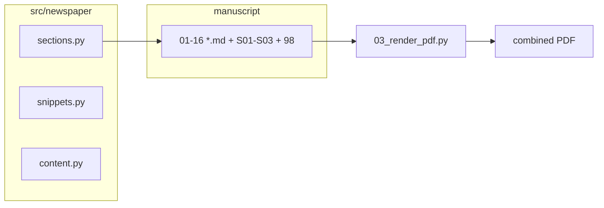

# Traditional Newspaper (exemplar)

Demonstrates a **16-slice manuscript** (one Markdown file per folio) rendered through the standard pipeline into a **tabloid-sized, multicolumn** PDF. Layout constants and LaTeX-oriented helpers live in `src/newspaper/`; the masthead is generated deterministically in Stage 02. **Supplemental** (`S01_layout_and_pipeline.md`, `S02_typography_and_measure.md`, `S03_validation_and_outputs.md`) and **glossary** (`98_newspaper_and_pipeline_terms.md`) append after the sixteen main folios, per `discover_manuscript_files` ordering.

## Caveat: folios vs sheet count

Each slice becomes a **new page** after the previous in the combined PDF (plus the template title front matter). The **total PDF page count** is not fixed at sixteen physical sheets—it depends on title pages and how much copy fits in each `multicols` block.

## Pipeline flow



## Commands

```bash
uv run python scripts/01_run_tests.py --project traditional_newspaper
uv run python scripts/02_run_analysis.py --project traditional_newspaper
uv run python scripts/03_render_pdf.py --project traditional_newspaper
```

## Layout

| Item | Location |
|------|-----------|
| Tabloid geometry + `multicol` | `manuscript/preamble.md` |
| Section order (16 core folios) | `src/newspaper/sections.py` (`PAGE_SLICES`, `SLICE_BY_STEM`) |
| Optional tracked slices | `MANUSCRIPT_OPTIONAL_FILENAMES` (supplemental + glossary) |
| Masthead PNG | `scripts/generate_masthead.py` → `output/figures/masthead.png` (`NEWSPAPER_TITLE` / `NEWSPAPER_TAGLINE` env optional) |
| Manuscript stats JSON | `scripts/report_manuscript_stats.py` → `output/data/manuscript_stats.json` |
| B&W word-count chart PNG | `scripts/visualization_wordcount_bw.py` → `output/figures/wordcount_bars_bw.png` (after stats JSON) |
| Section desk banners | `scripts/generate_section_banners.py` → `output/figures/section_banner_*.png` (19 stems) |

## Documentation

- [Project docs hub](docs/README.md) — agent instructions, architecture, rendering, syntax

## See also

- [New project setup](../../docs/guides/new-project-setup.md)
- [Manuscript README](manuscript/README.md)
- [Documentation index](../../docs/documentation-index.md) (Usage Guides)
