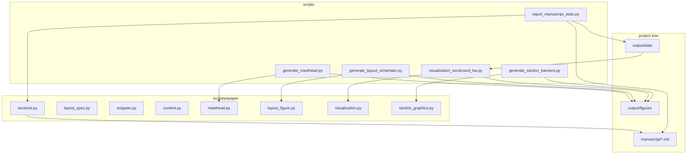

# Architecture — `traditional_newspaper`

## Overview

The exemplar ties a **canonical slice list** in Python to markdown folios, generates PNG figures (masthead, layout schematic, B&W word-count chart) plus stats JSON in analysis, and renders a combined tabloid PDF through the root pipeline.

## `src/newspaper/`

| Module | Responsibility |
|--------|----------------|
| `sections.py` | `PAGE_SLICES` (16 core stems), `MANUSCRIPT_OPTIONAL_FILENAMES`, `all_tracked_manuscript_basenames()`, inventory validation |
| `layout_spec.py` | `NewspaperLayout`, `LAYOUT`, LaTeX geometry helpers, column count rules |
| `snippets.py` | LaTeX fragments for headlines, rules, multicols wrappers (used conceptually by manuscript authors; strings are maintained in code for tests) |
| `content.py` | Deterministic filler sentences and paragraphs |
| `masthead.py` | `render_masthead_png` |
| `layout_figure.py` | `render_layout_schematic_png` |
| `visualization.py` | Monochrome matplotlib style + word-count bar chart from stats JSON |
| `section_graphics.py` | Wide B\&W section header strips (`render_section_banner_bw`) |
| `__init__.py` | Re-exports public API |

## Scripts and stdout contract

Each analysis script resolves `PROJECT_DIR` from `PROJECT_DIR` env or `scripts/`’s parent, ensures `repo_root` and `src/` are on `sys.path`, then:

| Script | Writes | Stdout |
|--------|--------|--------|
| `generate_masthead.py` | `output/figures/masthead.png` | Absolute path to PNG |
| `generate_layout_schematic.py` | `output/figures/layout_schematic.png` | Absolute path to PNG |
| `generate_section_banners.py` | `output/figures/section_banner_*.png` (19 paths) | One absolute path printed per banner |
| `report_manuscript_stats.py` | `output/data/manuscript_stats.json` | Absolute path to JSON |
| `visualization_wordcount_bw.py` | `output/figures/wordcount_bars_bw.png` | Absolute path to PNG (requires stats JSON on disk) |

Optional env: `NEWSPAPER_TITLE`, `NEWSPAPER_TAGLINE` (masthead only).

## Pipeline integration

- Discovery: project must live under `projects/` with `src/`, `tests/`, and `manuscript/config.yaml` (template discovery rules).
- Rendering: `infrastructure.rendering` discovers manuscript files and inserts page breaks between combined markdown; details in [rendering_pipeline.md](rendering_pipeline.md).

## See also

- [../src/newspaper/AGENTS.md](../src/newspaper/AGENTS.md) — public API table
- [../scripts/AGENTS.md](../scripts/AGENTS.md) — per-script notes
