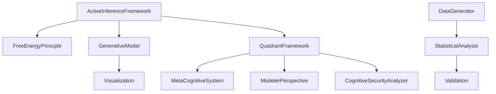

# PAI.md - Active Inference Meta-Pragmatic Context

## Purpose

This project explores **Active Inference** principles applied to meta-pragmatic analysis --- how agents reason about and optimize their own reasoning processes. It implements a 2x2 quadrant model (Data/Meta-Data x Cognitive/Meta-Cognitive) alongside core Active Inference computations (EFE, generative models, meta-cognition). The manuscript comprises 13 sections with 52 bibliography entries spanning Active Inference, meta-cognition, predictive processing, AI safety, cognitive security, and information theory.

## Architecture Overview



### Source Modules (11 modules in 4 subpackages + utils)

| Subpackage | Module | Purpose |
| ---------- | ------ | ------- |
| `core/` | `active_inference.py` | Core EFE calculations and policy selection |
| `core/` | `free_energy_principle.py` | FEP system boundary analysis and structure preservation |
| `core/` | `generative_models.py` | A, B, C, D matrix implementations |
| `framework/` | `quadrant_framework.py` | 2×2 matrix cognitive process analysis |
| `framework/` | `meta_cognition.py` | Confidence assessment and adaptive control |
| `framework/` | `modeler_perspective.py` | Dual role analysis (architect and subject) |
| `framework/` | `cognitive_security.py` | Attack surface analysis, anomaly detection, framework integrity |
| `analysis/` | `data_generator.py` | Synthetic data generation for demonstrations |
| `analysis/` | `statistical_analysis.py` | Statistical testing, regression, hypothesis validation |
| `analysis/` | `validation.py` | Framework validation suite |
| `visualization/` | `visualization.py` | Publication-quality plotting |

## PAI Integration Points

### Skill Compatibility

- **Meta-Cognition**: Frameworks for PAI self-monitoring
- **Free Energy Minimization**: Decision-making optimization
- **Belief Updating**: Bayesian inference patterns

### Key Concepts for PAI Use

| Concept | PAI Application |
| ------- | --------------- |
| Free Energy | Prediction error minimization in agent behavior |
| Active Inference | Action selection through expected free energy |
| Meta-Pragmatics | Reasoning about communication effectiveness |
| Quadrant Model | Cognitive/Metacognitive × Data/Metadata taxonomy |

### Theoretical Framework

The quadrant model provides structure for PAI agent cognition:

- **Q1 (Data, Cognitive)**: Direct perception and action
- **Q2 (Metadata, Cognitive)**: Context-aware processing
- **Q3 (Data, Metacognitive)**: Self-monitoring of processes
- **Q4 (Metadata, Metacognitive)**: Meta-level optimization

## Build and Test

```bash
# Install
uv sync  # or: pip install -e .

# Run tests (~17 test files, 95%+ coverage target)
uv run pytest tests/ --tb=short -q

# Run with coverage
uv run pytest tests/ --cov=src --cov-report=term
```

## Dependencies

| Package | Use |
|---------|-----|
| numpy ≥1.24 | Numerical computations and matrix operations |
| scipy ≥1.10 | Statistical functions and optimization |
| matplotlib ≥3.7 | Visualization and plotting |
| pandas ≥2.0 | Data organization |
| psutil ≥5.9 | System resource monitoring |
| pytest ≥7.4 | Testing framework (dev) |
| pytest-cov ≥4.1 | Coverage reporting (dev) |

## Documentation (4 files in doc/)

| Document | Description |
|----------|-------------|
| `doc/architecture.md` | System architecture, module dependencies, data flow, design decisions |
| `doc/api_reference.md` | Comprehensive API reference with class/method signatures |
| `doc/theoretical_primer.md` | Accessible introduction to Active Inference and the 2x2 framework |
| `doc/quickstart.md` | 5-minute getting-started guide |

## Agent Guidelines

- **Theoretical Focus**: This project emphasizes formal frameworks
- **Mathematical Rigor**: Equations and proofs required
- **No Mocks Policy**: All tests use real data and computations
- **Cross-Reference**: Link to empirical implementations elsewhere
- **Publication Ready**: Academic manuscript format
