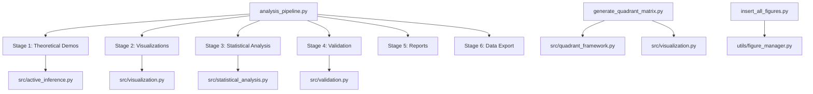

# scripts/ - Analysis Scripts

Thin orchestrators that coordinate Active Inference analysis workflows.

## Quick Start

```bash
# Run analysis pipeline
python3 scripts/analysis_pipeline.py

# Generate quadrant matrix visualizations
python3 scripts/generate_quadrant_matrix.py

# Generate Active Inference concept demonstrations
python3 scripts/generate_active_inference_concepts.py

# View generated outputs
ls -la ../output/figures/
```

## Key Features

- **analysis pipeline** (6-stage workflow)
- **Automated figure generation** (quadrant matrices, concept visualizations)
- **Statistical analysis** (validation and verification)
- **Manuscript integration** (figure registration and cross-referencing)

## Common Commands

### Run Analysis Pipeline
```bash
python3 analysis_pipeline.py
```
Executes 6-stage analysis workflow.

### Generate Specific Visualizations
```bash
python3 generate_quadrant_matrix.py          # 2×2 quadrant matrices
python3 generate_active_inference_concepts.py # Core AI concepts
python3 generate_fep_visualizations.py         # Free Energy Principle
python3 generate_quadrant_examples.py          # Quadrant demonstrations
```

### Insert Figures into Manuscript
```bash
python3 insert_all_figures.py
```
Registers and inserts all generated figures into manuscript sections.

## Architecture



## More Information

See [AGENTS.md](AGENTS.md) for technical documentation.
