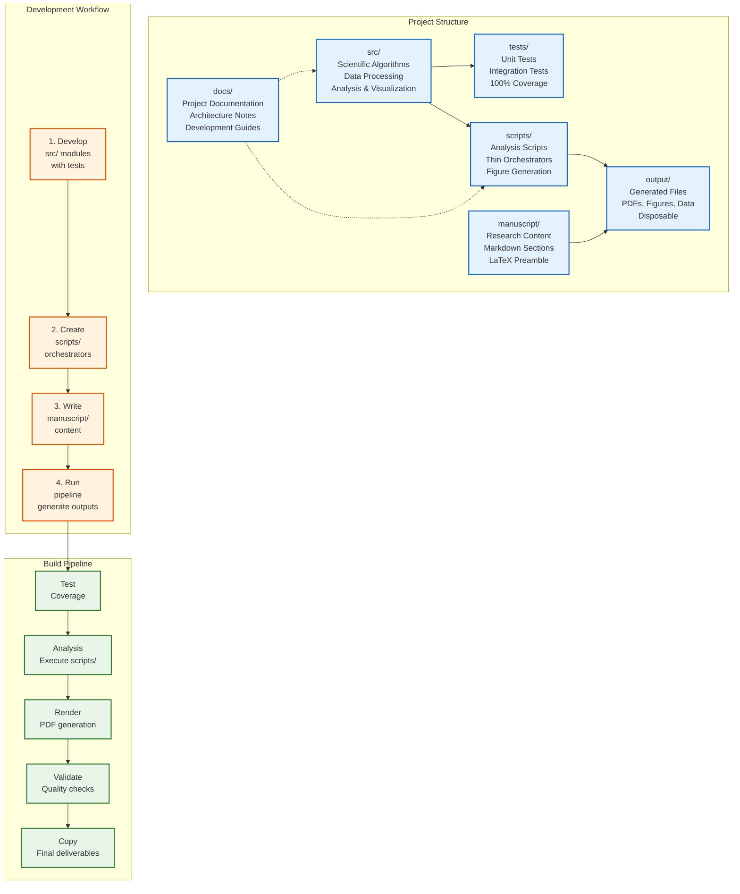

# Ento-Linguistic Research Project, self-contained research project examining how language shapes scientific understanding in entomology through systematic analysis of terminology networks across six Ento-Linguistic domains

## Research Overview

This project investigates the entanglement of speech and thought in entomological research by analyzing how scientific terminology creates conceptual frameworks, framing assumptions, and communication patterns that influence research practice.

**Six Core Domains:**

1. **Unit of Individuality** - Ant vs. colony vs. superorganism
2. **Behavior and Identity** - Foraging behavior vs. forager identity
3. **Power & Labor** - Caste, queen, worker terminology structures
4. **Sex & Reproduction** - Gender concepts in ant reproduction
5. **Kin & Relatedness** - Kinship terminology in social insects
6. **Economics** - Market logic in colony resource allocation

## Project Structure

```
./
├── src/                    # Ento-Linguistic analysis algorithms
├── tests/                  # Test suite (785 tests)
├── scripts/                # Analysis pipelines and workflows
├── manuscript/             # Research manuscript on language in entomology
├── docs/                   # Analysis documentation and guidelines
└── output/                 # Generated analyses, figures, and reports
```

## Quick Start

### Install Dependencies

```bash
pip install -e .
# or with uv:
uv sync
```

### Run Tests

```bash
pytest tests/ --cov=src
```

### Run Analysis Scripts

```bash
python3 scripts/analysis_pipeline.py
```

### Build Manuscript

```bash
cd ..
python3 scripts/03_render_pdf.py
```

## Recent Improvements (v2.4)

- **Test Suite**: 785 tests passing with HTTP testing using pytest-httpserver
- **Performance Optimizations**: O(n) complexity improvements in term extraction algorithms
- **Input Validation**: validation across all core methods with informative error messages
- **Robust Error Handling**: Graceful degradation in processing and utility components
- **URL Encoding**: Proper encoding for PubMed API queries preventing failures
- **Standalone Compatibility**: Scripts work independently
- **Documentation Enhancement**: Improved API documentation with practical examples
- **Manuscript Clarity**: explanations of technical concepts and quantitative results
- **Additional Test Coverage**: tests for validation framework methods improving coverage
- **Advanced Statistical Analysis**: Added statistical significance testing, co-occurrence analysis, ambiguity quantification
- **Domain Analysis**: Quantitative metrics, confidence scores, term frequency distributions
- **Sophisticated Concept Mapping**: Similarity scoring, centrality analysis, relationship strength quantification
- **Discourse Analysis**: Rhetorical pattern metrics, argumentative structure scoring, conceptual shift tracking
- **Advanced Visualization Suite**: Interactive networks, temporal evolution plots, heatmaps, statistical summaries
- **Statistical Visualization Module**: Significance testing visualizations, correlation matrices, distribution comparisons
- **Cross-Domain Analysis**: Term overlap detection, domain bridging analysis, comparative metrics
- **Bug Fixes**: Resolved critical script errors, import issues, and API mismatches

## Refactor & Extension Quickstart

- Read `docs/refactor_playbook.md` for the safe-change checklist and dependency hotspots.
- Use script CLIs with `--dry-run` to verify wiring (`scripts/analysis_pipeline.py`, `scripts/generate_scientific_figures.py`).
- Run `scripts/manuscript_preflight.py --strict` before rendering PDFs to catch missing assets.
- Add new logic in `src/`, keep `scripts/` thin, and extend tests alongside changes.

## Scientific Contributions

**Ento-Linguistic Analysis Framework:**

- **Six-domain taxonomy** for analyzing terminology in entomological research
- **Mixed-methodology approach** combining computational text analysis with theoretical discourse examination
- **Terminology network analysis** revealing structural patterns in scientific language
- **Domain-specific insights** into how language shapes scientific understanding

**Key Domains Analyzed:**

1. **Unit of Individuality** - Biological vs. social individuality concepts
2. **Behavior and Identity** - How behavioral descriptions create categorical identities
3. **Power & Labor** - Hierarchical terminology in social insect research
4. **Sex & Reproduction** - Gender concepts applied to insect reproductive biology
5. **Kin & Relatedness** - Kinship terminology in social insect societies
6. **Economics** - Market logic in colony resource allocation

## Reproducibility & Data Availability

**Reproducible Analysis:**

- All computational methods include seeded randomness for deterministic results
- codebase with test suite (785 tests)
- Detailed documentation of algorithms and methodological choices
- Version-controlled environment specifications

**Data Sources:**

- PubMed API integration for real-time literature access
- arXiv API for preprint literature
- Cached search results to minimize redundant API calls
- Structured corpus management with serialization support

**Code Availability:**

- Python implementation with type hints
- Modular architecture supporting extension and reuse
- error handling and input validation
- Cross-platform compatibility (macOS, Linux, Windows)

## Features

- **Test coverage** - test suite with data testing (785 tests passing)
- **Modular design** - Clean separation of concerns with 15+ specialized modules including new statistical analysis
- **HTTP testing** - Uses pytest-httpserver for genuine PubMed/arXiv API interactions (no mocks)
- **Performance optimized** - Efficient algorithms with O(n) complexity improvements and single-pass processing
- **Input validation** - Robust error handling with input validation across all methods
- **Reproducible** - Deterministic computation with seeded randomness
- **Documented** - documentation with detailed API references and examples
- **Robust error handling** - Graceful degradation and informative error messages with actionable suggestions
- **Portable** - project in one folder, copy to use elsewhere
- **Advanced Statistical Analysis** - Statistical significance testing, co-occurrence analysis, ambiguity quantification
- **Domain Analysis** - Quantitative metrics, confidence scores, term frequency distributions, cross-domain overlap
- **Sophisticated Concept Mapping** - Similarity scoring, centrality analysis, relationship strength quantification, concept clustering
- **Discourse Analysis** - Rhetorical pattern metrics, argumentative structure scoring, conceptual shift tracking, framing effects
- **Advanced Visualization Suite** - Interactive 3D networks, temporal evolution plots, domain overlap heatmaps, statistical dashboards
- **Statistical Visualization Module** - Hypothesis testing visualizations, correlation matrices, effect size plots, confidence intervals

## Project Architecture



## Quick Usage Examples

### Basic Term Extraction

```python
from src.term_extraction import TerminologyExtractor

# Extract terms from entomological texts
extractor = TerminologyExtractor()
texts = [
    "Ant colonies exhibit complex social behavior with division of labor.",
    "The queen ant lays eggs while worker ants forage for food.",
    "Eusocial insects demonstrate sophisticated communication patterns."
]

terms = extractor.extract_terms(texts, min_frequency=2)
for term_name, term_obj in terms.items():
    print(f"Term: {term_name}, Frequency: {term_obj.frequency}, Domains: {term_obj.domains}")
```

### Literature Mining

```python
from src.literature_mining import PubMedMiner, LiteratureCorpus

# Search PubMed for entomological research
miner = PubMedMiner()
pmids = miner.search("ant colony behavior", max_results=50)

# Fetch publication details
publications = miner.fetch_publications(pmids[:5])  # Get first 5
corpus = LiteratureCorpus(publications)

# Analyze the corpus
stats = corpus.get_statistics()
print(f"Corpus contains {stats['total_publications']} publications")
```

### Domain Analysis

```python
from src.domain_analysis import DomainAnalyzer
from src.term_extraction import TerminologyExtractor

# Extract terms and analyze domains
extractor = TerminologyExtractor()
terms = extractor.extract_terms(texts, min_frequency=2)

analyzer = DomainAnalyzer()
domain_analyses = analyzer.analyze_all_domains(terms, texts)

for domain_name, analysis in domain_analyses.items():
    print(f"Domain: {domain_name}")
    print(f"Key terms: {analysis.key_terms[:3]}")
    print(f"Ambiguities found: {len(analysis.ambiguities)}")
```

## Project Layout

### src/

Scientific code implementing algorithms, data processing, analysis, and visualization.

- `term_extraction.py` - Terminology extraction with domain classification
- `literature_mining.py` - PubMed/arXiv search and corpus management
- `domain_analysis.py` - Six-domain Ento-Linguistic analysis
- `discourse_analysis.py` - Rhetorical pattern and framing analysis
- `conceptual_mapping.py` - Concept network construction and analysis
- `concept_visualization.py` - Network visualization (requires networkx)
- ... and more specialized modules

### tests/

test suite covering src/ modules.

- data testing (no mocks)
- Integration tests
- Performance validation
- 785 tests passing

### scripts/

Thin orchestrators that use src/ modules.

- Import from src/
- Orchestrate workflows
- Generate outputs

### manuscript/

Research manuscript in Markdown format.

- Individual sections
- References and bibliography
- Configuration files

## Development

### Adding Features

1. **Implement in src/**
   - Add module to `src/`
   - Add tests
   - Ensure coverage requirements met

2. **Use in scripts/**
   - Import from src/
   - Orchestrate analysis
   - Generate figures/tables

3. **Document in manuscript/**
   - Update manuscript sections
   - Add figures and results
   - Update configuration

### Running Quality Checks

```bash
# Full test suite with coverage
pytest tests/ --cov=src --cov-report=html

# View coverage report
open htmlcov/index.html
```

### Quality Validation

- Preflight: `python3 scripts/manuscript_preflight.py --strict`
- Quality report: `python3 scripts/quality_report.py`
- Markdown/PDF: Use local validation utilities
- Outputs: Use local integrity checking utilities

## Deployment

### Standalone Use

Copy this project to any location to use independently:

```bash
cp -r . /path/to/my_research
cd /path/to/my_research
pytest tests/ --cov=src
```

### Standalone Operation

This project is designed to work as a standalone research project:

```bash
cd /path/to/project
python3 scripts/03_render_pdf.py  # Builds manuscript PDFs
```

## Dependencies

- Python 3.10+
- NumPy, SciPy, Matplotlib, Pandas
- pytest, pytest-cov

See `pyproject.toml` for dependencies.

## Documentation

- `AGENTS.md` - Architecture and module documentation
- `docs/` - Additional project-specific documentation
- Docstrings in source code

## See Also

- [`AGENTS.md`](AGENTS.md) - project documentation
- [`src/README.md`](src/README.md) - Scientific code overview
- [`scripts/README.md`](scripts/README.md) - Analysis scripts guide
- [`tests/README.md`](tests/README.md) - Test suite overview
- [`manuscript/README.md`](manuscript/README.md) - Manuscript guide
- [`../../AGENTS.md`](../../AGENTS.md) - Template system documentation
- Local utilities in `src/utils/` - Local utility modules

## License

See LICENSE file in project root.
