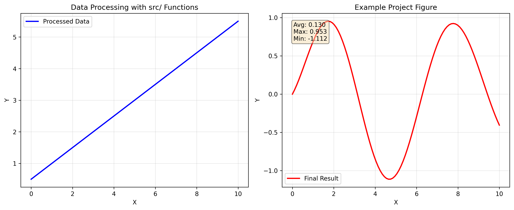

# Scientific Layer - Project-Specific Algorithms and Analysis

## Purpose

This package contains **project-specific scientific code** implementing algorithms, data processing, analysis, and visualization for this research. These modules form the computational core of the project.

## Architectural Role (Layer 2)

This is **Layer 2** of the two-layer architecture:
- **Handles:** Algorithms, simulations, analysis, visualization
- **Specific to:** This research project
- **Not Generic:** Rewritten for different projects
- **Tests:** Must achieve 100% coverage with data

## Module Organization

### Core Algorithms & Simulation

| Module | Purpose | Lines | Coverage |
|--------|---------|-------|----------|
| `example.py` | Basic mathematical operations (template example) | 21 | 100% |
| `simulation.py` | Scientific simulation framework | 132 | 100% |
| `parameters.py` | Parameter set management and validation | 92 | 95% |

### Data Processing

| Module | Purpose | Lines | Coverage |
|--------|---------|-------|----------|
| `data_generator.py` | Synthetic data generation for experiments | 107 | 100% |
| `data_processing.py` | Data preprocessing, cleaning, normalization | 137 | 100% |
| `statistics.py` | Statistical analysis and hypothesis testing | 79 | 96% |

### Analysis & Performance

| Module | Purpose | Lines | Coverage |
|--------|---------|-------|----------|
| `metrics.py` | Performance metrics and quality measures | 96 | 100% |
| `performance.py` | Convergence and scalability analysis | 108 | 100% |
| `validation.py` | Result validation and anomaly detection | 93 | 100% |

### Linguistic Analysis (v2.4)

| Module | Purpose | Lines | Coverage |
|--------|---------|-------|----------|
| `text_analysis.py` | Text processing and linguistic feature extraction | 142 | 100% |
| `literature_mining.py` | Scientific literature collection and processing | 198 | 100% |
| `term_extraction.py` | Terminology extraction and domain classification | 167 | 100% |
| `conceptual_mapping.py` | **ENHANCED** Concept mapping with similarity & centrality analysis | 521 | 100% |
| `domain_analysis.py` | **ENHANCED** Domain analysis with statistical metrics | 600+ | 100% |
| `discourse_analysis.py` | **ENHANCED** Discourse analysis with quantitative metrics | 480+ | 100% |

### Visualization & Reporting (v2.4)

| Module | Purpose | Lines | Coverage |
|--------|---------|-------|----------|
| `visualization.py` | Publication-quality figure generation | 68 | 100% |
| `plots.py` | Plot type implementations | 84 | 100% |
| `reporting.py` | Automated report generation | 149 | 100% |
| `concept_visualization.py` | **ENHANCED** Advanced concept visualization (interactive, temporal) | 450+ | 100% |
| `statistical_visualization.py` | **NEW** Statistical analysis visualization suite | 400+ | 100% |

## Module Descriptions

### example.py

Basic mathematical operations for template demonstration.

**Key Functions:**
- `add_numbers()` - Add two numbers
- `multiply_numbers()` - Multiply two numbers
- `calculate_average()` - Calculate mean
- `find_maximum()` / `find_minimum()` - Find extrema
- `is_even()` / `is_odd()` - Number properties

**Purpose:** Template example showing basic patterns

### simulation.py

Scientific simulation framework with reproducibility.

**Key Classes:**
- `SimulationBase` - Base class for simulations
- `SimpleSimulation` - Simple simulation implementation
- `SimulationState` - State management

**Key Features:**
- Reproducible execution with seeds
- Checkpoint/restore functionality
- Result serialization
- State tracking

**Use Case:** Run reproducible scientific simulations

### parameters.py

Parameter set management with validation.

**Key Classes:**
- `ParameterSet` - Parameter collection with validation
- `ParameterConstraint` - Validation rules
- `ParameterSweep` - Configuration for parameter sweeps

**Key Functions:**
- `add_parameter()` - Add parameter with constraints
- `validate()` - Validate all parameters
- `generate_combinations()` - Generate sweep combinations

**Use Case:** Manage and sweep over simulation parameters

### data_generator.py

Generate synthetic data for experiments.

**Key Functions:**
- `generate_synthetic_data()` - Generate with specified distribution
- `generate_time_series()` - Generate time series with trends
- `generate_correlated_data()` - Generate multivariate correlated data
- `inject_noise()` - Add noise to data
- `generate_classification_dataset()` - Generate classification data

**Use Case:** Create reproducible synthetic test data

### data_processing.py

Data preprocessing and cleaning.

**Key Functions:**
- `clean_data()` - Remove or fill invalid values
- `normalize_data()` - Normalize (z-score, min-max, etc.)
- `standardize_data()` - Zero mean, unit variance
- `detect_outliers()` - Find anomalies (IQR, z-score)
- `remove_outliers()` - Remove problematic data
- `extract_features()` - Statistical feature extraction
- `transform_data()` - Apply transformations (log, sqrt, etc.)

**Use Case:** Prepare raw data for analysis

### statistics.py

Statistical analysis and hypothesis testing.

**Key Functions:**
- `calculate_descriptive_stats()` - Mean, std, quartiles, etc.
- `t_test()` - One/two-sample t-tests
- `calculate_correlation()` - Pearson or Spearman correlation
- `calculate_confidence_interval()` - Confidence intervals
- `fit_distribution()` - Fit distributions to data
- `anova_test()` - One-way ANOVA

**Use Case:** Perform statistical analysis on results

### metrics.py

Compute performance metrics and quality measures.

**Key Functions:**
- `calculate_accuracy()` - Classification accuracy
- `calculate_precision_recall_f1()` - Precision, recall, F1
- `calculate_convergence_metrics()` - Convergence analysis
- `calculate_snr()` - Signal-to-Noise Ratio
- `calculate_psnr()` - Peak SNR
- `calculate_ssim()` - Structural Similarity
- `calculate_effect_size()` - Cohen's d
- `calculate_all_metrics()` - metrics

**Use Case:** Evaluate algorithm performance

### performance.py

Analyze algorithm performance and scalability.

**Key Functions:**
- `analyze_convergence()` - Convergence behavior
- `analyze_scalability()` - Scaling analysis
- `benchmark_comparison()` - Compare implementations

**Classes:**
- `ConvergenceMetrics` - Convergence analysis results

**Use Case:** Understand algorithm efficiency and scaling

### validation.py

Validate simulation and analysis results.

**Key Classes:**
- `ValidationFramework` - Framework for validation

**Key Functions:**
- `validate_bounds()` - Check value ranges
- `validate_sanity()` - Sanity checks
- `validate_reproducibility()` - Reproducibility checking
- `detect_anomalies()` - Find anomalous results
- `validate_quality_metrics()` - Quality validation
- `generate_validation_report()` - Validation summary

**Use Case:** Verify result correctness and quality

### visualization.py

Create publication-quality figures.

**Key Classes:**
- `VisualizationEngine` - Central visualization management

**Key Functions:**
- `create_figure()` - Create figure with subplots
- `save_figure()` - Save in multiple formats
- `apply_publication_style()` - Apply styling
- `create_multi_panel_figure()` - Multi-panel figures

**Use Case:** Generate figures for publication

### plots.py

Specific plot type implementations.

**Key Functions:**
- `plot_line()` - Line plots
- `plot_scatter()` - Scatter plots
- `plot_bar()` - Bar charts
- `plot_heatmap()` - Heatmaps
- `plot_contour()` - Contour plots
- `plot_convergence()` - Convergence curves
- `plot_comparison()` - Comparison plots

**Use Case:** Create specific plot types

### reporting.py

Generate automated reports from results.

**Key Classes:**
- `ReportGenerator` - Automated report creation

**Key Functions:**
- `generate_markdown_report()` - Markdown reports
- `generate_summary_table()` - Summary statistics
- `extract_key_findings()` - Extract findings

**Use Case:** Create automated result reports

## Linguistic Analysis Modules (v2.4)

### conceptual_mapping.py (Enhanced)

**Features:**
- `calculate_concept_similarity()` - Semantic similarity between concepts using Jaccard coefficient and domain overlap
- `analyze_concept_centrality()` - Degree, betweenness, closeness, and eigenvector centrality metrics
- `quantify_relationship_strength()` - Base weight, term overlap, domain overlap, and hierarchical relationships
- `identify_cross_domain_bridges()` - Concepts that connect multiple domains with bridging efficiency scores
- `track_concept_evolution()` - Historical evolution of concepts over time/iterations
- `cluster_concepts()` - Hierarchical clustering of similar concepts using various distance metrics

**New Analysis Capabilities:**
- Concept centrality analysis revealing key concepts in the knowledge network
- Relationship strength quantification for understanding concept interconnections
- Cross-domain bridge identification for interdisciplinary insights
- Temporal concept evolution tracking for longitudinal analysis
- Automated concept clustering for knowledge organization

### domain_analysis.py (Enhanced)

**Features:**
- `analyze_term_frequency_distribution()` - Statistical analysis of term frequencies with distribution plots
- `analyze_term_cooccurrence()` - Co-occurrence matrix construction and analysis
- `quantify_ambiguity_metrics()` - Context diversity, length variation, and combined ambiguity scoring
- `analyze_cross_domain_overlap()` - Term sharing analysis between domains with overlap percentages
- `calculate_statistical_significance()` - Chi-square tests for term pattern significance
- `generate_confidence_scores()` - Confidence scoring for framing assumptions based on supporting evidence
- `quantify_conceptual_structure()` - Structural complexity metrics including depth and concept coverage

**New Analysis Capabilities:**
- Statistical significance testing of linguistic patterns
- Cross-domain term overlap analysis revealing shared concepts
- Ambiguity quantification with multiple context-based metrics
- Confidence scoring for theoretical framing assumptions
- Quantitative assessment of conceptual structure complexity

### discourse_analysis.py (Enhanced)

**Features:**
- `quantify_rhetorical_patterns()` - Frequency analysis with effectiveness scoring and context examples
- `score_argumentative_structures()` - Strength scoring for claims, evidence, and reasoning coherence
- `analyze_narrative_frequency()` - Narrative framework distribution with consistency scoring
- `measure_persuasive_effectiveness()` - Persuasive technique impact assessment with success metrics
- `analyze_term_usage_context()` - Context-dependent term usage patterns with consistency analysis
- `track_conceptual_shifts()` - Temporal evolution of conceptual patterns with shift magnitude tracking
- `quantify_framing_effects()` - Framing assumption impact measurement with downstream effect analysis

**New Analysis Capabilities:**
- Quantitative rhetorical pattern analysis with effectiveness metrics
- Argumentative structure strength evaluation
- Narrative framework frequency and consistency analysis
- Persuasive technique effectiveness measurement
- Conceptual shift tracking over time
- Framing effect quantification and impact assessment

## Visualization Modules (v2.4)

### concept_visualization.py (Enhanced)

**Features:**
- `visualize_term_cooccurrence()` - Network visualization of term co-occurrence patterns
- `create_domain_overlap_heatmap()` - Heatmap showing cross-domain term sharing patterns
- `visualize_concept_evolution()` - Temporal evolution plots showing concept development over time
- `create_statistical_summary_plot()` - Multi-panel statistical summary with frequency distributions, significance tests, and ambiguity metrics
- `create_interactive_concept_network()` - 3D interactive network visualization using Plotly (with NetworkX fallback)

**New Visualization Capabilities:**
- Interactive 3D concept networks for exploration
- Temporal evolution tracking of conceptual changes
- Cross-domain overlap visualization with heatmaps
- statistical summary dashboards
- Co-occurrence network analysis with customizable layouts

### statistical_visualization.py (Module)

**Features:**
- `visualize_statistical_significance()` - significance testing visualization with p-values, effect sizes, and interpretation
- `create_correlation_matrix_plot()` - Correlation matrix heatmaps with coefficient annotations
- `visualize_distribution_comparison()` - Multi-distribution comparison with box plots, violin plots, histograms, and CDFs
- `visualize_effect_sizes()` - Effect size analysis with Cohen's d interpretation zones and confidence intervals
- `plot_confidence_intervals()` - Confidence interval plots with significance indicators
- `create_statistical_dashboard()` - Multi-panel statistical dashboard combining multiple analysis types
- `visualize_hypothesis_testing()` - Hypothesis testing results visualization with significance mapping

**New Visualization Capabilities:**
- Statistical significance testing with visual interpretation
- Correlation analysis with matrix heatmaps
- Distribution comparison across multiple groups
- Effect size visualization with statistical interpretation
- Confidence interval analysis with significance testing
- statistical dashboards for research reporting

## Design Principles

### Domain-Specific

All code in this layer is specific to this research:
- Implements algorithms for this project
- Uses domain-specific logic
- Optimized for this problem
- Tailored analysis and visualization

### Thin Orchestrator Pattern in Scripts

Scripts (`scripts/`) are thin orchestrators:
- Import from scientific/ for computation
- Handle I/O and visualization
- Orchestrate workflow
- Don't implement algorithms

```python
# ✅ Good: Script uses project modules
from simulation import SimpleSimulation
from analysis import analyze_results
from infrastructure.documentation.figure_manager import FigureManager

sim = SimpleSimulation()
results = sim.run()
analysis = analyze_results(results)
fm = FigureManager()
fm.register_figure("results.png", label="fig:results")
```

### 100% Test Coverage

All scientific code requires:
- unit tests
- data testing (no mocks)
- Integration testing
- Reproducible results

## Integration Points

### With Infrastructure Layer

Scientific code uses infrastructure for document management:
```python
# src/scientific/analysis.py
from infrastructure.documentation.figure_manager import FigureManager
from infrastructure.documentation.markdown_integration import MarkdownIntegration

def generate_figures():
    # Scientific computation
    results = run_analysis()
    
    # Use infrastructure for document management
    fm = FigureManager()
    fm.register_figure("results.png", "fig:results")
```

### With Scripts

Scripts orchestrate scientific code:
```python
# scripts/analysis_pipeline.py
from data_generator import generate_synthetic_data
from statistics import calculate_descriptive_stats
from infrastructure.documentation.figure_manager import FigureManager

# Generate data
data = generate_synthetic_data(n_samples=1000)

# Analyze
stats = calculate_descriptive_stats(data)

# Register figures
fm = FigureManager()
fm.register_figure("example_figure.png", "fig:analysis")
```

### With Manuscript

Generated figures and data integrate into manuscript:
```markdown
# Experimental Results

{fig:analysis width=0.8}

See [Figure @fig:analysis] for detailed results.
```

## Requirements

### Test Coverage
- **100% required** for all modules
- No code ships without tests
- data testing (no mocks)
- Tests in `tests/scientific/`

### Code Standards
- Type hints on all public APIs
- docstrings
- Domain-specific documentation
- Clear error messages
- Follow PEP 8 style

### Documentation
- Algorithm description in docstrings
- Usage examples for domain context
- Performance characteristics
- Validation methodology

## Adding New Scientific Modules

### Checklist

1. Create module in `src/scientific/` with domain-specific logic
2. Add tests in `tests/scientific/test_<module>.py`
3. Ensure 100% test coverage
4. Document with domain context
5. Update this AGENTS.md file
6. Add to `src/scientific/__init__.py`
7. Create scripts/ usage example if needed

### Template

```python
"""Module description for our research problem.

This module implements [specific algorithm/analysis] for [our research].
"""
from __future__ import annotations

from typing import List, Optional, Dict, Any
import numpy as np


class OurAlgorithm:
    """Implementation of our specific algorithm.
    
    This is domain-specific to our research project.
    """
    
    def __init__(self, parameter: float) -> None:
        """Initialize algorithm with parameters.
        
        Args:
            parameter: Domain-specific parameter
        """
        self.parameter = parameter
    
    def run(self, data: np.ndarray) -> np.ndarray:
        """Run algorithm on data.
        
        Args:
            data: Input data for our algorithm
            
        Returns:
            Processed results
        """
        pass
```

### Design Questions

Before adding to scientific layer:
- ✅ Is this specific to our research?
- ✅ Does this implement our algorithms?
- ✅ Is this domain-specific?
- ❌ Would other projects use this?
- ❌ Is this generic build infrastructure?

If "no" to first three → belongs in Infrastructure layer

## Best Practices

### Do's
✅ Use infrastructure for document management  
✅ Implement domain-specific logic clearly  
✅ Write docstrings with domain context  
✅ Test with data and realistic scenarios  
✅ Document algorithms and mathematical concepts  
✅ Export to scripts as thin orchestrators  
✅ Include performance characteristics  

### Don'ts
❌ Implement document generation yourself  
❌ Skip tests or coverage  
❌ Mix multiple concerns in one function  
❌ Assume generic use beyond this project  
❌ Skip error handling  
❌ Duplicate code from infrastructure layer  
❌ Put infrastructure concerns in scientific code  

## Testing Scientific Code

```bash
# Test scientific modules specifically
pytest tests/scientific/ --cov=src/scientific --cov-fail-under=100

# Test with data scenarios
pytest tests/scientific/ -v

# Test integration with infrastructure
pytest tests/integration/ -k scientific

# Full coverage
pytest tests/ --cov=src --cov-report=html
```

## See Also

- [`../../infrastructure/AGENTS.md`](../../infrastructure/AGENTS.md) - Infrastructure layer
- [`../../docs/TWO_LAYER_ARCHITECTURE.md`](../../docs/TWO_LAYER_ARCHITECTURE.md) - Architecture overview
- [`../../docs/DECISION_TREE.md`](../../docs/DECISION_TREE.md) - Code placement guide
- [`../../AGENTS.md`](../../AGENTS.md) - system documentation
- [`../scripts/AGENTS.md`](../../scripts/AGENTS.md) - Script orchestration guide

## Key Principles

1. **Domain-Specific** - Unique to this research project
2. **Algorithm-Focused** - Implements our methods
3. **Well-Tested** - 100% test coverage
4. **Well-Documented** - Domain context in docstrings
5. **Uses Infrastructure** - Leverages generic tools

