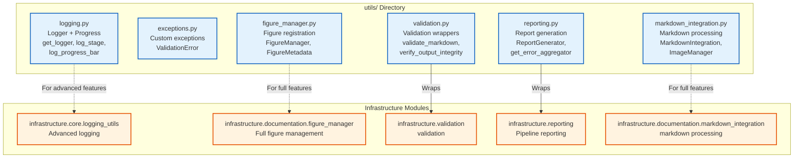

# utils/ - Project Utility Modules

Quick reference for project-specific utility modules in the Ento-Linguistic Research Project.

## Overview

The `utils/` directory provides lightweight utility modules for logging, exception handling, figure management, validation, reporting, and markdown integration. These utilities complement the generic infrastructure modules with project-specific functionality.

## Quick Start

```python
# Logging with progress tracking
from projects.ento_linguistics.src.utils.logging import get_logger, log_stage, log_progress_bar
logger = get_logger(__name__)
log_stage(1, 5, "Data Collection", logger)
log_progress_bar(50, 100, "Processing", logger)

# Figure Management
from projects.ento_linguistics.src.utils.figure_manager import FigureManager
fig_manager = FigureManager()
metadata = fig_manager.register_figure("plot.png", "Analysis results")

# Validation
from projects.ento_linguistics.src.utils.validation import validate_markdown
result = validate_markdown("manuscript/", strict=False)
```

## Module Structure



## Modules

### logging.py
- `get_logger(name: str) -> logging.Logger` - Get configured logger
- `log_substep(message: str, logger: Optional[Logger] = None)` - Log indented substep
- `log_progress_bar(current: int, total: int, task: str, logger: Optional[Logger] = None)` - Log progress bar
- `log_stage(stage_num: int, total_stages: int, stage_name: str, logger: Optional[Logger] = None)` - Log stage header

### exceptions.py
- `ValidationError` - Custom exception with context and suggestions

### figure_manager.py
- `FigureManager` - Register and manage figures
- `FigureMetadata` - Figure metadata dataclass

### validation.py
- `validate_markdown(markdown_path: str, strict: bool = False) -> Dict` - Validate markdown files
- `validate_figure_registry() -> Dict` - Validate figure registry
- `verify_output_integrity(output_path: Path) -> Dict` - Verify output integrity
- `validate_pdf_rendering(pdf_path: str) -> Dict` - Validate PDF rendering
- `IntegrityReport` - Integrity report dataclass

### reporting.py
- `get_error_aggregator() -> ErrorAggregator` - Get error aggregator
- `generate_pipeline_report(*args, **kwargs) -> Dict` - Generate pipeline report
- `save_pipeline_report(*args, **kwargs) -> List[Path]` - Save pipeline report
- `ReportGenerator` - Generate markdown reports from results

### markdown_integration.py
- `MarkdownIntegration` - Basic markdown processing (stub)
- `ImageManager` - Image registration (stub)

## Usage Examples

### Logging with Progress
```python
from projects.ento_linguistics.src.utils.logging import get_logger, log_stage, log_progress_bar

logger = get_logger(__name__)
log_stage(1, 5, "Data Collection", logger)
log_progress_bar(50, 100, "Processing documents", logger)
```

### Figure Registration
```python
from projects.ento_linguistics.src.utils.figure_manager import FigureManager

fig_manager = FigureManager()
metadata = fig_manager.register_figure(
    filename="domain_analysis.png",
    caption="Terminology network analysis",
    section="Results"
)
```

### Validation
```python
from projects.ento_linguistics.src.utils.validation import validate_markdown, verify_output_integrity
from pathlib import Path

# Validate markdown
result = validate_markdown("manuscript/", strict=False)
print(f"Status: {result['status']}, Issues: {result['summary']['total_issues']}")

# Verify output integrity
integrity = verify_output_integrity(Path("output/"))
```

### Reporting
```python
from projects.ento_linguistics.src.utils.reporting import get_error_aggregator, ReportGenerator

# Error aggregation
aggregator = get_error_aggregator()
aggregator.add_error("test_failure", "Test failed", stage="tests")

# Report generation
report_gen = ReportGenerator(output_dir="output/reports")
report_path = report_gen.generate_markdown_report(
    title="Analysis Results",
    results={"summary": {"total": 100}}
)
```

## Integration with Infrastructure

For advanced features, use infrastructure modules:
- **Logging**: `infrastructure.core.logging_utils` for advanced logging
- **Figures**: `infrastructure.documentation.figure_manager` for full figure management
- **Validation**: `infrastructure.validation` for validation tools
- **Reporting**: `infrastructure.reporting` for pipeline reporting
- **Markdown**: `infrastructure.documentation.markdown_integration` for markdown processing

## See Also

- [AGENTS.md](AGENTS.md) - technical documentation
- [../AGENTS.md](../AGENTS.md) - Project source documentation
- [../../../../infrastructure/core/AGENTS.md](../../../../infrastructure/core/AGENTS.md) - Infrastructure utilities
