# Small Prose Project - Quick Reference

Minimal prose-focused research project demonstrating manuscript capabilities.

## Quick Start

```bash
# Edit manuscript
vim manuscript/01_introduction.md

# Run tests
pytest tests/ -v

# Generate PDF
python3 ../../scripts/03_render_pdf.py
```

## Key Features

- **Academic prose** with mathematical notation
- **Publication workflow** (metadata extraction, citation generation, DOI validation)
- **Manuscript validation** (structure checking, cross-reference validation, standards compliance)
- **API documentation generation** (automated code documentation from source)
- **Publishing materials** (BibTeX/APA/MLA citations, submission checklists)
- **LaTeX equations** and derivations
- **Structured argumentation**

## Common Commands

### Edit Content
```bash
vim manuscript/01_introduction.md
vim manuscript/02_methodology.md
```

### Publishing Workflow
```bash
# Prepare publication materials
python3 scripts/prepare_publication.py

# Validate manuscript
python3 scripts/validate_manuscript.py

# Generate API documentation
python3 scripts/generate_api_docs.py
```

### Run Tests
```bash
pytest tests/ -v
```

### Generate Output
```bash
python3 ../../scripts/03_render_pdf.py
open ../../output/pdf/project_combined.pdf
```

## Architecture

```mermaid
graph TD
    A[manuscript/] --> B[Academic Writing]
    B --> C[Mathematical Content]
    B --> D[Structured Prose]

    E[scripts/] --> F[Publication Preparation]
    E --> G[Manuscript Validation]
    E --> H[API Documentation]

    F --> I[Citation Generation]
    F --> J[DOI Validation]
    F --> K[Publication Materials]

    G --> L[Structure Validation]
    G --> M[Cross-Reference Checks]
    G --> N[Standards Compliance]

    H --> O[Code Scanning]
    H --> P[Documentation Tables]
    H --> Q[Manuscript Integration]

    R[src/] --> S[Minimal Code]
    R --> T[Pipeline Compliance]

    U[tests/] --> V[Validation Tests]
    U --> W[Publishing Tests]
    U --> X[Documentation Tests]
    U --> Y[Coverage Requirements]
```



## .cursorrules Compliance

✅ **Fully compliant** with template development standards:

- **Testing**: 100% coverage, real data only, no mocks
- **Documentation**: Complete AGENTS.md + README.md in each directory
- **Type Safety**: Full type hints on all public APIs
- **Code Quality**: Black formatting, descriptive naming, proper imports
- **Error Handling**: Context preservation, informative messages
- **Logging**: Unified logging system throughout

## More Information

See [AGENTS.md](AGENTS.md) for complete technical documentation.