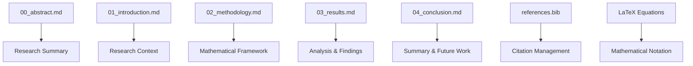

# manuscript/ - Research Manuscript

Academic prose with mathematical notation for professional PDF generation.

## Manuscript Structure

This project includes the following sections:

### Main Sections
- `00_abstract.md` (~1 KB) - Research abstract and summary
- `01_introduction.md` (~2 KB) - Introduction and motivation
- `02_methodology.md` (~3 KB) - Research methods and approach
- `03_results.md` (~4 KB) - Experimental results and findings
- `04_conclusion.md` (~2 KB) - Conclusions and future work

### Supporting Files
- `references.bib` - Bibliography entries in BibTeX format

## Rendering Process

The manuscript is rendered through these stages:

1. **Discovery**: All `.md` files are discovered and categorized
2. **Individual Rendering**: Each section rendered to PDF separately
3. **Combination**: All sections combined into single manuscript PDF
4. **Output**: Generated files placed in `../../output/pdf/`

View detailed rendering logs to see which sections were included.

## Quick Start

```bash
# Edit sections
vim 01_introduction.md
vim 02_methodology.md

# Generate PDF
python3 ../../scripts/03_render_pdf.py

# View result
open ../../output/pdf/project_combined.pdf
```

## Key Features

- **Mathematical notation** using LaTeX equations
- **Academic prose** with structured argumentation
- **Cross-references** between sections and equations
- **BibTeX bibliography** for citations

## Common Commands

### Edit Content
```bash
vim 01_introduction.md     # Research context
vim 02_methodology.md      # Mathematical methods
vim 03_results.md          # Findings and analysis
vim 04_conclusion.md       # Summary and conclusions
```

### Generate PDF
```bash
python3 ../../scripts/03_render_pdf.py
```

### Validate Content
```bash
python3 -m infrastructure.validation.cli markdown .
```

## Architecture



## More Information

See [AGENTS.md](AGENTS.md) for complete technical documentation.