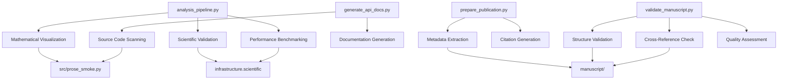

# scripts/ - Publication and Documentation Scripts

Thin orchestrators that demonstrate proper integration with infrastructure modules and `src/` modules.

## Quick Start

```bash
# Run complete analysis pipeline
python3 scripts/analysis_pipeline.py

# Generate API documentation
python3 scripts/generate_api_docs.py

# Prepare publication materials
python3 scripts/prepare_publication.py

# Validate manuscript
python3 scripts/validate_manuscript.py
```

## Key Features

- **Mathematical analysis pipeline** (visualization + scientific validation)
- **Publication preparation** (citations, metadata, submission materials)
- **API documentation generation** (automated from source code)
- **Manuscript validation** (quality checks and cross-reference verification)
- **Infrastructure integration** (performance monitoring, progress tracking, error handling)

## Common Commands

### Run Analysis Pipeline
```bash
python3 scripts/analysis_pipeline.py
```
Executes mathematical analysis, generates visualizations, and performs scientific validation.

### Generate API Documentation
```bash
python3 scripts/generate_api_docs.py
```
Scans source code and generates comprehensive API reference documentation.

### Prepare Publication Materials
```bash
python3 scripts/prepare_publication.py
```
Extracts metadata and generates citations in multiple formats (BibTeX, APA, MLA).

### Validate Manuscript
```bash
python3 scripts/validate_manuscript.py
```
Performs comprehensive validation of manuscript structure, cross-references, and quality.

## Architecture



## Script Descriptions

### analysis_pipeline.py
Mathematical analysis and visualization pipeline that:
- Generates publication-quality mathematical visualizations
- Performs numerical stability validation
- Benchmarks function performance
- Integrates with infrastructure modules for monitoring and progress tracking

### generate_api_docs.py
Automated API documentation generator that:
- Scans Python source code for functions, classes, and methods
- Generates markdown documentation tables
- Creates comprehensive API reference
- Optionally integrates documentation into manuscript

### prepare_publication.py
Publication preparation tool that:
- Extracts publication metadata from manuscript
- Generates citations in BibTeX, APA, and MLA formats
- Creates submission checklists and readiness reports
- Validates DOI and publication information

### validate_manuscript.py
Comprehensive manuscript validation that:
- Validates markdown structure and formatting
- Checks cross-reference integrity
- Verifies academic writing standards compliance
- Assesses output directory integrity
- Generates detailed validation reports

## Output Locations

- **Figures**: `output/figures/`
- **Data**: `output/data/`
- **Reports**: `output/reports/`
- **Documentation**: `output/docs/`
- **Citations**: `output/citations/`

## More Information

See [AGENTS.md](AGENTS.md) for complete technical documentation.
