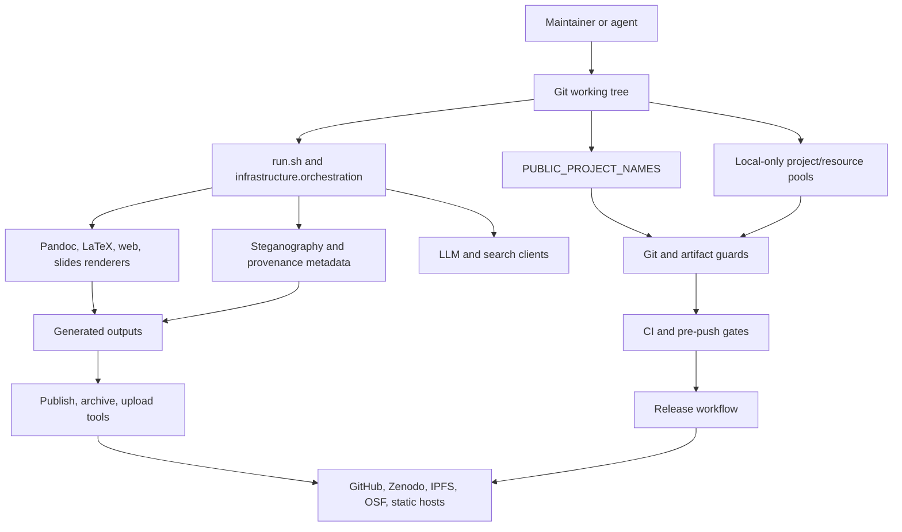

# Template Repository Threat Model

Generated: 2026-07-09

Scope: `docxology/template` style public research-project template checkout at
`/Users/hum/Documents/GitHub/HumOS/projects/outside_of_hum/template`.

## Executive Summary

This repository's primary security problem is not a network perimeter. It is a
public research-template supply chain: local/private project material must never
enter public git history or generated public artifacts, release/publishing tools
must not accidentally publish the wrong payload, and CI/security gates must keep
the reusable Layer-1 infrastructure honest as templates are added.

The strongest current controls are:

- Public scope is centralized in `infrastructure/project/public_scope.py:19`.
- Git-index confidentiality guards derive allowed public project paths from that
  roster in `infrastructure/project/git_guards.py:14`.
- Generated/local artifacts and oversized public-template outputs are rejected by
  `infrastructure/project/git_guards.py:102` and
  `infrastructure/project/git_guards.py:202`.
- CI runs with `contents: read` for normal jobs in `.github/workflows/ci.yml:14`
  and includes Ruff, mypy, tracked-artifact, confidentiality, pip-audit, Bandit,
  and shell-injection sweeps.
- Publishing and archival paths are dry-run by default in
  `scripts/publish/publish_project_release.py:104`,
  `scripts/runner/archive_publication.py:7`, and
  `infrastructure/publishing/upload_runner.py:8`.

The main residual risks are:

- Sensitive areas have a bus factor of 1 across every queried category. The
  ownership map found no orphaned sensitive code, but all sensitive tags are
  historically controlled by one owner.
- `TO-DO.md` was stale about R1/R2/R7; the detailed remediation file shows those
  shipped and R10 is the remaining repo-wide review item.
- `.github/CODEOWNERS` has a default catch-all, but its explicit
  `projects/templates/*` roster has drifted from the current
  `PUBLIC_PROJECT_NAMES` list.
- Publication, archival, and upload tools accept real credentials from env or
  local config; dry-run defaults lower risk, but payload/path preflight should be
  made explicit before real deposits.
- LLM, rendering, and steganography surfaces intentionally process manuscript
  content and external/local model inputs. They need strong scoping,
  sanitization, and "do not upload private paths" guarantees.
- `projects/ongoing/askos/TODO.md` is an adjacent high-risk backlog if AskOS is ever
  promoted into this repository's shipped/public/deployed boundary.

## Scope And Assumptions

In scope:

- Layer-1 infrastructure under `infrastructure/`.
- Orchestration and publishing scripts under `scripts/`, `run.sh`, and
  `secure_run.sh`.
- CI/CD, CODEOWNERS, security policy, dependency and pre-commit gates under
  `.github/`, `.pre-commit-config.yaml`, `bandit.yaml`, `pyproject.toml`, and
  `uv.lock`.
- Public canonical exemplars derived from
  `infrastructure.project.public_scope.PUBLIC_PROJECT_NAMES`.
- Local-only confidentiality boundaries for `projects/`, `fonds/`, `rules/`,
  and `tools`.
- Release/publishing/upload paths that can contact GitHub, Zenodo, arXiv,
  IPFS providers, HuggingFace, OSF, Netlify, Cloudflare, and similar services.
- LLM, search, rendering, and steganography subsystems because they process
  untrusted project/manuscript content or talk to external/local services.

Out of scope:

- Runtime security of private project code that remains local-only and untracked.
- GitHub organization settings that are not visible in the checkout, except as
  explicit assumptions or external acceptance checks.
- Secrets themselves. No `.env` or local credential files were read.
- A full vulnerability audit of every project exemplar's domain logic.

Assumptions requiring owner validation:

- Branch protection requires the intended CI jobs on `main`; this cannot be
  proven from repository files alone.
- Publishing tokens are not configured in CI except where visible workflow files
  declare them. Local publish tools may use operator environment variables.
- AskOS remains outside the public template release boundary unless explicitly
  promoted.
- Historical git authorship approximates ownership. It is not a formal
  responsibility model.

The user asked to proceed, so this report uses conservative assumptions rather
than pausing for validation.

## System Model

Primary components:

- Entry points: `run.sh`, `secure_run.sh`, and `python -m infrastructure.orchestration`.
- Public-scope resolver: `infrastructure.project.public_scope`.
- Confidentiality/artifact guards: `infrastructure.project.git_guards` and
  `scripts/audit/check_tracked_all.py`.
- Renderers: PDF, web, slides, ebook, and supporting Pandoc/LaTeX/Chrome tooling.
- Publishing stack: release workflow, publish scripts, archival providers, upload
  runners, and HTTP adapter helpers.
- External API clients: literature/search connectors and LLM review/generation
  tools.
- Provenance/crypto subsystem: steganography, hash manifests, metadata, optional
  encryption, and watermarking.
- CI/CD: GitHub Actions, pre-commit/pre-push hooks, Bandit, pip-audit, Ruff,
  mypy, generated-artifact guards, docs gates, and regression tests.
- Ownership controls: `.github/CODEOWNERS`, `.github/SECURITY.md`, and
  generated ownership-map artifacts under `security-analysis/ownership-map/`.

Trust boundaries:

- Public git history vs local-only working/archive/ongoing/private sidecars.
- Checked-in template infrastructure vs project manuscript/content inputs.
- Local dry-run rendering vs credentialed publication/deposit operations.
- GitHub Actions read-only CI vs release workflow with `contents: write`.
- Local model/LLM usage vs external API providers.
- Generated outputs vs tracked source files.
- Provenance metadata vs sensitive recipient/project/operator identifiers.



## Assets And Security Objectives

| Asset | Objective | Evidence |
| --- | --- | --- |
| Local/private project contents | Never tracked, published, indexed, or exposed through generated docs/manifests | `infrastructure/project/git_guards.py:122`, `scripts/audit/check_tracked_all.py:27`, `.github/SECURITY.md:19` |
| Public project roster | One authoritative source for CI, docs, guards, and publishing | `infrastructure/project/public_scope.py:19` |
| Credentials and tokens | Load only from intended local/env sources, never log or commit values | `infrastructure/core/credentials.py:64`, `scripts/publish/publish_project_release.py:47`, `scripts/runner/archive_publication.py:7` |
| Release artifacts | Publish only intended files from public scope, with repeatable metadata | `scripts/publish/publish_project_release.py:170`, `infrastructure/publishing/_adapter_http.py:39` |
| CI/security gates | Enforce formatting, typing, dependency, secret/confidentiality, generated-artifact, and security scans | `.github/workflows/ci.yml:143`, `.github/workflows/ci.yml:649`, `.pre-commit-config.yaml:72` |
| LLM/search inputs | Avoid prompt/data exfiltration and sanitize user-facing prompt paths | `infrastructure/llm/core/sanitization.py:37`, `infrastructure/llm/core/client.py:163`, `infrastructure/llm/core/client.py:224` |
| Rendering subprocesses | Avoid shell injection, resource hangs, unsafe generated HTML, and unbounded local file reads | `infrastructure/rendering/pdf_renderer.py:117`, `infrastructure/rendering/pdf_renderer.py:131`, `infrastructure/rendering/web_renderer.py:160` |
| Provenance metadata | Prove origin without leaking recipient secrets or overclaiming tamper resistance | `infrastructure/steganography/THREAT_MODEL.md:15`, `infrastructure/steganography/THREAT_MODEL.md:66`, `infrastructure/steganography/core.py:99` |
| Ownership continuity | Sensitive surfaces have explicit reviewers and continuity beyond one maintainer | `security-analysis/ownership-map/summary.json` |

## Attacker Model

Capabilities:

- Opens a pull request that modifies infrastructure, public exemplars, docs, or
  CI configuration.
- Adds malicious or malformed manuscript Markdown, BibTeX, LaTeX, images, SVG,
  Mermaid, notebook outputs, or generated artifacts.
- Attempts to force-add local-only files from `projects/working`,
  `projects/archive`, `projects/ongoing`, `fonds`, `rules`, or `tools`.
- Attempts to bypass dry-run publication or cause a maintainer to run a real
  publish/deposit command on the wrong payload.
- Tries prompt injection through manuscript text, generated text, or search/LLM
  inputs.
- Tries dependency or GitHub Action supply-chain manipulation.
- Tries to exploit single-maintainer review gaps or stale ownership policy.

Non-capabilities assumed:

- Cannot read local `.env` or `~/.config` credential files unless a local command
  leaks them.
- Cannot modify branch protection or repository secrets through this checkout.
- Cannot bypass GitHub's permission model for CI jobs.
- Cannot execute code on maintainer machines except through commands the
  maintainer/agent chooses to run.

## Entry Points And Attack Surfaces

| Surface | Entry | Trust boundary | Existing controls | Residual risk |
| --- | --- | --- | --- | --- |
| Orchestration | `run.sh`, `secure_run.sh`, `infrastructure.orchestration` | CLI args and project paths into pipeline execution | Shell scripts exec Python orchestrator; `secure_run.sh` syncs optional steganography extras before secure mode | Malicious project content can trigger expensive or unsafe local tool paths if guards are incomplete |
| Public roster | `PUBLIC_PROJECT_NAMES` | Public exemplars vs local-only trees | Central roster in `public_scope.py`; guards derive allowed dirs | Any alternate discovery surface that does not intersect tracked/public paths can leak local names |
| Git guards | `check_tracked_all.py`, `git_guards.py` | Git index vs ignored/private work | Four resource-pool confidentiality checks plus generated-artifact checks | New top-level resource pools need explicit coverage |
| CI | `.github/workflows/ci.yml` | PR content into runner | Pinned checkout, read-only normal permissions, lint/type/security/docs gates | Branch-protection requirements and repo settings are external to code |
| Release | `.github/workflows/release.yml` | Manual dispatch/tag into write-permission release | Existing tag verification and pinned release action | Release job has `contents: write`; branch/tag protections must be enforced outside repo |
| Publish/archive | `scripts/publish/*`, `scripts/runner/archive_publication.py`, `upload_runner.py` | Local artifacts and tokens into external services | Dry-run defaults, explicit token checks | Need stronger path manifest and local-only refusal before commit mode |
| Credentials | `CredentialManager`, `.env`, env vars, local credential JSON | Secret stores into runtime | Optional dotenv, safe YAML load, env substitution, bearer header helper | Logging and receipt objects must never include token values or credentialed URLs |
| Rendering | Pandoc, LaTeX, web/slides renderers | Manuscript content into subprocesses/HTML/PDF | List-based subprocess calls, timeouts, HTML hardening helpers | Renderer toolchains are large; untrusted content should be isolated for hostile inputs |
| LLM/search | LLM clients and search connectors | Manuscript/content into models and external APIs | Prompt sanitization default and raw-query warning | `query_raw` and opt-out sanitization rely on caller discipline |
| Steganography | Metadata, hashes, barcodes, encryption | Project/recipient metadata into PDF outputs | Existing steganography threat model and standard primitives | Per-recipient secrets and embedded metadata can become privacy risk if misconfigured |
| Ownership | CODEOWNERS and actual git history | Review intent vs actual control | Default CODEOWNERS catch-all, security policy | Explicit template roster drift and all sensitive categories have single-owner history |

## Top Abuse Paths

1. Local-only leak through an unscoped discovery/indexing surface.
   - Path: add or symlink private content under `projects/working` or a resource
     pool, then regenerate docs/manifests with a command that walks untracked
     paths.
   - Current controls: git guards, public roster, generated-artifact guard.
   - Gap: every new discovery surface must prove it intersects public/tracked
     paths. Root TODO had stale R2 status, which indicates this risk needs an
     explicit regression, even though detailed remediation says R2 shipped.

2. Accidental real publication of wrong payload.
   - Path: maintainer runs a publish/archive/upload command with credentials and
     `--commit` or non-dry-run options against a bundle containing private or
     stale generated files.
   - Current controls: dry-run defaults and provider-specific token checks.
   - Gap: real publish mode should emit and validate a redacted payload manifest
     and refuse local-only paths.

3. CI/release supply-chain downgrade.
   - Path: alter workflow permissions, action pins, installer URLs, audit ignore
     files, or Bandit skip policy.
   - Current controls: pinned actions, read-only normal CI permissions, security
     workflow, Bandit low sweep, pip-audit.
   - Gap: release workflow necessarily has `contents: write`; branch/tag
     protection and required reviews must be checked externally.

4. Prompt or model-context exfiltration.
   - Path: manuscript text embeds instructions that cause LLM review/generation
     to reveal hidden repo context, secrets, or local paths.
   - Current controls: sanitization is default in `LLMClient.query()` and
     `stream_query()`.
   - Gap: `query_raw()` bypasses context, system prompt injection, and
     sanitization by design; callers must be narrow and documented.

5. Rendering toolchain abuse.
   - Path: malicious Markdown/LaTeX/SVG/Mermaid/HTML content triggers a Pandoc,
     LaTeX, browser, or filter behavior that reads local files, hangs, or emits
     unsafe HTML.
   - Current controls: list-based subprocess calls, timeouts, HTML hardening and
     path normalization.
   - Gap: hostile inputs should be rendered in a sandbox or minimal container,
     especially for external submissions.

6. Provenance metadata privacy failure.
   - Path: per-recipient or project identifiers are embedded into PDFs and later
     distributed beyond intended scope, or recipient keys are committed.
   - Current controls: existing steganography threat model says no tracking on
     open and keys stay outside the repo.
   - Gap: publication preflight should classify embedded metadata and fail if it
     contains recipient secrets or unexpected identifiers.

7. CODEOWNERS drift hides review intent.
   - Path: new templates are added to `PUBLIC_PROJECT_NAMES`; default `*` still
     covers them, but explicit project ownership lines do not communicate the
     intended review owner.
   - Current controls: `.github/CODEOWNERS:6` catch-all.
   - Gap: explicit roster parity with `PUBLIC_PROJECT_NAMES` is not enforced.

8. Single-maintainer sensitive-area concentration.
   - Path: all sensitive categories are historically owned by one person, so a
     compromised account or unavailable maintainer can alter high-risk surfaces
     without independent code-history counterweight.
   - Current controls: public CI and local gates.
   - Gap: governance, not code: add required review, generated CODEOWNERS parity,
     and periodic ownership-map review for sensitive tags.

9. AskOS promotion without closing auth/export policy gaps.
   - Path: `projects/ongoing/askos` becomes active/public/deployed while TODO gaps remain
     for JWT verification, policy evaluation, redaction, vault, route tests, and
     MCP tests.
   - Current controls: AskOS appears adjacent/local in this analysis, not the
     public template security boundary.
   - Gap: promotion blocker should require closing or explicitly risk-accepting
     those AskOS security TODOs.

## Threat Register

| ID | Threat | Likelihood | Impact | Severity | Evidence | Recommended mitigation |
| --- | --- | --- | --- | --- | --- | --- |
| TM-001 | Private/local project names or content leak into public docs/manifests/published artifacts | Medium | Critical | Critical | `docs/maintenance/review-remediation-2026-07.md:123`, `git_guards.py:122`, `public_scope.py:19` | Add tracked/public-scope invariant tests for every discovery and manifest generator; keep R2-style regression close to affected code |
| TM-002 | Real publish/deposit uploads wrong payload or local-only files | Medium | High | High | `publish_project_release.py:104`, `archive_publication.py:66`, `_adapter_http.py:39` | Require redacted payload manifest and local-only path refusal before any non-dry-run publish |
| TM-003 | Credential value or credentialed URL leaks in logs, receipts, config display, or generated reports | Low-Medium | High | High | `credentials.py:64`, `publish_project_release.py:47`, `projects/ongoing/askos/TODO.md:22` | Add reusable secret-redaction helper to publish receipts/logging and test token-shaped URL redaction |
| TM-004 | CI/release workflow modified to weaken security gates or run with excess permissions | Medium | High | High | `.github/workflows/ci.yml:14`, `.github/workflows/release.yml:13`, `.pre-commit-config.yaml:115` | Protect workflow files through CODEOWNERS and branch protection; audit `permissions` deltas in CI |
| TM-005 | Dependency/action supply chain compromise | Medium | High | High | `.github/workflows/ci.yml:45`, `.github/workflows/ci.yml:649`, `bandit.yaml:44` | Keep action pins immutable, keep pip-audit ignore file time-bounded, and require review for lockfile/security config deltas |
| TM-006 | LLM prompt injection or raw-query misuse leaks hidden context/private content | Medium | High | High | `sanitization.py:37`, `client.py:163`, `client.py:224` | Restrict `query_raw()` to named internal call sites, add tests preventing raw calls on project/manuscript text |
| TM-007 | Rendering hostile manuscripts causes local file disclosure, command execution, unsafe HTML, or denial of service | Medium | High | High | `pdf_renderer.py:117`, `pdf_renderer.py:131`, `web_renderer.py:160` | Run hostile/untrusted rendering in a sandbox/container and add malicious fixture tests for file inclusion and long-running inputs |
| TM-008 | Provenance/watermark metadata leaks recipient/operator identifiers or keys | Low-Medium | High | High | `THREAT_MODEL.md:66`, `encryption.py:50`, `core.py:128` | Add metadata classification preflight and fail publish when recipient secrets or unexpected identifiers appear |
| TM-009 | CODEOWNERS explicit project roster drifts from public roster | High | Medium | Medium | `.github/CODEOWNERS:23`, `public_scope.py:19` | Generate CODEOWNERS project stanza or add a parity test against `PUBLIC_PROJECT_NAMES` |
| TM-010 | Security-sensitive ownership has bus factor 1 | High | Medium-High | High | `security-analysis/ownership-map/summary.json` | Add formal sensitive-area owner map, required reviews, and periodic ownership-map report |
| TM-011 | Generated artifacts or oversized outputs are force-added | Low-Medium | High | High | `git_guards.py:102`, `git_guards.py:202`, `.pre-commit-config.yaml:72` | Keep generated-artifact guard required in CI and pre-push; extend patterns when new output roots appear |
| TM-012 | AskOS auth/policy/export gaps become in-scope without promotion gate | Medium if promoted | Critical | Conditional Critical | `projects/ongoing/askos/TODO.md:26`, `projects/ongoing/askos/TODO.md:35`, `projects/ongoing/askos/TODO.md:46`, `projects/ongoing/askos/TODO.md:177` | Add an AskOS promotion checklist requiring JWT, policy, redaction, vault, route, and MCP test closure before active/public/deployed status |

## TODO Scope

Current root TODO correction:

- `TO-DO.md` identified R1/R2/R7 as highest leverage open items.
- `docs/maintenance/review-remediation-2026-07.md:51` says R1/R2 were shipped
  in the second pass.
- `docs/maintenance/review-remediation-2026-07.md:77` says R7 shipped in the
  third pass.
- `docs/maintenance/review-remediation-2026-07.md:118` says R10 is the only
  genuinely open repo-wide review item in that list.

Security-scoped active backlog should therefore prioritize:

1. SECURITY-OWNERSHIP-1: define explicit sensitive-area ownership and review
   requirements for CI/CD, credentials, publishing, guards, rendering, LLM/search,
   and provenance/crypto.
2. SECURITY-CODEOWNERS-1: enforce parity between `.github/CODEOWNERS` and
   `PUBLIC_PROJECT_NAMES`, or deliberately replace explicit template lines with a
   generated/wildcard policy.
3. SECURITY-PUBLISH-1: add a publish/archive/upload preflight that emits a
   redacted payload manifest, redacted credential-source summary, and local-only
   path refusal before commit mode.
4. SECURITY-LLM-RAW-1: inventory `query_raw()` and sanitization opt-out call
   sites; require named justification and tests for any user/project-content path.
5. SECURITY-RENDER-SANDBOX-1: document and test a hostile-input rendering mode
   that runs Pandoc/LaTeX/browser conversions under a narrower sandbox.
6. SECURITY-STEG-METADATA-1: add metadata classification before publish to avoid
   accidental per-recipient/operator identifier disclosure.
7. SECURITY-ASKOS-PROMOTION-1: block AskOS promotion into active/public/deployed
   scope until JWT, policy, redaction, vault, route, and MCP TODOs are closed or
   explicitly risk-accepted.

## Ownership Map Summary

Command run:

```bash
uv run python /Users/hum/.codex/skills/security-ownership-map/scripts/run_ownership_map.py \
  --repo . \
  --out security-analysis/ownership-map \
  --sensitive-config security-analysis/sensitive-paths.csv \
  --emit-commits \
  --cochange-max-files 120 \
  --community-top-owners 8
```

Key results:

- Commits analyzed: 1008.
- People identified: 3.
- Files represented: 22381.
- Co-change edges emitted: 35192.
- Orphaned sensitive code: none.
- Hidden-owner categories: orchestration, rendering_subprocess, external_api,
  dependency_policy, ci_cd, publishing, security_policy, security_gate,
  credentials, entrypoint, confidentiality_guard, artifact_guard,
  provenance_crypto, and ownership_policy all show 100 percent control by
  `danielarifriedman@gmail.com` in the historical map.

Focused tag results:

- `credentials`: `infrastructure/core/credentials.py`, bus factor 1.
- `confidentiality_guard`: `git_guards.py`, `public_scope.py`,
  `sidecar_linking.py`, `check_tracked_all.py`, all bus factor 1.
- `publishing`: publishing package and scripts, bus factor 1.
- `ci_cd`: `.github/`, workflow, security, dependency, and CODEOWNERS files,
  bus factor 1.
- `external_api`: LLM/search modules, bus factor 1.
- `rendering_subprocess`: rendering package, bus factor 1.
- `provenance_crypto`: steganography package, bus factor 1.

GraphML was not emitted because NetworkX GraphML serialization cannot represent
list-valued attributes from this map. CSV/JSON outputs were emitted and used.

## Focus Paths For Security Review

Review these paths first for a deep security audit:

- `infrastructure/project/git_guards.py`
- `infrastructure/project/public_scope.py`
- `scripts/audit/check_tracked_all.py`
- `scripts/audit/check_tracked_generated_artifacts.py`
- `infrastructure/core/credentials.py`
- `scripts/publish/publish_project_release.py`
- `scripts/runner/archive_publication.py`
- `infrastructure/publishing/`
- `.github/workflows/ci.yml`
- `.github/workflows/release.yml`
- `.github/CODEOWNERS`
- `.github/SECURITY.md`
- `.pre-commit-config.yaml`
- `bandit.yaml`
- `infrastructure/llm/core/client.py`
- `infrastructure/llm/core/sanitization.py`
- `infrastructure/rendering/pdf_renderer.py`
- `infrastructure/rendering/web_renderer.py`
- `infrastructure/steganography/`
- `projects/ongoing/askos/TODO.md` if AskOS is promoted into active/public/deployed
  scope.

## Quality Check

- Repository-grounded: yes. Every threat above is anchored to files and current
  scan artifacts.
- Ownership map run: yes, with repo-specific sensitive-path configuration.
- Orphaned sensitive files: none reported.
- Bus-factor hotspots: yes, all sensitive categories have single-owner history.
- Assumptions explicit: yes.
- TODO scoped: yes, including stale root TODO correction and security follow-ups.
- Secrets inspected: no.
- Code changed: no runtime code changed by this threat model.
