# tests/ - Test Suite

Comprehensive test suite ensuring coverage requirements for both infrastructure and project modules (60% infrastructure minimum, 90% project minimum). Current status: **100% project**, **83.33% infrastructure**, **2118 tests passing** (1796 infra [2 skipped] + 320 project).

## Quick Start

### Run All Tests
```bash
# With coverage report (both infrastructure and project)
pytest tests/ --cov=infrastructure --cov=project/src --cov-report=html

# Using uv
uv run pytest tests/ --cov=infrastructure --cov=project/src --cov-report=html

# Verify coverage requirements
pytest tests/infrastructure/ --cov=infrastructure --cov-fail-under=60
pytest project/tests/ --cov=project/src --cov-fail-under=90
```

### Run Specific Tests
```bash
# Infrastructure tests
pytest tests/infrastructure/core/test_config_loader.py -v

# Project tests
pytest project/tests/test_example.py -v

# Integration tests
pytest tests/integration/test_module_interoperability.py -v

# By pattern
pytest tests/ -k "test_config" -v

# Skip Ollama-dependent tests
pytest tests/ -m "not requires_ollama"
# Stop on first failure
pytest tests/ -x

### Common Markers
- `requires_ollama`: marks tests that need a running Ollama service. Skip with `-m "not requires_ollama"`.
```

## Coverage Requirements (pipeline enforced)

- **Project** (`project/src/`): 90% minimum (currently 100% - perfect coverage!)
- **Infrastructure** (`infrastructure/`): 60% minimum (currently 83.33% - exceeds stretch goal!)
- Tests must pass before PDF generation
- Real data only (no mocks)
- Coverage report: `htmlcov/index.html`

## Test Organization

```mermaid
graph TD
    subgraph TestStructure["Test Suite Structure"]
        ROOT[tests/<br/>Root configuration<br/>conftest.py]

        INFRA[tests/infrastructure/<br/>Module-specific tests<br/>Mirrors infrastructure/]

        INTEGRATION[tests/integration/<br/>Cross-module tests<br/>End-to-end workflows]

        PROJECT[project/tests/<br/>Project-specific tests<br/>90%+ coverage required]
    end

    subgraph InfrastructureTests["Infrastructure Module Tests"]
        CORE[core/<br/>Config, logging, exceptions<br/>+ project discovery]
        BUILD[build/<br/>Build verification & quality]
        VALIDATION[validation/<br/>Quality assurance]
        RENDERING[rendering/<br/>PDF & HTML generation]
        LLM[llm/<br/>AI integration]
        PUBLISHING[publishing/<br/>Academic dissemination]
        REPORTING[reporting/<br/>Dashboard & reporting]
        DOCS[documentation/<br/>Figure management]
        SCIENTIFIC[scientific/<br/>Research utilities]
    end

    subgraph IntegrationTests["Integration Tests"]
        INTEROP[test_module_interoperability.py<br/>Cross-module integration]
        FIGURES[test_figure_equation_citation.py<br/>Figure/equation handling]
        OUTPUT[test_output_copying.py<br/>File operations]
        EDGES[test_edge_cases_and_error_paths.py<br/>Error conditions]
        SCRIPTS[test_run_sh.py<br/>Script orchestration]
        EXEC[test_07_generate_executive_report.py<br/>Executive reporting]
        LOGGING[test_logging.py<br/>Bash logging]
        BASH[test_bash_utils.sh<br/>Bash utilities]
    end

    ROOT --> INFRA
    ROOT --> INTEGRATION
    ROOT --> PROJECT

    INFRA --> CORE
    INFRA --> BUILD
    INFRA --> VALIDATION
    INFRA --> RENDERING
    INFRA --> LLM
    INFRA --> PUBLISHING
    INFRA --> REPORTING
    INFRA --> DOCS
    INFRA --> SCIENTIFIC

    INTEGRATION --> INTEROP
    INTEGRATION --> FIGURES
    INTEGRATION --> OUTPUT
    INTEGRATION --> EDGES
    INTEGRATION --> SCRIPTS
    INTEGRATION --> EXEC
    INTEGRATION --> LOGGING
    INTEGRATION --> BASH

    classDef root fill:#e3f2fd,stroke:#1565c0,stroke-width:2px
    classDef infra fill:#fff3e0,stroke:#e65100,stroke-width:2px
    classDef integration fill:#f3e5f5,stroke:#4a148c,stroke-width:2px
    classDef project fill:#e8f5e8,stroke:#2e7d32,stroke-width:2px

    class ROOT root
    class INFRA,CORE,BUILD,VALIDATION,RENDERING,LLM,PUBLISHING,REPORTING,DOCS,SCIENTIFIC infra
    class INTEGRATION,INTEROP,FIGURES,OUTPUT,EDGES,SCRIPTS,EXEC,LOGGING,BASH integration
    class PROJECT project
```



```
tests/
├── conftest.py                          # Root test configuration
│
│ # Note: Multiple test files with suffixes (_coverage, _full, _comprehensive)
│ # exist to achieve comprehensive coverage across scenarios and edge cases
├── infrastructure/                      # Infrastructure module tests
│   ├── conftest.py                      # Infrastructure test configuration
│   ├── test_project_discovery.py        # Project discovery and validation
│   ├── build/                           # Build validation tests
│   ├── core/                            # Core utilities tests
│   ├── documentation/                   # Documentation handling tests
│   ├── llm/                             # LLM integration tests
│   ├── publishing/                      # Publishing tools tests
│   ├── rendering/                       # Rendering pipeline tests
│   ├── reporting/                       # Reporting and dashboard tests
│   ├── scientific/                      # Scientific tools tests
│   └── validation/                      # Validation tests
└── integration/                         # Integration tests
    ├── conftest.py                      # Integration test configuration
    ├── test_07_generate_executive_report.py # Executive report generation
    ├── test_bash_utils.sh               # Bash utility tests
    ├── test_edge_cases_and_error_paths.py # Edge cases and error handling
    ├── test_figure_equation_citation.py # Fig/Eq/Citation tests
    ├── test_logging.py                  # Bash logging integration
    ├── test_module_interoperability.py  # Cross-module integration
    ├── test_output_copying.py           # Output file handling
    └── test_run_sh.py                   # Script orchestration tests
```

## Test Categories

### Infrastructure Module Tests

**Core Module** (`infrastructure/core/`)
- `test_checkpoint.py` - Checkpoint/resume functionality
- `test_config_loader.py` - Configuration file handling
- `test_exceptions.py` - Custom exception handling
- `test_logging_utils.py` - Logging utilities
- `test_progress.py` - Progress tracking
- `test_retry.py` - Retry mechanisms
- `test_project_discovery.py` - Project discovery and validation

**Build Module** (`infrastructure/build/`)
- `test_build_verifier.py` - Build verification and integrity
- `test_quality_checker.py` - Document quality analysis
- `test_reproducibility.py` - Environment tracking

**Documentation Module** (`infrastructure/documentation/`)
- `test_figure_manager.py` - Figure management and registration
- `test_image_manager.py` - Image handling in markdown
- `test_glossary_gen.py` - API documentation generation
- `test_markdown_integration.py` - Markdown processing integration

**LLM Module** (`infrastructure/llm/`)
- `test_core.py` - LLM client core functionality
- `test_context.py` - Conversation context management
- `test_templates.py` - Template system for common tasks
- `test_config.py` - LLM configuration
- `test_validation.py` - Input validation
- `test_llm_review.py` - LLM manuscript review

**Publishing Module** (`infrastructure/publishing/`)
- `test_publishing.py` - Publishing metadata and citations
- `test_api.py` - Platform API clients (Zenodo, arXiv, GitHub)
- `test_cli.py` - CLI wrapper for publishing

**Rendering Module** (`infrastructure/rendering/`)
- `test_core.py` - Render manager core
- `test_latex_utils.py` - LaTeX compilation utilities
- `test_renderers.py` - PDF, HTML, and slides renderers
- `test_pdf_renderer_*.py` - PDF generation tests
- `test_poster_renderer.py` - Scientific poster rendering

**Reporting Module** (`infrastructure/reporting/`)
- `test_executive_reporter.py` - Executive report generation
- `test_dashboard_generator.py` - Dashboard creation
- `test_pipeline_reporter.py` - Pipeline reporting

**Scientific Module** (`infrastructure/scientific/`)
- `test_scientific_dev.py` - Scientific development utilities

**Validation Module** (`infrastructure/validation/`)
- `test_markdown_validator.py` - Markdown validation
- `test_pdf_validator.py` - PDF validation
- `test_integrity.py` - Integrity verification
- `test_check_links.py` - Link validation
- `test_doc_scanner.py` - Document scanning
- `test_config.py` - Rendering configuration
- `test_poster_renderer.py` - Scientific poster generation
- `test_cli.py` - CLI wrapper for rendering

**Scientific Module** (`infrastructure/scientific/`)
- `test_scientific_dev.py` - Scientific computing best practices

**Validation Module** (`infrastructure/validation/`)
- `test_markdown_validator.py` - Markdown validation
- `test_pdf_validator.py` - PDF validation
- `test_integrity.py` - Integrity verification
- `test_check_links.py` - Documentation link checking
- `test_doc_scanner.py` - Comprehensive documentation scanning
- `test_repo_scanner.py` - Repository accuracy/completeness
- `test_cli.py` - CLI wrapper for validation

### Integration Tests (`tests/integration/`)
- `test_module_interoperability.py` - Cross-module integration validation
- `test_figure_equation_citation.py` - Figure/equation/citation handling
- `test_output_copying.py` - Output file handling and copying
- `test_edge_cases_and_error_paths.py` - Edge cases and error handling
- `test_run_sh.py` - Script orchestration and CLI testing
- `test_07_generate_executive_report.py` - Executive report generation
- `test_logging.py` - Bash logging integration tests
- `test_bash_utils.sh` - Bash utility function validation

### Project Tests (`project/tests/`)
- Unit tests for `project/src/` modules (see `project/tests/AGENTS.md`)
- Integration tests in `project/tests/integration/`
  - `test_integration_pipeline.py` - Full analysis pipeline
  - `test_example_figure.py` - Figure generation integration
  - `test_generate_research_figures.py` - Research figure pipeline

## Debugging

```bash
# Verbose output
pytest tests/ -vv

# Show print statements
pytest tests/ -s

# Run last failed tests
pytest tests/ --lf
```

## Writing Tests

```python
"""Tests for infrastructure/module.py or project/src/module.py"""
import pytest
from infrastructure.module import function
# or
from project.src.module import function

def test_basic_usage():
    """Test basic functionality."""
    result = function("input")
    assert result == "expected"

def test_error_handling():
    """Test error conditions."""
    with pytest.raises(ValueError):
        function("invalid")
```

## Figure, Equation, and Citation Tests

The test suite includes comprehensive validation for:

### Figure Handling
- Figure generation with proper paths
- Figure referencing in markdown
- LaTeX figure environments and captioning
- Multiple figures with unique labels

### Equation Handling
- Equation labeling and cross-referencing
- Multiple equations with unique labels
- Detection of unlabeled equations
- Equation reference resolution

### Citation Handling
- Citation formatting in markdown
- Bibliography file structure
- Multiple citations in sentences
- Citation extraction and validation

### Integrated Workflows
- Complete manuscript sections with all elements
- Cross-section references
- Validation integration
- PDF generation integration

## Test Coverage Statistics

### Overall Coverage (latest)
- **Project** (`project/src/`): **100%** (Target: 90%+) ✅ Perfect coverage!
- **Infrastructure** (`infrastructure/`): **83.33%** (Target: 60%+) ✅ Exceeds stretch goal!

### Coverage Details
Both test suites exceed their minimum requirements. For detailed coverage information, see the test coverage reports generated by pytest.

## See Also

- [`AGENTS.md`](AGENTS.md) - Detailed testing guide
- [`conftest.py`](conftest.py) - Test configuration
- [`../infrastructure/README.md`](../infrastructure/README.md) - Infrastructure modules being tested
- [`../project/src/README.md`](../project/src/README.md) - Project modules being tested
- [`../docs/WORKFLOW.md`](../docs/WORKFLOW.md) - Development workflow
