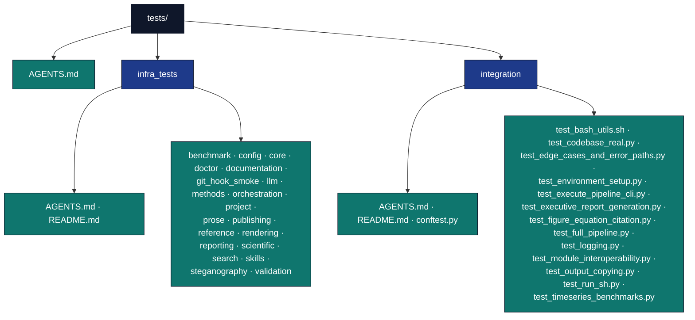

# tests/ - Test Suite

The `tests/` tree covers infrastructure modules and integration behavior.
Project-specific tests live under `projects/{name}/tests/`. Mock frameworks
(`MagicMock`, `mocker.patch`, `unittest.mock`) are prohibited; real data,
subprocesses, temporary files, and localhost services are preferred. Existing
`pytest.monkeypatch` dependency replacements are measured by
`scripts/audit/verify_no_mocks.py --inventory` and tracked as migration debt.

## Running Tests

```bash
# Pipeline infrastructure smoke contract
uv run python scripts/pipeline/stage_01_test.py --infra-only --infra-scope pipeline-smoke

# Infrastructure tests (≥60% coverage floor)
uv run python scripts/pipeline/stage_01_test.py --infra-only --infra-scope full

# Project tests — control positive exemplar (≥90% coverage floor)
uv run pytest projects/templates/template_code_project/tests/ --cov=projects/templates/template_code_project/src --cov-fail-under=90

# Integration tests
uv run pytest tests/integration/ -v

# Full infrastructure + coverage report
uv run pytest tests/infra_tests/ --cov=infrastructure --cov-report=html
```

## Layout


```mermaid
flowchart TB
    T[tests/]
    T --> T_AG[AGENTS.md]
    T --> INFRA_T[infra_tests]
    T --> INTEG[integration]

    INFRA_T --> INFRA_DOCS[AGENTS.md · README.md]
    INFRA_T --> INFRA_SUB[benchmark · config · core · doctor · documentation ·<br/>git_hook_smoke · llm · methods · orchestration · project ·<br/>prose · publishing · reference · rendering ·<br/>reporting · scientific · search · skills ·<br/>steganography · validation]

    INTEG --> INT_DOCS[AGENTS.md · README.md · conftest.py]
    INTEG --> INT_FILES[test_bash_utils.sh · test_codebase_real.py ·<br/>test_edge_cases_and_error_paths.py ·<br/>test_environment_setup.py · test_execute_pipeline_cli.py ·<br/>test_executive_report_generation.py ·<br/>test_figure_equation_citation.py · test_full_pipeline.py ·<br/>test_logging.py · test_module_interoperability.py ·<br/>test_output_copying.py · test_run_sh.py ·<br/>test_timeseries_benchmarks.py]

    classDef d fill:#0f172a,stroke:#0f172a,color:#fff
    classDef pkg fill:#1e3a8a,stroke:#0f172a,color:#fff
    classDef f fill:#0f766e,stroke:#0f172a,color:#fff
    class T d
    class INFRA_T,INTEG pkg
    class T_AG,INFRA_DOCS,INFRA_SUB,INT_DOCS,INT_FILES f
```

## Rules

- Use the mock-framework prohibition and do not add semantic stand-in debt.
- Prefer `uv run` for test commands.
- Keep infrastructure tests separate from project tests.
- Keep integration tests focused on end-to-end behavior.

## Ollama (`@pytest.mark.requires_ollama`)

Session setup lives in [`conftest.py`](conftest.py) as `ensure_ollama_for_tests`. Any test marked `requires_ollama` triggers it once per session (including under `tests/integration/`).

- **Default**: if the daemon is up but no “small/fast” preference model is installed (see `SMALL_FAST_MODEL_PREFERENCES` in `infrastructure.llm.utils.models`), the harness runs `ollama pull` for **`OLLAMA_TEST_PULL_MODEL`** (default `smollm2`). First pull needs network and can take several minutes; override timeout with **`OLLAMA_TEST_PULL_TIMEOUT`** (seconds; default `180`, or `none` for no limit).
- **Air-gapped / pre-seeded images**: set **`OLLAMA_SKIP_TEST_MODEL_PULL=1`** to skip auto-pull. You must still have at least one installed model; without a small/fast preference model, tests may use slower fallback models or fail if no model can be loaded.
- **LLM HTTP fakes**: `tests/infra_tests/llm/conftest.py` points `OLLAMA_HOST` at `pytest_httpserver` for most tests. That is **not** the Ollama daemon—only contract testing for the HTTP client. Real-daemon tests use an explicit `OllamaClientConfig` with default `base_url` or [`tests/infra_tests/llm/real_ollama_client.py`](infra_tests/llm/real_ollama_client.py).
- **Per-test timeout**: the repo default `pytest-timeout` is 10s; [`conftest.py`](conftest.py) adds `@pytest.mark.timeout(180)` to any collected test that already has `requires_ollama`, so streaming completions are not cut off. Override with an explicit `@pytest.mark.timeout(...)` on the test.

Exclude Ollama-tied tests from a local run: `pytest -m 'not requires_ollama'`.

## See Also

- [`AGENTS.md`](AGENTS.md)
- [`infra_tests/README.md`](infra_tests/README.md)
- [`integration/README.md`](integration/README.md)

<!-- foam-orphan-nav:start (auto-managed: links sub-docs so they are reachable) -->

## Directory & sub-document map

Navigation links to in-tree documents (keeps them discoverable):

- [tests/fixtures/private_project/cogant/tools/](fixtures/private_project/cogant/tools/AGENTS.md)
- [COGANT tool scripts (fixture)](fixtures/private_project/cogant/tools/README.md)
- [Methods Tests](infra_tests/methods/AGENTS.md)
- [Methods Tests](infra_tests/methods/README.md)
- [tests/infra_tests/sia/](infra_tests/sia/AGENTS.md)
- [SIA infrastructure tests](infra_tests/sia/README.md)
- [tests/infra_tests/validation/docs/consistency/](infra_tests/validation/docs/consistency/AGENTS.md)
- [Documentation consistency lint tests](infra_tests/validation/docs/consistency/README.md)
- [template_code_project — figure regression tests](regression/projects/template_code_project/figures/README.md)
- [template_code_project — table regression tests](regression/projects/template_code_project/tables/README.md)
- [template_prose_project — figure regression tests](regression/projects/template_prose_project/figures/README.md)
- [template_prose_project — table regression tests](regression/projects/template_prose_project/tables/README.md)

<!-- foam-orphan-nav:end -->
