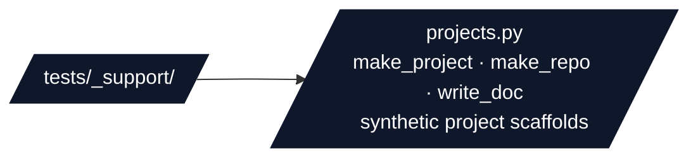

# Test Support Helpers

## Overview

Technical guide for `tests/_support/` — shared scaffold factories consumed by the
infrastructure test suites. These helpers build minimum-valid synthetic project
trees so tests exercise discovery, rendering, and orchestration without coupling
to the nine public exemplars.

## Directory Structure

## Key Conventions

- **Synthetic only:** every scaffold is created under `tmp_path`; helpers never write to the real `projects/` tree.
- **Qualified-name layout:** `make_project(..., program="templates")` nests under `projects/templates/<name>/`, matching the repo's typed-subfolder discovery (`templates/<name>`, `active/<name>`). Omit `program` for a flat standalone `projects/<name>/`.
- **`repo_layout=False`** drops the `projects/` wrapper for integration fixtures that operate on a bare project directory.
- `make_project` produces a tree that passes `validate_project_structure`: `src/__init__.py` + a stub module, `tests/__init__.py`, and optional `manuscript/`, `scripts/`, and `output/` subtrees.

## See Also

- [README.md](README.md) — Quick navigation
- [`projects.py`](projects.py) — The scaffold factory implementation
- [`../AGENTS.md`](../AGENTS.md) — Test suite documentation
- [`../infra_tests/AGENTS.md`](../infra_tests/AGENTS.md) — Primary consumer
