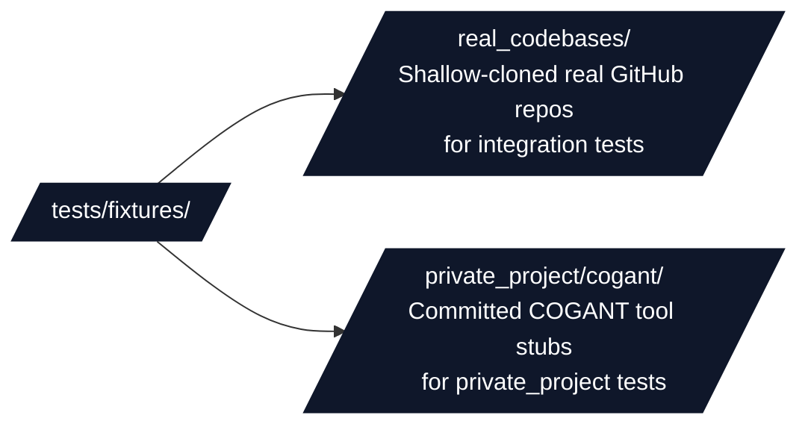

# Test Fixtures

## Overview

Technical guide for `tests/fixtures/` — shared test fixture data consumed by the template repository's test suites.

## Directory Structure

## Key Conventions

- Fixtures are populated by scripts in [`scripts/fixtures/`](../../scripts/fixtures/).
- `real_codebases/` contains sparse-checkout clones (only source subdirectories) — **do not edit** these; regenerate with `python scripts/fixtures/download_real_codebases.py`. Required when running tests marked `external_fixture`.
- `private_project/cogant/` is **git-tracked** — minimal COGANT audit/coverage scripts and manuscript fragment used when `projects_in_progress/cogant/` is absent.
- `real_codebases/` and `timeseries/` are download-generated (see setup scripts below); they are not committed and must be created locally before running tests that need them.
- Timeseries fixtures are stored at `tests/fixtures/timeseries/` (created by `scripts/fixtures/download_timeseries_benchmarks.py`).

## See Also

- [README.md](README.md) — Quick navigation
- [`real_codebases/AGENTS.md`](real_codebases/AGENTS.md) — Real codebase fixture docs
- [`../../scripts/fixtures/AGENTS.md`](../../scripts/fixtures/AGENTS.md) — Fixture download scripts
- [`../AGENTS.md`](../AGENTS.md) — Test suite documentation
