# Core Infrastructure Tests

## Overview

The `tests/infra_tests/core/` directory contains test suites for the core infrastructure utilities. These tests ensure the reliability and correctness of shared utilities used across all infrastructure modules.

## Directory Structure

```mermaid
flowchart TB
    T[tests/infra_tests/core/]
    T --> META[AGENTS.md · __init__.py]
    T --> CFG_DIR[config<br/>schema extensions]
    T --> PIPE_DIR[pipeline<br/>parallel helpers]
    T --> TEL_DIR[telemetry<br/>retention]
    T --> RT_DIR[runtime<br/>setup checks]

    T --> CFG[Configuration / Environment<br/>test_config_cli_coverage · test_config_loader ·<br/>test_credentials · test_credentials_module ·<br/>test_environment]
    T --> EXC[Exceptions<br/>test_exceptions]
    T --> LOG[Logging<br/>test_logging_helpers · test_logging_progress ·<br/>test_logging_utils · test_logging_formatters]
    T --> FILES[Files / Filesystem<br/>test_file_inventory · test_file_operations]
    T --> MENU[Menu / Performance / Progress<br/>test_menu · test_performance_monitor · test_progress]
    T --> PIPE[Pipeline / Orchestration<br/>test_checkpoint · test_pipeline · test_pipeline_summary ·<br/>test_multi_project · test_retry]
    T --> DISC[Discovery<br/>test_project_discovery · test_script_discovery]
    T --> CLI[CLI<br/>test_cli]

    classDef d fill:#0f172a,stroke:#0f172a,color:#fff
    classDef cat fill:#1e3a8a,stroke:#0f172a,color:#fff
    classDef doc fill:#0f766e,stroke:#0f172a,color:#fff
    class T d
    class CFG,EXC,LOG,FILES,MENU,PIPE,DISC,CLI,CFG_DIR,PIPE_DIR,TEL_DIR cat
    class META doc
```



## Test Categories

### Focused Subdirectories

- [`config/`](config/) — config schema-extension registry, strict loading, and schema output.
- [`pipeline/`](pipeline/) — multi-project parallel helper behavior and worker isolation.
- [`telemetry/`](telemetry/) — telemetry retention and archive rotation.
- [`runtime/`](runtime/) — project discovery validation and runtime setup helpers.

### Configuration and Environment

**Configuration Loading (`test_config_loader.py`)**
- YAML configuration file parsing
- Environment variable integration
- Default value handling
- Configuration validation and error cases
- Translation language configuration testing

**Configuration Test Patterns:**
```python
def test_config_loading(project_config_file):
    """Test config loading with file structure"""
    config = load_config(project_config_file)
    assert config['paper']['title'] == 'Test Research Paper'

def test_translation_languages(tmp_path, sample_project_config):
    """Test translation language extraction from config"""
    # Create config at projects/project/manuscript/config.yaml
    config_file = tmp_path / "projects" / "project" / "manuscript" / "config.yaml"
    config_file.parent.mkdir(parents=True)

    with open(config_file, 'w') as f:
        yaml.dump(sample_project_config, f)

    languages = get_translation_languages(tmp_path)
    assert languages == ['zh', 'hi', 'ru']  # From sample config
```

**Test File Structure Requirements:**
- Config files must be at: `repo_root/projects/{project_name}/manuscript/config.yaml`
- Translation tests create realistic multi-level directory structures
- All tests use real YAML files, no mocks for file operations

**Environment Setup (Moved to Integration Tests)**
- Environment tests moved to `tests/integration/test_environment_setup.py`
- subprocess execution, filesystem operations, and system integration
- No mocks - uses actual `uv sync`, `shutil.which()`, directory creation

**Credentials Management (`test_credentials.py`)**
- Secure credential storage and retrieval
- Credential validation and sanitization
- Environment variable credential loading
- Credential masking in logs

### Logging and Progress

**Logging Utilities (`test_logging_utils.py`)**
- Logger initialization and configuration
- Context manager logging patterns
- TTY-aware color output testing
- Environment-based verbosity control

**Logging Helpers (`test_logging_helpers.py`)**
- Logging decorator functionality
- Structured logging with context
- Error logging with stack traces
- Performance logging integration

**Progress Logging (`test_logging_progress.py`)**
- Progress-aware logging integration
- Progress bar logging coordination
- Log level filtering with progress

**Progress Tracking (`test_progress.py`)**
- Progress bar creation and updates
- Sub-stage progress tracking
- Progress context manager testing
- Progress calculation and display

### Error Handling and Resilience

**Exception Hierarchy (`test_exceptions.py`)**
- Custom exception class testing
- Exception context preservation
- Exception chaining and wrapping
- Error message formatting

**Retry Logic (`test_retry.py`)**
- Exponential backoff retry implementation
- Configurable retry parameters
- Error-specific retry strategies
- Retry limit enforcement

### File and Data Management

**File Operations (`test_file_operations.py`)**
- Safe file read/write operations
- Directory creation and cleanup
- File permission handling
- Error recovery in file operations

**Checkpoint Management (`test_checkpoint.py`)**
- Checkpoint creation and validation
- State persistence and restoration
- Checkpoint corruption handling
- Resume capability testing

### Performance and Monitoring

**Performance Monitoring (`test_performance_monitor.py`)**
- Resource usage tracking
- Performance timer accuracy
- Memory and CPU monitoring
- Performance logging integration

### Script and Module Discovery

**Script Discovery (`test_script_discovery.py`)**
- Module and script detection
- Import path resolution
- Discovery filtering and validation
- Error handling in discovery operations

## Test Design Principles

### Data Testing

**No Mocks Philosophy:**
- All tests use data and actual functionality
- No mock objects or simulated responses
- Integration testing with actual dependencies
- Deterministic, reproducible test results

### Coverage

**Coverage Goals:**
- Measured coverage via `pytest --cov=infrastructure.core` → [`docs/development/coverage-gaps.md`](../../../docs/development/coverage-gaps.md)

### Test Organization

**Test Structure:**
- Each module has dedicated test file
- Test functions named descriptively
- Setup/teardown for test isolation
- Parameterized tests for multiple scenarios

## Key Test Files

### Configuration Testing

**`test_config_loader.py`:**
```python
def test_load_config_from_file():
    """Test loading configuration from YAML file."""
    config_file = create_test_config_file()
    config = load_config(config_file)
    assert config.some_setting == expected_value

def test_environment_variable_override():
    """Test environment variables override file config."""
    with mock.patch.dict(os.environ, {'SETTING': 'override'}):
        config = load_config()
        assert config.setting == 'override'
```

### Logging Testing

**`test_logging_utils.py`:**
```python
def test_logger_initialization():
    """Test logger creation with proper configuration."""
    logger = get_logger('test_module')
    assert logger.name == 'test_module'
    assert logger.level == logging.INFO

def test_context_manager_logging():
    """Test logging context manager functionality."""
    with capture_logs() as logs:
        with logging_context('operation'):
            logger.info('test message')
        assert 'operation' in logs[0]
```

### Exception Testing

**`test_exceptions.py`:**
```python
def test_exception_context_preservation():
    """Test exception context is properly preserved."""
    try:
        raise TemplateError("test error", context={'key': 'value'})
    except TemplateError as e:
        assert e.context['key'] == 'value'
        assert 'test error' in str(e)
```

### Performance Testing

**`test_performance_monitor.py`:**
```python
def test_performance_monitor():
    """Test performance monitoring accuracy."""
    monitor = PerformanceMonitor()
    with monitor.track('test_operation'):
        time.sleep(0.1)

    assert monitor.get_duration('test_operation') >= 0.1
```

## Testing Infrastructure

### Test Fixtures

**Common Fixtures:**
- Temporary directories for file operations
- Mock environment variables
- Test configuration files
- Isolated logger instances

**Example Fixtures:**
```python
@pytest.fixture
def temp_dir():
    """Provide temporary directory for tests."""
    with tempfile.TemporaryDirectory() as tmp:
        yield Path(tmp)

@pytest.fixture
def test_config():
    """Provide test configuration."""
    return create_test_config()
```

### Test Utilities

**Helper Functions:**
- Log capture for testing logging output
- File creation utilities
- Configuration test helpers
- Mock environment setup

## Running Tests

### Individual Test Execution

```bash
# Run all core tests
uv run pytest tests/infra_tests/core/

# Run specific test file
uv run pytest tests/infra_tests/core/test_config_loader.py

# Run specific test function
uv run pytest tests/infra_tests/core/test_config_loader.py::test_load_config_from_file
```

### Coverage Analysis

```bash
# Generate coverage report
uv run pytest tests/infra_tests/core/ --cov=infrastructure.core --cov-report=html

# Check coverage threshold
uv run pytest tests/infra_tests/core/ --cov=infrastructure.core --cov-fail-under=95
```

### Debug Testing

```bash
# Verbose output
uv run pytest tests/infra_tests/core/ -v

# Debug specific failure
uv run pytest tests/infra_tests/core/test_logging_utils.py -s --pdb
```

## Test Maintenance

### Adding Tests

**Test Development Process:**
1. Identify functionality to test
2. Create test file if needed
3. Write test functions with descriptive names
4. Use data and actual functionality
5. Ensure test isolation and cleanup
6. Verify coverage includes new code

**Test File Template:**
```python
"""Tests for module_name functionality."""
import pytest
from infrastructure.core.module_name import function_to_test  # noqa: docs-lint


class TestModuleName:
    """Test suite for module_name."""

    def test_function_basic_operation(self):
        """Test basic functionality of function."""
        result = function_to_test(input_data)
        assert result == expected_output

    def test_function_error_handling(self):
        """Test error handling in function."""
        with pytest.raises(ExpectedException):
            function_to_test(invalid_input)
```

### Test Quality Assurance

**Test Review Checklist:**
- [ ] Tests use data, no mocks
- [ ] All code paths covered
- [ ] Error conditions tested
- [ ] Test isolation maintained
- [ ] Descriptive test names
- [ ] Proper cleanup in teardown

## Integration with CI/CD

### Automated Testing

**GitHub Actions Integration:**
```yaml
- name: Run Core Tests
  run: |
    uv run pytest tests/infra_tests/core/ --cov=infrastructure.core --cov-report=xml

- name: Coverage Check
  run: |
    coverage report --fail-under=95
```

### Test Dependencies

**Required Packages:**
- `pytest` - Test framework
- `pytest-cov` - Coverage reporting
- `pytest-xdist` - Parallel test execution
- `pyfakefs` - File system mocking (minimal use)

## Troubleshooting

### Common Test Issues

**Import Errors:**
- Verify Python path includes repository root
- Check all `__init__.py` files exist
- Ensure dependencies are installed

**Coverage Gaps:**
- Run coverage analysis to identify untested lines
- Add test cases for missing branches
- Review conditional logic for edge cases

**Flaky Tests:**
- Identify non-deterministic behavior
- Use fixed seeds for random operations
- Add proper test isolation

### Debug Tools

**Test Debugging:**
```bash
# Run with detailed output
uv run pytest tests/infra_tests/core/ -v -s

# Debug specific test
uv run pytest tests/infra_tests/core/test_config_loader.py::TestConfigLoader::test_load_config -x --pdb

# Profile test performance
uv run pytest tests/infra_tests/core/ --durations=10
```

## Test Metrics

### Coverage Targets

Re-measure with:

```bash
uv run pytest tests/infra_tests/core/ --cov=infrastructure.core --cov-report=term-missing
```

Live aggregate → [`docs/development/coverage-gaps.md`](../../../docs/development/coverage-gaps.md). Gate: **60%** minimum on `infrastructure/`.

### Performance Benchmarks

**Test Execution Time:**
- Full suite: < 30 seconds
- Individual tests: < 1 second
- Setup overhead: < 2 seconds

## Future Enhancements

### Planned Improvements

**Testing:**
- Property-based testing with Hypothesis
- Performance regression testing
- Integration with mutation testing
- Automated test generation

**Test Infrastructure:**
- Test parallelization improvements
- fixture reusability
- Test result visualization
- Historical performance tracking

## See Also

**Related Documentation:**
- [`../../../infrastructure/core/AGENTS.md`](../../../infrastructure/core/AGENTS.md) - Core module documentation
- [`../AGENTS.md`](../AGENTS.md) - Infrastructure test suite overview
- [`../../../AGENTS.md`](../../../AGENTS.md) - System documentation

**Testing Guidelines:**
- [`docs/rules/testing_standards.md`](../../../docs/rules/testing_standards.md) - Testing standards
- [`docs/development/testing/testing-guide.md`](../../../docs/development/testing/testing-guide.md) - Testing guide
