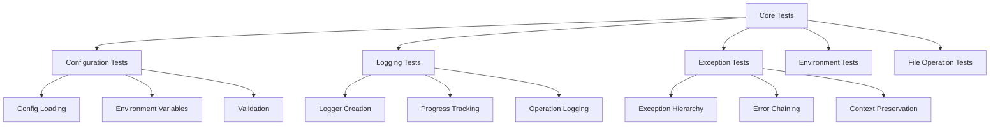

# Core Infrastructure Tests - Quick Reference

test suite for core infrastructure utilities.

## Overview

Tests for core infrastructure modules including configuration, logging, exceptions, environment setup, and file operations. These tests ensure reliability of shared utilities used across all infrastructure modules.

## Quick Start

```bash
# Run all core tests
pytest tests/infra_tests/core/ -v

# Run specific test module
pytest tests/infra_tests/core/test_config_loader.py -v

# Run with coverage
pytest tests/infra_tests/core/ --cov=infrastructure.core --cov-report=term
```

## Test Modules

### Configuration Tests (`test_config_loader.py`)

Configuration loading and environment variable integration:

```bash
pytest tests/infra_tests/core/test_config_loader.py -v
```

**Test Coverage:**
- YAML configuration parsing
- Environment variable overrides
- Default value handling
- Configuration validation

### Logging Tests (`test_logging_utils.py`, `test_logging_helpers.py`, `test_logging_progress.py`)

Logging system functionality:

```bash
pytest tests/infra_tests/core/test_logging*.py -v
```

**Test Coverage:**
- Logger creation and configuration
- Log level management
- Progress tracking
- Operation logging

### Exception Tests (`test_exceptions.py`)

Exception hierarchy and error handling:

```bash
pytest tests/infra_tests/core/test_exceptions.py -v
```

**Test Coverage:**
- Exception inheritance
- Context preservation
- Error chaining
- Exception formatting

### Environment Tests (Moved to Integration)

Environment setup and validation moved to integration tests:

```bash
pytest tests/integration/test_environment_setup.py -v
pytest tests/integration/test_environment_setup.py -m integration
```

**Test Coverage:**
- Dependency checking
- Build tool verification
- Directory structure validation
- Environment variable processing

### File Operations Tests (`test_file_operations.py`)

File management utilities:

```bash
pytest tests/infra_tests/core/test_file_operations.py -v
```

**Test Coverage:**
- Output directory cleaning
- File copying operations
- Path validation
- Error handling

## Test Categories

### Unit Tests

Individual function and class testing:

```bash
# Test specific function
pytest tests/infra_tests/core/test_config_loader.py::test_load_config -v

# Test specific class
pytest tests/infra_tests/core/test_exceptions.py::TestTemplateError -v
```

### Integration Tests

Cross-module functionality:

```bash
# Test configuration + logging integration
pytest tests/infra_tests/core/test_config_loader.py::test_config_with_logging -v
```

### Edge Case Tests

Boundary conditions and error paths:

```bash
# Test error handling
pytest tests/infra_tests/core/ -k "error" -v
```

## Common Test Patterns

### Configuration Testing

```python
# test_config_loader.py pattern
def test_load_config():
    config = load_config(Path("config.yaml"))
    assert config["key"] == "value"
```

### Exception Testing

```python
# test_exceptions.py pattern
def test_exception_chaining():
    with pytest.raises(TemplateError) as exc_info:
        raise TemplateError("Error") from ValueError("Original")
    assert isinstance(exc_info.value.__cause__, ValueError)
```

### Logging Testing

```python
# test_logging_utils.py pattern
def test_logger_creation():
    logger = get_logger(__name__)
    assert logger.name == __name__
```

## Coverage Requirements

Core infrastructure tests maintain high coverage:

- **Target**: 60% minimum (currently exceeds)
- **Focus**: Critical path coverage
- **Quality**: data, no mocks

## Running Tests

### All Core Tests

```bash
pytest tests/infra_tests/core/ -v
```

### Specific Categories

```bash
# Configuration tests only
pytest tests/infra_tests/core/test_config*.py -v

# Logging tests only
pytest tests/infra_tests/core/test_logging*.py -v

# Exception tests only
pytest tests/infra_tests/core/test_exceptions.py -v
```

### With Coverage

```bash
pytest tests/infra_tests/core/ \
    --cov=infrastructure.core \
    --cov-report=html \
    --cov-report=term-missing
```

## Debugging

### Verbose Output

```bash
pytest tests/infra_tests/core/ -vv -s
```

### Last Failed

```bash
pytest tests/infra_tests/core/ --lf
```

### Stop on First Failure

```bash
pytest tests/infra_tests/core/ -x
```

## Architecture



## See Also

- [AGENTS.md](AGENTS.md) - test documentation
- [../../../infrastructure/core/README.md](../../../infrastructure/core/README.md) - Core module overview
- [../../../tests/README.md](../../../tests/README.md) - Test suite overview