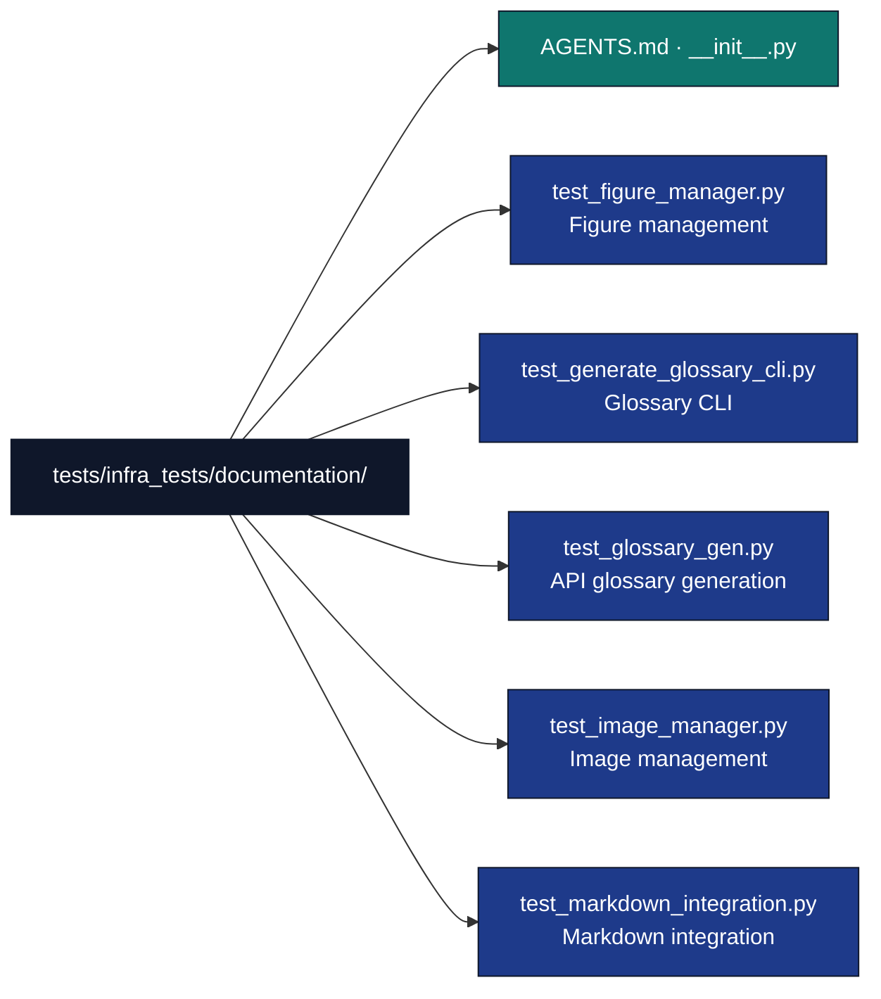

# Documentation Infrastructure Tests

## Overview

The `tests/infra_tests/documentation/` directory contains tests for the documentation generation and figure management infrastructure. These tests ensure the reliability of documentation tools used throughout the research template system.

## Directory Structure



## Test Categories

### Figure Management

**Figure Manager Tests (`test_figure_manager.py`)**
- Figure registry creation and management
- JSON persistence of figure metadata
- LaTeX figure block generation
- Cross-reference generation and validation
- Figure numbering and labeling

**Key Test Scenarios:**
- Figure registration with metadata
- Registry persistence to JSON files
- LaTeX code generation for figures
- Reference resolution and validation
- Error handling for invalid figures

### API Documentation Generation

**Glossary Generation Tests (`test_glossary_gen.py`)**
- AST-based API extraction from Python modules
- Markdown table generation for API documentation
- Function signature parsing and formatting
- Class and method documentation
- Module-level API discovery

**Test Coverage:**
- Single module API extraction
- Multi-module API aggregation
- Signature parsing accuracy
- Documentation formatting
- Error handling for invalid modules

**Glossary CLI Tests (`test_generate_glossary_cli.py`)**
- Command-line interface functionality
- Argument parsing and validation
- File output generation
- Integration with glossary generation core

### Image Management

**Image Manager Tests (`test_image_manager.py`)**
- Image file discovery and validation
- Image insertion into markdown documents
- Reference creation and management
- Image metadata extraction
- Error handling for missing images

**Test Scenarios:**
- Image file detection in directories
- Markdown insertion syntax generation
- Reference link creation
- Image format validation
- Path resolution and normalization

### Markdown Integration

**Markdown Integration Tests (`test_markdown_integration.py`)**
- Figure insertion into markdown sections
- Section detection and parsing
- Reference integration and validation
- Table of figures generation
- Cross-reference resolution

**Integration Testing:**
- End-to-end figure insertion workflows
- Markdown parsing and modification
- Reference validation across documents
- Error handling for malformed markdown

## Test Design Principles

### Data Approach

**No Mock Data Philosophy:**
- Tests use actual Python modules and documentation
- file system operations for image/document handling
- Actual AST parsing for API extraction
- Integration testing with real dependencies

### Coverage

**Coverage Goals:**
- All major functionality paths tested
- Error conditions and edge cases covered
- Integration scenarios validated
- File I/O operations thoroughly tested

## Key Test Implementations

### Figure Management Testing

**Registry Persistence:**
```python
def test_figure_registry_persistence():
    """Test figure registry saves and loads correctly."""
    registry = FigureRegistry()

    # Register figures
    registry.register_figure("figure1.png", "Figure 1 caption", "fig:figure1")
    registry.register_figure("figure2.png", "Figure 2 caption", "fig:figure2")

    # Save to temporary file
    with tempfile.NamedTemporaryFile(mode='w', suffix='.json', delete=False) as f:
        temp_file = f.name

    try:
        registry.save_to_file(Path(temp_file))

        # Load from file
        new_registry = FigureRegistry.load_from_file(Path(temp_file))

        # Verify persistence
        assert len(new_registry.figures) == 2
        assert new_registry.get_figure("fig:figure1").caption == "Figure 1 caption"
    finally:
        os.unlink(temp_file)
```

### API Glossary Testing

**AST-Based Extraction:**
```python
def test_api_extraction_from_module():
    """Test API extraction from actual Python module."""
    from infrastructure.core.config import loader as config_loader  # Real module

    functions, classes = extract_api_from_module(config_loader)

    # Verify extraction captured expected functions
    function_names = {func.name for func in functions}
    assert 'load_config' in function_names

    # Verify class extraction
    class_names = {cls.name for cls in classes}
    assert 'Config' in class_names  # Assuming Config class exists
```

### Markdown Integration Testing

**Figure Insertion:**
```python
def test_figure_insertion_into_markdown():
    """Test inserting figures into markdown content."""
    markdown_content = """
# Introduction

Some text here.

# Results

More content.
"""

    figure_refs = [
        FigureReference("fig:results", "results_figure.png", "Results Figure")
    ]

    # Insert figures
    modified_content = insert_figures_into_markdown(
        markdown_content, figure_refs, Path("images")
    )

    # Verify insertion
    assert "" in modified_content
    assert "{#fig:results}" in modified_content
```

## Testing Infrastructure

### Test Fixtures

**Common Fixtures:**
```python
@pytest.fixture
def temp_dir():
    """Temporary directory for file operations."""
    with tempfile.TemporaryDirectory() as tmp:
        yield Path(tmp)

@pytest.fixture
def sample_module():
    """Create a sample Python module for testing."""
    module_content = '''
def sample_function(param: str) -> int:
    """Sample function for testing."""
    return len(param)

class SampleClass:
    """Sample class for testing."""

    def method(self) -> None:
        """Sample method."""
        pass
'''
    # Create temporary module file
    # Return module path for testing
```

### Test Utilities

**Helper Functions:**
- Temporary file creation for testing file operations
- Sample content generation for testing
- Markdown parsing validation
- AST comparison utilities

## Running Tests

### Execution Commands

```bash
# Run all documentation tests
uv run pytest tests/infra_tests/documentation/

# Run specific test file
uv run pytest tests/infra_tests/documentation/test_glossary_gen.py

# Run with coverage
uv run pytest tests/infra_tests/documentation/ --cov=infrastructure.documentation --cov-report=html
```

### Coverage Analysis

**Coverage Requirements:** measured per module → [`docs/development/coverage-gaps.md`](../../../docs/development/coverage-gaps.md)

## Test Maintenance

### Adding Tests

**Development Process:**
1. Identify new functionality in documentation modules
2. Create corresponding test file if needed
3. Write tests using data and actual operations
4. Ensure error case coverage
5. Verify integration with existing test suite

### Test Quality Standards

**Test Checklist:**
- [ ] Uses data, no mocks
- [ ] Tests all major code paths
- [ ] Includes error condition testing
- [ ] Maintains test isolation
- [ ] Has descriptive test names
- [ ] Includes proper cleanup

## Integration Testing

### End-to-End Workflows

**Documentation Generation Pipeline:**
```python
def test_full_documentation_pipeline():
    """Test documentation generation workflow."""
    # Create temporary project structure
    with tempfile.TemporaryDirectory() as tmp:
        project_dir = Path(tmp) / "project"
        project_dir.mkdir()

        # Create sample Python module
        module_file = project_dir / "src" / "sample.py"
        module_file.parent.mkdir(parents=True)
        module_file.write_text("""
def analyze_data(data):
    '''Analyze research data.'''
    return len(data)

class ResearchAnalyzer:
    '''Main research analysis class.'''

    def process(self, data):
        '''Process research data.'''
        return analyze_data(data)
""")

        # Generate glossary
        glossary = generate_api_glossary(str(project_dir / "src"))

        # Verify extraction
        assert "analyze_data" in glossary
        assert "ResearchAnalyzer" in glossary
        assert "process" in glossary
```

## Performance Considerations

### Test Efficiency

**Fast Execution:**
- Tests in < 10 seconds total
- File operations use temporary directories
- AST parsing is efficient for test modules
- No external network dependencies

### Resource Management

**Cleanup:**
- All temporary files removed after tests
- No persistent state between test runs
- Memory usage minimized for CI/CD compatibility

## Troubleshooting

### Common Issues

**AST Parsing Errors:**
- Verify Python syntax in test modules
- Check import paths are correct
- Ensure modules are properly structured

**File Operation Failures:**
- Check temporary directory permissions
- Verify file cleanup in test teardown
- Ensure proper path handling

**Coverage Gaps:**
- Run coverage analysis to identify missing lines
- Add test cases for uncovered branches
- Review conditional logic for edge cases

### Debug Tools

**Verbose Testing:**
```bash
# Debug specific test
uv run pytest tests/infra_tests/documentation/test_glossary_gen.py::test_api_extraction -v -s

# Profile test performance
uv run pytest tests/infra_tests/documentation/ --durations=5
```

## Test Metrics

### Coverage Status

**Current Coverage:** re-measure with `uv run pytest tests/infra_tests/documentation/ --cov=infrastructure.documentation` → [`docs/development/coverage-gaps.md`](../../../docs/development/coverage-gaps.md)

### Quality Metrics

**Test Health:**
- All tests pass consistently
- No flaky or non-deterministic behavior
- Clear test names and documentation
- Proper error message validation

## Future Enhancements

### Planned Improvements

**Testing:**
- Integration with documentation validation
- Performance regression testing
- Cross-platform compatibility testing
- Automated test generation for modules

**Test Infrastructure:**
- fixture reusability
- Test result visualization
- Historical performance tracking
- Parallel test execution optimization

## See Also

**Related Documentation:**
- [`../../../infrastructure/documentation/AGENTS.md`](../../../infrastructure/documentation/AGENTS.md) - Documentation module details
- [`../AGENTS.md`](../AGENTS.md) - Infrastructure test suite overview
- [`../../../AGENTS.md`](../../../AGENTS.md) - System documentation

**Testing Standards:**
- [`docs/rules/testing_standards.md`](../../../docs/rules/testing_standards.md) - Testing standards
- [`docs/development/testing/testing-guide.md`](../../../docs/development/testing/testing-guide.md) - Testing guide
