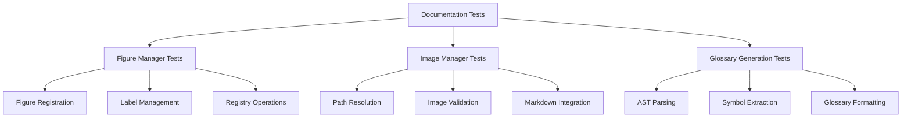

# Documentation Infrastructure Tests - Quick Reference

tests for documentation generation and figure management.

## Overview

Tests for documentation module including figure management, image handling, glossary generation, and markdown integration.

## Quick Start

```bash
# Run all documentation tests
pytest tests/infra_tests/documentation/ -v

# Run specific test module
pytest tests/infra_tests/documentation/test_figure_manager.py -v
```

## Test Modules

### Figure Manager Tests (`test_figure_manager.py`)

Figure registration and management:

```bash
pytest tests/infra_tests/documentation/test_figure_manager.py -v
```

**Test Coverage:**
- Figure registration
- Label management
- Registry operations
- Cross-reference handling

### Image Manager Tests (`test_image_manager.py`)

Image handling in markdown:

```bash
pytest tests/infra_tests/documentation/test_image_manager.py -v
```

**Test Coverage:**
- Image path resolution
- Image validation
- Markdown image syntax
- Path normalization

### Glossary Generation Tests (`test_glossary_gen.py`)

API glossary generation:

```bash
pytest tests/infra_tests/documentation/test_glossary_gen.py -v
```

**Test Coverage:**
- AST parsing
- Symbol extraction
- Glossary formatting
- Markdown generation

## Test Categories

### Unit Tests

Individual function testing:

```bash
# Test figure registration
pytest tests/infra_tests/documentation/test_figure_manager.py::test_register_figure -v
```

### Integration Tests

End-to-end workflows:

```bash
# Full glossary generation
pytest tests/infra_tests/documentation/test_glossary_gen.py::test_generate_glossary -v
```

## Common Test Patterns

### Figure Management Testing

```python
# test_figure_manager.py pattern
def test_register_figure():
    fm = FigureManager()
    fm.register_figure("figure.png", label="fig:test")
    assert fm.has_figure("fig:test")
```

### Image Handling Testing

```python
# test_image_manager.py pattern
def test_resolve_image_path():
    resolved = resolve_image_path("figures/image.png", repo_root)
    assert resolved.exists()
```

## Running Tests

### All Documentation Tests

```bash
pytest tests/infra_tests/documentation/ -v
```

### With Coverage

```bash
pytest tests/infra_tests/documentation/ \
    --cov=infrastructure.documentation \
    --cov-report=term
```

## Architecture



## See Also

- [AGENTS.md](AGENTS.md) - test documentation
- [../../../infrastructure/documentation/README.md](../../../infrastructure/documentation/README.md) - Documentation module overview
- [../../../tests/README.md](../../../tests/README.md) - Test suite overview