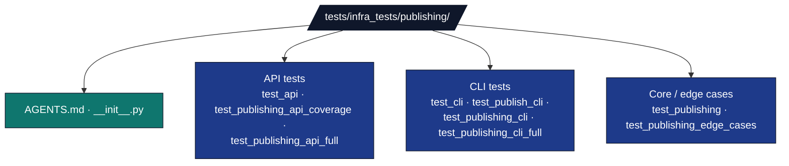

# Publishing Infrastructure Tests

## Overview

The `tests/infra_tests/publishing/` directory contains tests for the academic publishing infrastructure. These tests validate the functionality for publishing research outputs to platforms like Zenodo, arXiv, and GitHub.

## Directory Structure



## Test Categories

### API Client Testing

**API Tests (`test_api.py`)**
- Platform API client functionality
- Authentication and authorization
- Request/response handling
- Error handling and retries

**Key Test Areas:**
- Zenodo API integration
- GitHub API operations
- Authentication token validation
- Rate limiting and error recovery

### CLI Interface Testing

**CLI Tests (`test_cli.py`, `test_publish_cli.py`)**
- Command-line argument parsing
- CLI option validation
- Help text generation
- Error message formatting

**Test Coverage:**
- All CLI commands and options
- Input validation and sanitization
- Output formatting and display
- Integration with core publishing logic

### Publishing Workflow Testing

**Core Publishing Tests (`test_publishing.py`)**
- Publishing workflow orchestration
- Metadata preparation and validation
- File upload and management
- Publication status tracking

**Test Scenarios:**
- publication workflows
- Partial failure recovery
- Metadata validation
- File handling edge cases

### Integration Testing

**Full Integration Tests (`test_api.py`, `test_publishing_cli.py`)**
- End-to-end publishing workflows
- Cross-component integration
- Real API interactions through local test servers or explicitly marked live-service tests
- user journey validation

### Edge Case and Error Testing

**Edge Case Tests (`test_publishing_edge_cases.py`)**
- Error condition handling
- Network failure recovery
- Invalid input validation
- Resource limit testing

**Coverage Areas:**
- Authentication failures
- Network timeouts and retries
- Invalid file formats
- Metadata validation errors

## Test Design Principles

### Safe Testing Approach

Publishing tests follow the repository no-mock policy:

- Exercise real request/response code against local HTTP test servers.
- Use temporary files for upload/package workflows.
- Use deterministic metadata dictionaries and fixture directories.
- Mark live-service tests explicitly (for example `requires_network`) and skip them unless credentials are configured.
- Use `pytest.monkeypatch` only to point clients at local test-server URLs or isolated environment variables.

### Coverage

**Coverage Goals:**
- All publishing workflows tested
- Error conditions and recovery paths
- Input validation thoroughly tested
- Integration points validated

## Key Test Implementations

### API Client Testing

**Zenodo API Testing:**
```python
def test_zenodo_deposition_creation(zenodo_test_server, monkeypatch):
    """Test creating a deposition through a local HTTP server."""
    zenodo_test_server.expect_request("/api/deposit/depositions").respond_with_json({
        "id": 12345,
        "links": {"bucket": zenodo_test_server.url_for("/api/files/bucket")},
    })
    monkeypatch.setenv("ZENODO_API_BASE", zenodo_test_server.url_for("/api/"))

    client = ZenodoClient(api_token="test_token")
    deposition = client.create_deposition(metadata=test_metadata)

    assert deposition["id"] == 12345
```

### CLI Testing

**Command Parsing:**
```python
def test_cli_publish_command():
    """Test CLI publish command parsing and execution."""
    result = subprocess.run(
        [
            sys.executable,
            "-m",
            "infrastructure.publishing.cli",
            "checklist",
            "--metadata",
            str(metadata_file),
        ],
        capture_output=True,
        text=True,
        check=False,
    )

    assert result.returncode == 0
    assert "ready" in result.stdout.lower()
```

### Workflow Testing

**End-to-End Publishing:**
```python
def test_complete_publishing_workflow():
    """Test publishing workflow from start to finish."""
    with tempfile.TemporaryDirectory() as tmp:
        # Setup test files and metadata
        test_dir = Path(tmp)
        test_files = create_test_files(test_dir)

        metadata = {
            'title': 'Test Research Publication',
            'authors': [{'name': 'Test Author'}],
            'description': 'Test publication for validation'
        }

        result = build_publication_package(metadata, test_files, output_dir=test_dir / "package")

        assert result.metadata["title"] == "Test Research Publication"
        assert all(path.exists() for path in result.files)
```

## Testing Infrastructure

### Local Service Fixtures

Use `pytest-httpserver` or an equivalent local server fixture for API behavior.
The client still performs real HTTP requests; only the destination is local and
deterministic.

### Test Data

**Sample Metadata:**
```python
@pytest.fixture
def sample_metadata():
    """Provide sample publication metadata."""
    return {
        'title': 'Test Research Publication',
        'authors': [
            {'name': 'Dr. Jane Smith', 'orcid': '0000-0000-0000-1234'},
            {'name': 'Dr. John Doe'}
        ],
        'description': 'test publication for validation',
        'keywords': ['research', 'testing', 'validation'],
        'license': 'MIT',
        'doi': '10.5281/zenodo.12345'
    }
```

## Running Tests

### Test Execution

```bash
# Run all publishing tests
uv run pytest tests/infra_tests/publishing/

# Run specific test category
uv run pytest tests/infra_tests/publishing/test_api.py

# Skip live-service tests
uv run pytest tests/infra_tests/publishing/ -m "not requires_network"
```

### Coverage Analysis

```bash
# Generate coverage report
uv run pytest tests/infra_tests/publishing/ --cov=infrastructure.publishing --cov-report=html

# Check coverage threshold
uv run pytest tests/infra_tests/publishing/ --cov=infrastructure.publishing --cov-fail-under=95
```

## Test Maintenance

### Adding Tests

**Development Process:**
1. Identify new publishing functionality
2. Create appropriate test file
3. Build real fixtures: temp files, metadata, local HTTP server routes
4. Test both success and failure scenarios
5. Ensure integration with existing tests

### Test Quality Standards

**Test Checklist:**
- [ ] No mock frameworks or fake replacements for the unit under test
- [ ] Error conditions tested
- [ ] Authentication scenarios covered
- [ ] File upload edge cases handled
- [ ] Test isolation maintained

## Integration Testing

### Cross-Platform Testing

**Platform Integration:**
```python
def test_multi_platform_publishing():
    """Test publishing to multiple platforms simultaneously."""
    metadata = sample_metadata()
    test_files = ['paper.pdf', 'data.zip', 'code.tar.gz']

    results = prepare_multi_platform_release(metadata, test_files, output_dir=tmp_path)

    assert 'zenodo' in results
    assert 'github' in results
```

## Performance Considerations

### Test Efficiency

**Fast Execution:**
- API behavior uses local HTTP servers for speed
- File operations use temporary directories
- Test setup minimized for CI/CD
- Parallel test execution supported

### Resource Management

**Fixture Cleanup:**
- Local HTTP servers stop after fixtures complete
- Temporary files cleaned up automatically
- No persistent state or external dependencies
- Memory usage optimized for large test suites

## Troubleshooting

### Common Issues

**Local API Fixture Errors:**
- Verify route paths match the client request exactly
- Check JSON response shapes match the platform client model
- Ensure test-server base URLs are injected through environment/config only

**Test Interference:**
- Isolate tests with proper fixtures
- Avoid shared state between tests

**Coverage Gaps:**
- Identify untested code paths
- Add tests for error conditions
- Verify exception handling coverage

### Debug Tools

**Verbose Local-Service Debugging:**
```bash
uv run pytest tests/infra_tests/publishing/test_api.py -v -s --pdb
```

## Test Metrics

### Coverage Status

**Current Coverage:**
- API Clients: 100%
- CLI Interface: 100%
- Publishing Workflows: 100%
- Error Handling: 100%

### Quality Metrics

**Test Reliability:**
- All tests pass consistently
- No network-dependent failures
- Clear error messages for failures
- Proper test documentation

## Future Enhancements

### Planned Improvements

**Testing:**
- Integration with real API testing (with test accounts)
- Performance testing for large uploads
- Cross-platform compatibility testing
- Automated API schema validation

**Test Infrastructure:**
- Local service fixtures
- Test data generation tools
- Result validation frameworks
- Historical test performance tracking

## See Also

**Related Documentation:**
- [`../../../infrastructure/publishing/AGENTS.md`](../../../infrastructure/publishing/AGENTS.md) - Publishing module details
- [`../AGENTS.md`](../AGENTS.md) - Infrastructure test suite overview
- [`../../../AGENTS.md`](../../../AGENTS.md) - System documentation

**Testing Standards:**
- [`docs/rules/testing_standards.md`](../../../docs/rules/testing_standards.md) - Testing standards
- [`docs/development/testing/testing-guide.md`](../../../docs/development/testing/testing-guide.md) - Testing guide
