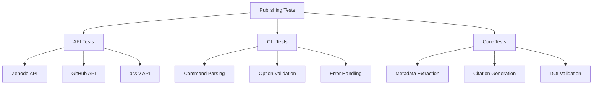

# Publishing Infrastructure Tests - Quick Reference

tests for academic publishing infrastructure.

## Overview

Tests for publishing module including platform API clients (Zenodo, arXiv, GitHub), citation generation, metadata extraction, and CLI interfaces.

## Quick Start

```bash
# Run all publishing tests
pytest tests/infra_tests/publishing/ -v

# Run API tests
pytest tests/infra_tests/publishing/test_api.py -v

# Run CLI tests
pytest tests/infra_tests/publishing/test_cli.py -v
```

## Test Modules

### API Tests (`test_api.py`)

Platform API client functionality:

```bash
pytest tests/infra_tests/publishing/test_api.py -v
```

**Test Coverage:**
- Zenodo API integration
- GitHub API operations
- Authentication handling
- Request/response processing

### CLI Tests (`test_cli.py`, `test_publish_cli.py`)

Command-line interface testing:

```bash
pytest tests/infra_tests/publishing/test_cli*.py -v
```

**Test Coverage:**
- Command parsing
- Option validation
- Help text generation
- Error handling

### Publishing Tests (`test_publishing.py`)

Core publishing functionality:

```bash
pytest tests/infra_tests/publishing/test_publishing.py -v
```

**Test Coverage:**
- Metadata extraction
- Citation generation
- DOI validation
- Publication package creation

## Test Categories

### Unit Tests

Individual function testing:

```bash
# Test metadata extraction
pytest tests/infra_tests/publishing/test_publishing.py::test_extract_metadata -v

# Test citation generation
pytest tests/infra_tests/publishing/test_publishing.py::test_generate_citation -v
```

### Integration Tests

End-to-end workflows:

```bash
# Full publishing workflow
pytest tests/infra_tests/publishing/test_publishing_api_full.py -v
```

### Edge Case Tests

Error conditions and boundaries:

```bash
# Error handling tests
pytest tests/infra_tests/publishing/test_publishing_edge_cases.py -v
```

## Common Test Patterns

### API Testing

```python
# test_api.py pattern
def test_zenodo_client():
    client = ZenodoClient(token="test_token")
    # Test API operations...
```

### Metadata Testing

```python
# test_publishing.py pattern
def test_extract_metadata():
    metadata = extract_publication_metadata([Path("manuscript.md")])
    assert metadata.title is not None
```

### Citation Testing

```python
# test_publishing.py pattern
def test_generate_citation():
    bibtex = generate_citation_bibtex(metadata)
    assert "@article" in bibtex
```

## Running Tests

### All Publishing Tests

```bash
pytest tests/infra_tests/publishing/ -v
```

### Specific Test Files

```bash
# API tests only
pytest tests/infra_tests/publishing/test_api.py -v

# CLI tests only
pytest tests/infra_tests/publishing/test_cli*.py -v

# Core functionality
pytest tests/infra_tests/publishing/test_publishing.py -v
```

### With Coverage

```bash
pytest tests/infra_tests/publishing/ \
    --cov=infrastructure.publishing \
    --cov-report=html
```

## Debugging

### Verbose Output

```bash
pytest tests/infra_tests/publishing/ -vv -s
```

### Test Specific Function

```bash
pytest tests/infra_tests/publishing/test_publishing.py::test_extract_metadata -v
```

## Architecture



## See Also

- [AGENTS.md](AGENTS.md) - test documentation
- [../../infrastructure/publishing/README.md](../../infrastructure/publishing/README.md) - Publishing module overview
- [../../../tests/README.md](../../../tests/README.md) - Test suite overview