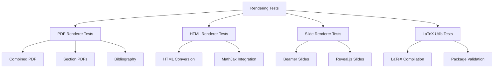

# Rendering Infrastructure Tests - Quick Reference

tests for multi-format output generation.

## Overview

Tests for rendering module including PDF generation, HTML rendering, slide creation, and LaTeX compilation.

## Quick Start

```bash
# Run all rendering tests
pytest tests/infra_tests/rendering/ -v

# Run PDF renderer tests
pytest tests/infra_tests/rendering/test_pdf_renderer*.py -v
```

## Test Modules

### PDF Renderer Tests (`test_pdf_renderer*.py`)

PDF generation and LaTeX compilation:

```bash
pytest tests/infra_tests/rendering/test_pdf_renderer*.py -v
```

**Test Coverage:**
- Combined PDF generation
- Individual section PDFs
- LaTeX compilation
- Bibliography processing
- Figure integration

### HTML Renderer Tests (`test_html_renderer.py`)

HTML output generation:

```bash
pytest tests/infra_tests/rendering/test_html_renderer.py -v
```

**Test Coverage:**
- HTML conversion
- MathJax integration
- Cross-reference handling
- Style application

### Slide Renderer Tests (`test_slides_renderer.py`)

Presentation slide generation:

```bash
pytest tests/infra_tests/rendering/test_slides_renderer.py -v
```

**Test Coverage:**
- Beamer PDF slides
- Reveal.js HTML slides
- Slide structure
- Content formatting

## Test Categories

### Unit Tests

Individual renderer testing:

```bash
# Test PDF generation
pytest tests/infra_tests/rendering/test_pdf_renderer_combined.py::test_render_combined_pdf -v
```

### Integration Tests

End-to-end rendering workflows:

```bash
# Full rendering pipeline
pytest tests/infra_tests/rendering/test_pdf_renderer_combined.py::test_full_pipeline -v
```

## Common Test Patterns

### PDF Rendering Testing

```python
# test_pdf_renderer_combined.py pattern
def test_render_combined_pdf():
    renderer = PDFRenderer()
    pdf_path = renderer.render_combined_pdf(sections, output_dir)
    assert pdf_path.exists()
```

### LaTeX Testing

```python
# test_latex_utils.py pattern
def test_compile_latex():
    result = compile_latex(tex_path, output_dir)
    assert result["success"]
```

## Running Tests

### All Rendering Tests

```bash
pytest tests/infra_tests/rendering/ -v
```

### Specific Renderers

```bash
# PDF tests only
pytest tests/infra_tests/rendering/test_pdf*.py -v

# HTML tests only
pytest tests/infra_tests/rendering/test_html*.py -v

# Slide tests only
pytest tests/infra_tests/rendering/test_slides*.py -v
```

### With Coverage

```bash
pytest tests/infra_tests/rendering/ \
    --cov=infrastructure.rendering \
    --cov-report=html
```

## Debugging

### Verbose Output

```bash
pytest tests/infra_tests/rendering/ -vv -s
```

### Check LaTeX Output

```bash
# View LaTeX compilation logs
cat output/pdf/*.log | tail -50
```

## Architecture



## See Also

- [AGENTS.md](AGENTS.md) - test documentation
- [../../infrastructure/rendering/README.md](../../infrastructure/rendering/README.md) - Rendering module overview
- [../../../tests/README.md](../../../tests/README.md) - Test suite overview