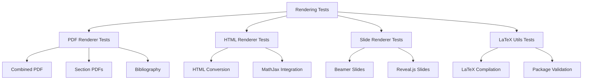

# Rendering Infrastructure Tests - Quick Reference

tests for multi-format output generation.

## Overview

Tests for rendering module including PDF generation, HTML rendering, slide creation, and LaTeX compilation.

## Quick Start

```bash
# Run all rendering tests
uv run pytest tests/infra_tests/rendering/ -v

# Run PDF renderer tests
uv run pytest tests/infra_tests/rendering/test_pdf_renderer*.py -v
```

## Test Modules

### PDF Renderer Tests (`test_pdf_renderer*.py`)

PDF generation and LaTeX compilation:

```bash
uv run pytest tests/infra_tests/rendering/test_pdf_renderer*.py -v
```

**Test Coverage:**
- Combined PDF generation
- Individual section PDFs
- LaTeX compilation
- Bibliography processing
- Figure integration

### HTML / Web Renderer Tests (`test_web_renderer.py`)

HTML output generation:

```bash
uv run pytest tests/infra_tests/rendering/test_web_renderer.py -v
```

**Test Coverage:**
- HTML conversion
- MathJax integration
- Cross-reference handling
- Style application

### Slide Renderer Tests

The slide contract is partitioned across `test_slides_bibliography.py`,
`test_slides_frame_splitting.py`, `test_slides_math_header.py`,
`test_slides_module_contract.py`, `test_slides_render_executions.py`,
`test_slides_tex_figures.py`,
`test_slides_accessibility.py`, `test_slides_accessibility_reveal_regressions.py`,
`test_slides_beamer_accessibility.py`, `test_slides_beamer_safe_area.py`,
`test_slides_crossref.py`, `test_slides_figure_area.py`,
`test_slides_formal_content.py`, and `test_slides_identifier_integrity.py`.

Presentation slide generation:

```bash
uv run pytest \
  tests/infra_tests/rendering/test_slides_bibliography.py \
  tests/infra_tests/rendering/test_slides_frame_splitting.py \
  tests/infra_tests/rendering/test_slides_math_header.py \
  tests/infra_tests/rendering/test_slides_module_contract.py \
  tests/infra_tests/rendering/test_slides_render_executions.py \
  tests/infra_tests/rendering/test_slides_tex_figures.py \
  tests/infra_tests/rendering/test_slides_accessibility.py \
  tests/infra_tests/rendering/test_slides_accessibility_reveal_regressions.py \
  tests/infra_tests/rendering/test_slides_beamer_accessibility.py \
  tests/infra_tests/rendering/test_slides_beamer_safe_area.py \
  tests/infra_tests/rendering/test_slides_crossref.py \
  tests/infra_tests/rendering/test_slides_figure_area.py \
  tests/infra_tests/rendering/test_slides_formal_content.py \
  tests/infra_tests/rendering/test_slides_identifier_integrity.py -v
```

**Test Coverage:**
- Beamer PDF slides
- Reveal.js HTML slides
- Slide structure
- Content formatting
- Archive-profile backwards compatibility
- Semantic block-boundary composition and stable density diagnostics
- 80-word prose, eight-row table, 70% figure-area, and 28/20/16-point contracts
- Reveal.js headings, landmarks, keyboard support, figure alternatives, long descriptions, and manuscript links
- Beamer typography floors and explicit untagged-derivative boundary
- Post-compile Beamer glyph/rule safe areas and the fail-loud `pdfplumber` capability boundary
- Figure max-fit allocation, authored-style rejection, and intrinsic raster geometry
- Raw formal-content parity and contiguous identifier preservation

## Test Categories

### Unit Tests

Individual renderer testing:

```bash
# Test PDF generation
uv run pytest tests/infra_tests/rendering/test_pdf_renderer_combined.py::test_render_combined_pdf -v
```

### Integration Tests

End-to-end rendering workflows:

```bash
# Full rendering pipeline
uv run pytest tests/infra_tests/rendering/test_pdf_renderer_combined.py::test_full_pipeline -v
```

## Common Test Patterns

### PDF Rendering Testing

```python
# test_pdf_renderer_combined.py pattern
def test_render_combined_pdf():
    renderer = PDFRenderer()
    pdf_path = renderer.render_combined_pdf(sections, output_dir)
    assert pdf_path.exists()
```

### LaTeX Testing

```python
# test_latex_utils.py pattern
def test_compile_latex():
    result = compile_latex(tex_path, output_dir)
    assert result["success"]
```

## Running Tests

### All Rendering Tests

```bash
uv run pytest tests/infra_tests/rendering/ -v
```

### Specific Renderers

```bash
# PDF tests only
uv run pytest tests/infra_tests/rendering/test_pdf*.py -v

# HTML tests only
uv run pytest tests/infra_tests/rendering/test_html*.py -v

# Slide tests only
uv run pytest tests/infra_tests/rendering/test_slides*.py -v
```

### With Coverage

```bash
uv run pytest tests/infra_tests/rendering/ \
    --cov=infrastructure.rendering \
    --cov-report=html
```

## Debugging

### Verbose Output

```bash
uv run pytest tests/infra_tests/rendering/ -vv -s
```

### Check LaTeX Output

```bash
# View LaTeX compilation logs
find projects/*/output/pdf output/*/pdf -name "*.log" -print -exec tail -50 {} \;
```

## Architecture


```mermaid
graph TD
    A[Rendering Tests] --> B[PDF Renderer Tests]
    A --> C[HTML Renderer Tests]
    A --> D[Slide Renderer Tests]
    A --> E[LaTeX Utils Tests]

    B --> F[Combined PDF]
    B --> G[Section PDFs]
    B --> H[Bibliography]

    C --> I[HTML Conversion]
    C --> J[MathJax Integration]

    D --> K[Beamer Slides]
    D --> L[Reveal.js Slides]

    E --> M[LaTeX Compilation]
    E --> N[Package Validation]
```

## See Also

- [AGENTS.md](AGENTS.md) - test documentation
- [../../../infrastructure/rendering/README.md](../../../infrastructure/rendering/README.md) - Rendering module overview
- [../../../tests/README.md](../../../tests/README.md) - Test suite overview
