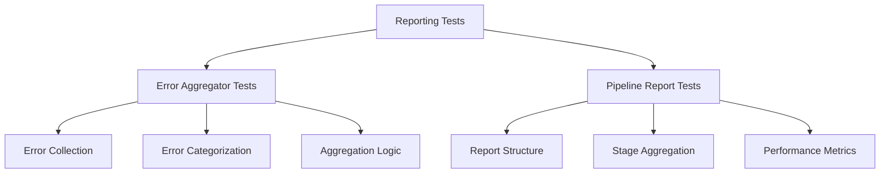

# Reporting Infrastructure Tests - Quick Reference

tests for pipeline reporting and error aggregation.

## Overview

Tests for reporting module including pipeline report generation, error aggregation, performance metrics, and report formatting.

## Quick Start

```bash
# Run all reporting tests
pytest tests/infra_tests/reporting/ -v

# Run specific test module
pytest tests/infra_tests/reporting/test_error_aggregator.py -v
```

## Test Modules

### Error Aggregator Tests (`test_error_aggregator.py`)

Error collection and aggregation:

```bash
pytest tests/infra_tests/reporting/test_error_aggregator.py -v
```

**Test Coverage:**
- Error collection
- Aggregation logic
- Error categorization
- Report generation

### Pipeline Report Tests (`test_pipeline_report.py`)

Pipeline report generation:

```bash
pytest tests/infra_tests/reporting/test_pipeline_report.py -v
```

**Test Coverage:**
- Report structure
- Stage result aggregation
- Performance metrics
- Report formatting

## Test Categories

### Unit Tests

Individual component testing:

```bash
# Test error aggregation
pytest tests/infra_tests/reporting/test_error_aggregator.py::test_aggregate_errors -v
```

### Integration Tests

End-to-end reporting workflows:

```bash
# Full reporting pipeline
pytest tests/infra_tests/reporting/test_pipeline_report.py::test_full_pipeline -v
```

## Common Test Patterns

### Error Aggregation Testing

```python
# test_error_aggregator.py pattern
def test_aggregate_errors():
    aggregator = ErrorAggregator()
    aggregator.add_error("stage1", "Error message")
    errors = aggregator.get_errors()
    assert len(errors) == 1
```

### Report Generation Testing

```python
# test_pipeline_report.py pattern
def test_generate_report():
    report = generate_pipeline_report(
        stage_results=[{"name": "test", "exit_code": 0}],
        total_duration=10.0
    )
    assert report["summary"]["total_stages"] == 1
```

## Running Tests

### All Reporting Tests

```bash
pytest tests/infra_tests/reporting/ -v
```

### With Coverage

```bash
pytest tests/infra_tests/reporting/ \
    --cov=infrastructure.reporting \
    --cov-report=term
```

## Architecture



## See Also

- [AGENTS.md](AGENTS.md) - test documentation
- [../../../infrastructure/reporting/README.md](../../../infrastructure/reporting/README.md) - Reporting module overview
- [../../../tests/README.md](../../../tests/README.md) - Test suite overview