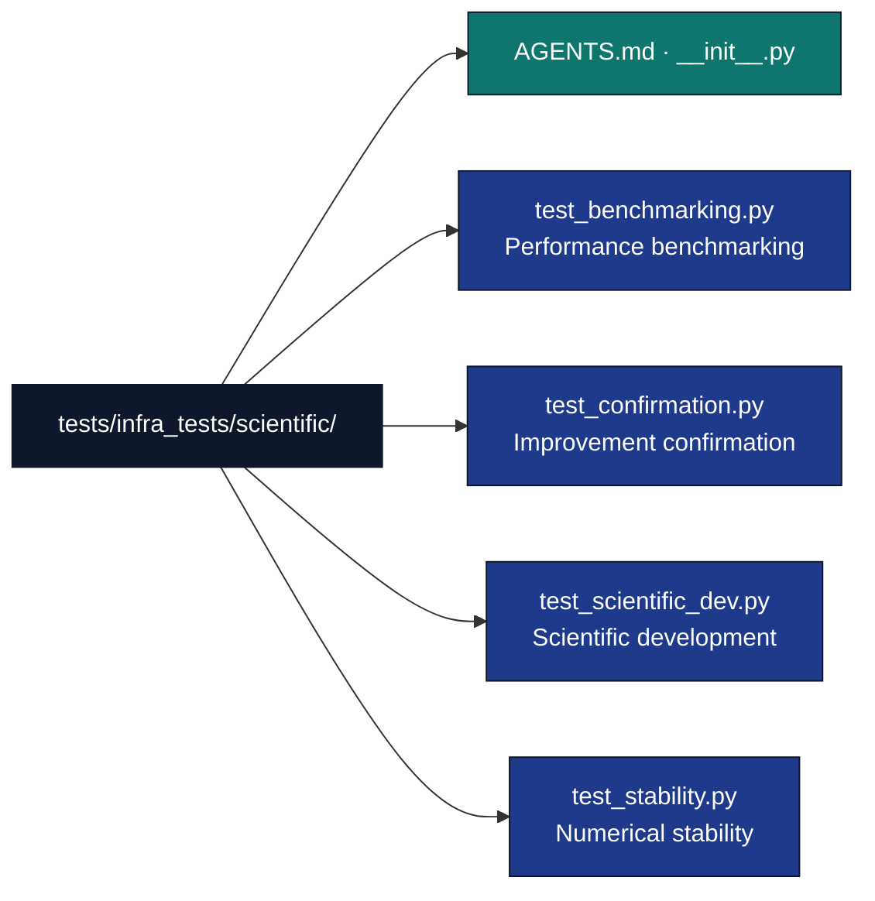

# Scientific Infrastructure Tests

## Overview

The `tests/infra_tests/scientific/` directory contains tests for the scientific computing infrastructure. These tests validate the scientific development tools, benchmarking capabilities, numerical stability, and improvement confirmation that support research workflows.

The scientific module is an **exemplar-support tier** Layer-1 module (see [`../../../infrastructure/scientific/AGENTS.md`](../../../infrastructure/scientific/AGENTS.md)).

## Directory Structure



## Test Categories

### Scientific Development Tests

**Scientific Dev Tests (`test_scientific_dev.py`)**
- Scientific utility function validation
- Research workflow tool testing
- Best practices compliance checking
- Development environment validation

**Key Test Areas:**
```python
def test_scientific_utilities():
    """Test scientific utility functions."""
    from infrastructure.scientific.stability import check_numerical_stability
    from infrastructure.scientific.benchmarking import benchmark_function

    # Test numerical stability checking
    stable_result = check_numerical_stability(lambda x: x**2 + 2*x + 1, [1, 2, 3])
    assert stable_result.stability_score > 0.8

    # Test benchmarking
    result = benchmark_function(lambda x: x**2, [1.0, 2.0, 3.0], iterations=10)
    assert result.execution_time >= 0
```

### Benchmarking Tests

**Benchmarking Tests (`test_benchmarking.py`)**
- Performance measurement accuracy
- Benchmark result validation
- Statistical analysis of performance data
- Comparative benchmarking functionality

**Test Scenarios:**
```python
def test_performance_benchmarking():
    """Test performance benchmarking functionality."""
    from infrastructure.scientific.benchmarking import (
        benchmark_function,
        generate_performance_report,
        format_benchmark_report,
        BenchmarkResult,
    )

    # Benchmark single function
    result = benchmark_function(lambda x: x**2, [1.0, 2.0, 3.0], iterations=100)
    assert isinstance(result, BenchmarkResult)
    assert result.execution_time >= 0
    assert result.iterations == 100

    # Generate performance report from results list
    report = generate_performance_report([result])
    assert 'Performance Analysis Report' in report

    # format_benchmark_report produces the same Markdown output
    formatted = format_benchmark_report([result])
    assert 'Performance Analysis Report' in formatted
```

### Confirmation Tests

**Confirmation Tests (`test_confirmation.py`)**
- Candidate-vs-baseline comparison beyond the noise band
- `Confirmation` dataclass field validation
- Deterministic seed-based evaluation

### Stability Tests

**Stability Tests (`test_stability.py`)**
- Numerical stability analysis validation
- Algorithm robustness testing
- Edge case handling verification
- Convergence testing

**Test Implementation:**
```python
def test_numerical_stability():
    """Test numerical stability analysis."""
    from infrastructure.scientific.stability import (
        check_numerical_stability,
        StabilityTest,
    )

    # Check stability of a well-behaved function
    result = check_numerical_stability(lambda x: x**2, [1.0, 2.0, 3.0], tolerance=1e-10)
    assert isinstance(result, StabilityTest)
    assert result.stability_score >= 0.0
    assert result.stability_score <= 1.0
    assert 'numerical_stability' in result.test_name

    # Check stability of an ill-behaved function (division by near-zero)
    import numpy as np
    unstable = lambda x: 1.0 / (x + 1e-15) if abs(x) < 1e-14 else x
    unstable_result = check_numerical_stability(unstable, [0.0, 1e-15, 1.0])
    assert isinstance(unstable_result, StabilityTest)
```

## Test Design Principles

### Research-Focused Testing

**Real Scientific Data Approach:**
- Tests use realistic scientific datasets and algorithms
- Validation against known research methodologies
- Performance benchmarks based on actual computational requirements
- Edge cases derived from real research scenarios

**Scientific Validation:**
```python
def validate_scientific_algorithm(algorithm, test_cases):
    """scientific validation of algorithms."""

    results = {
        'correctness': [],
        'performance': [],
        'stability': [],
        'scalability': []
    }

    for test_case in test_cases:
        # Test correctness
        result = algorithm(test_case['input'])
        correctness = validate_result(result, test_case['expected'])
        results['correctness'].append(correctness)

        # Test performance
        performance = benchmark_algorithm(algorithm, test_case['input'])
        results['performance'].append(performance)

        # Test stability
        stability = test_numerical_stability(algorithm, test_case['input'])
        results['stability'].append(stability)

        # Test scalability
        scalability = test_scalability(algorithm, test_case['input'])
        results['scalability'].append(scalability)

    # Aggregate results
    summary = {
        'overall_correctness': sum(results['correctness']) / len(results['correctness']),
        'average_performance': statistics.mean(results['performance']),
        'stability_score': min(results['stability']),  # Worst case
        'scalability_rating': assess_scalability(results['scalability'])
    }

    return summary
```

### Test Organization

**Domain-Specific Test Structure:**
- Algorithm-specific test modules
- Methodology validation test suites
- Performance benchmarking test collections
- Documentation quality test categories

**Scientific Test Data Management:**
```python
@pytest.fixture
def scientific_test_data():
    """Provide realistic scientific test datasets."""
    return {
        'tabular_data': load_research_dataset('clinical_trials.csv'),
        'time_series': generate_synthetic_time_series(length=1000, trend=0.1),
        'image_data': load_medical_images('mri_scans/', sample_size=50),
        'genomic_data': load_genomic_sequences('sequences.fasta', n_sequences=100),
        'network_data': generate_social_network(nodes=500, edges=2000),
        'spatial_data': load_geographic_data('environmental_samples.geojson')
    }

@pytest.fixture
def research_algorithms():
    """Provide research algorithms for testing."""
    return {
        'statistical_model': lambda data: run_linear_regression(data),
        'machine_learning': lambda data: train_neural_network(data),
        'optimization': lambda data: genetic_algorithm_optimization(data),
        'simulation': lambda params: monte_carlo_simulation(params),
        'clustering': lambda data: hierarchical_clustering(data),
        'dimensionality_reduction': lambda data: pca_reduction(data, n_components=10)
    }
```

## Test Infrastructure

### Scientific Fixtures

**Research Data Fixtures:**
```python
@pytest.fixture
def synthetic_research_dataset():
    """Generate synthetic research dataset."""
    np.random.seed(42)  # Reproducible

    n_samples, n_features = 1000, 20
    X = np.random.randn(n_samples, n_features)
    # Add some structure
    X[:, 0] = X[:, 1] + X[:, 2] * 0.5 + np.random.randn(n_samples) * 0.1
    y = (X[:, 0] + X[:, 1] > 0).astype(int)

    return pd.DataFrame(X, columns=[f'feature_{i}' for i in range(n_features)]), y

@pytest.fixture
def performance_test_cases():
    """Provide performance benchmarking test cases."""
    return [
        {'name': 'small_dataset', 'size': (100, 10), 'iterations': 100},
        {'name': 'medium_dataset', 'size': (1000, 50), 'iterations': 50},
        {'name': 'large_dataset', 'size': (10000, 100), 'iterations': 10},
        {'name': 'sparse_data', 'size': (5000, 200), 'sparsity': 0.1, 'iterations': 20}
    ]
```

### Validation Helpers

**Scientific Result Validation:**
```python
def validate_scientific_result(result, expected_properties):
    """Validate scientific computation results."""

    # Check result structure
    assert isinstance(result, dict), "Result must be a dictionary"
    assert 'converged' in result, "Must indicate convergence status"
    assert 'metrics' in result, "Must include evaluation metrics"

    # Validate convergence
    if expected_properties.get('should_converge', True):
        assert result['converged'] is True, "Algorithm should have converged"

    # Validate metrics
    metrics = result['metrics']
    for expected_metric in expected_properties.get('required_metrics', []):
        assert expected_metric in metrics, f"Missing required metric: {expected_metric}"

        metric_value = metrics[expected_metric]
        if 'metric_ranges' in expected_properties:
            min_val, max_val = expected_properties['metric_ranges'].get(expected_metric, (-float('inf'), float('inf')))
            assert min_val <= metric_value <= max_val, f"Metric {expected_metric} out of range: {metric_value}"

    # Validate computational properties
    if 'max_runtime' in expected_properties:
        assert result.get('runtime', 0) <= expected_properties['max_runtime'], "Exceeded maximum runtime"

    return True
```

## Running Tests

### Test Execution

```bash
# Run all scientific tests
uv run pytest tests/infra_tests/scientific/

# Run specific scientific domain tests
uv run pytest tests/infra_tests/scientific/test_stability.py

# Run performance benchmarking tests
uv run pytest tests/infra_tests/scientific/test_benchmarking.py

# Run with performance profiling
uv run pytest tests/infra_tests/scientific/ --durations=10
```

### Specialized Test Execution

**Performance-Focused Testing:**
```bash
# Run performance tests only
uv run pytest tests/infra_tests/scientific/ -k "benchmark or performance"

# Run with memory profiling
uv run pytest tests/infra_tests/scientific/ --memray

# Run scalability tests
uv run pytest tests/infra_tests/scientific/ -k "scalability"
```

## Test Coverage and Quality

### Coverage Goals

**Scientific Module Coverage:**
- Scientific development tools: 95%+ coverage
- Benchmarking functionality: 90%+ coverage
- Stability analysis: 95%+ coverage
- Improvement confirmation: 90%+ coverage

### Quality Metrics

**Scientific Accuracy:**
- Algorithms produce mathematically correct results
- Statistical tests validate properly
- Performance benchmarks are reproducible
- Documentation examples execute correctly
- Validation rules match scientific standards

## Common Test Issues

### Numerical Precision Problems

**Floating Point Testing:**
```python
def test_numerical_precision():
    """Test numerical computations with appropriate precision."""

    # Use relative tolerance for floating point comparisons
    result = scientific_algorithm(test_input)
    expected = known_correct_result

    # Use numpy.testing for robust floating point comparison
    np.testing.assert_allclose(result, expected, rtol=1e-10, atol=1e-12)

    # Alternative: check relative error
    relative_error = abs(result - expected) / abs(expected)
    assert relative_error < 1e-10, f"Relative error too high: {relative_error}"
```

### Performance Benchmark Variability

**Stable Benchmarking:**
```python
def stable_performance_test():
    """Run performance tests with statistical stability."""

    # Run multiple times to account for variability
    runtimes = []
    for _ in range(10):  # Multiple runs
        start_time = time.perf_counter()
        result = algorithm(test_data)
        end_time = time.perf_counter()
        runtimes.append(end_time - start_time)

        # Verify correctness each time
        assert validate_result(result)

    # Statistical analysis of runtimes
    mean_runtime = statistics.mean(runtimes)
    std_runtime = statistics.stdev(runtimes)
    cv = std_runtime / mean_runtime  # Coefficient of variation

    # Accept results if low variability
    assert cv < 0.1, f"High runtime variability: CV = {cv}"

    return {
        'mean_runtime': mean_runtime,
        'std_runtime': std_runtime,
        'coefficient_of_variation': cv
    }
```

### Memory and Resource Issues

**Resource-Intensive Testing:**
```python
def test_large_scale_computation():
    """Test large-scale computations with resource management."""

    # Check available resources before testing
    available_memory = psutil.virtual_memory().available
    required_memory = estimate_memory_requirement(large_dataset)

    if available_memory < required_memory * 1.2:  # 20% buffer
        pytest.skip(f"Insufficient memory: {available_memory / 1e9:.1f}GB available, {required_memory / 1e9:.1f}GB required")

    # Run test with resource monitoring
    with memory_monitor() as mem_monitor:
        result = large_scale_algorithm(large_dataset)

    # Verify result correctness
    assert validate_large_result(result)

    # Check resource usage was reasonable
    peak_memory = mem_monitor.get_peak_memory()
    assert peak_memory < required_memory * 1.5  # Allow 50% overhead
```

## Integration with Research Workflow

### End-to-End Scientific Testing

**Research Pipeline Testing:**
```python
def test_research_pipeline():
    """Test research workflow with scientific tools."""

    # 1. Data validation
    data_validation = validate_research_data(raw_dataset)
    assert data_validation['valid']

    # 2. Algorithm selection and benchmarking
    algorithms = [algorithm1, algorithm2, algorithm3]
    benchmark_results = benchmark_algorithms(algorithms, validated_data)

    best_algorithm = select_best_algorithm(benchmark_results)
    assert best_algorithm is not None

    # 3. Stability analysis
    stability_report = analyze_stability(best_algorithm, validated_data)
    assert stability_report['stable']

    # 4. Documentation generation
    docs = generate_api_docs(best_algorithm)
    assert len(docs) > 0

    # 5. Result validation
    final_result = best_algorithm(validated_data)
    result_validation = validate_scientific_result(final_result, research_requirements)
    assert result_validation['valid']

    # 6. Reproducibility check
    reproducibility = verify_reproducibility(best_algorithm, validated_data, random_seed=42)
    assert reproducibility['reproducible']
```

## Future Test Enhancements

### Advanced Scientific Testing

**Planned Improvements:**
- **Statistical Power Analysis**: Test suite statistical validation
- **Algorithm Convergence Testing**: Advanced convergence analysis
- **Cross-Platform Scientific Testing**: Numerical consistency across platforms
- **GPU Acceleration Testing**: CUDA/OpenCL scientific computing validation

**Research Integration:**
- **Dataset Integration**: Tests with anonymized research datasets
- **Peer Review Simulation**: Automated scientific review process testing
- **Publication Readiness Validation**: Pre-publication checklist testing

## Troubleshooting

### Scientific Test Debugging

**Numerical Debugging:**
```python
def debug_numerical_issues():
    """Debug numerical computation issues."""

    # Test with simple inputs first
    simple_result = algorithm(simple_input)
    print(f"Simple input result: {simple_result}")

    # Gradually increase complexity
    for complexity_level in [1, 2, 3, 4, 5]:
        test_input = generate_complexity_level(complexity_level)
        try:
            result = algorithm(test_input)
            print(f"Complexity {complexity_level}: SUCCESS - {result}")
        except Exception as e:
            print(f"Complexity {complexity_level}: FAILED - {e}")
            break

    # Check numerical properties
    check_numerical_properties(algorithm, test_input)
```

**Performance Debugging:**
```bash
# Profile scientific computations
uv run python -c "
import cProfile
from tests.infrastructure.scientific.test_benchmarking import benchmark_function

cProfile.run('benchmark_function(target_algorithm, test_data)', 'scientific_profile.prof')

# Analyze profile
import pstats
stats = pstats.Stats('scientific_profile.prof')
stats.sort_stats('cumulative').print_stats(20)
"
```

### Environment Validation

**Scientific Dependencies Check:**
```bash
# Validate scientific computing environment
uv run python -c "
import sys
print(f'Python: {sys.version}')

# Core scientific libraries
libs = ['numpy', 'scipy', 'pandas', 'scikit-learn', 'matplotlib']
for lib in libs:
    try:
        __import__(lib)
        print(f'{lib}: ✓')
    except ImportError:
        print(f'{lib}: ✗')

# Check BLAS/LAPACK
try:
    import numpy as np
    print(f'BLAS/LAPACK: {\"✓\" if np.__config__.blas_opt_info else \"✗\"}')
except:
    print('BLAS/LAPACK: Unable to check')
"
```

## See Also

**Related Documentation:**
- [`../../../infrastructure/scientific/AGENTS.md`](../../../infrastructure/scientific/AGENTS.md) - Scientific module details
- [`../AGENTS.md`](../AGENTS.md) - Infrastructure test suite overview
- [`../../../AGENTS.md`](../../../AGENTS.md) - System documentation

**Testing Standards:**
- [`docs/rules/testing_standards.md`](../../../docs/rules/testing_standards.md) - Testing standards
- [`docs/development/testing/testing-guide.md`](../../../docs/development/testing/testing-guide.md) - Testing guide
