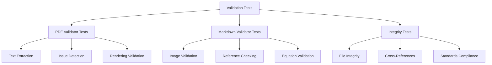

# Validation Infrastructure Tests - Quick Reference

tests for quality assurance and validation systems.

## Overview

Tests for validation module including PDF validation, markdown validation, integrity checking, and link validation.

## Quick Start

```bash
# Run all validation tests
pytest tests/infra_tests/validation/ -v

# Run PDF validator tests
pytest tests/infra_tests/validation/test_pdf_validator.py -v
```

## Test Modules

### PDF Validator Tests (`test_pdf_validator.py`)

PDF quality validation:

```bash
pytest tests/infra_tests/validation/test_pdf_validator.py -v
```

**Test Coverage:**
- Text extraction
- Issue detection
- Rendering validation
- Reference checking

### Markdown Validator Tests (`test_markdown_validator.py`)

Markdown structure validation:

```bash
pytest tests/infra_tests/validation/test_markdown_validator.py -v
```

**Test Coverage:**
- Image reference validation
- Cross-reference checking
- Equation validation
- Link verification

### Integrity Tests (`test_integrity.py`)

File integrity and consistency:

```bash
pytest tests/infra_tests/validation/test_integrity.py -v
```

**Test Coverage:**
- File hash verification
- Cross-reference integrity
- Data consistency
- Academic standards compliance

## Test Categories

### Unit Tests

Individual validator testing:

```bash
# Test PDF validation
pytest tests/infra_tests/validation/test_pdf_validator.py::test_validate_pdf -v
```

### Integration Tests

End-to-end validation workflows:

```bash
# Full validation pipeline
pytest tests/infra_tests/validation/test_integrity.py::test_full_integrity_check -v
```

## Common Test Patterns

### PDF Validation Testing

```python
# test_pdf_validator.py pattern
def test_validate_pdf():
    report = validate_pdf_rendering(pdf_path)
    assert report["summary"]["has_issues"] == False
```

### Markdown Validation Testing

```python
# test_markdown_validator.py pattern
def test_validate_markdown():
    problems, exit_code = validate_markdown(markdown_dir, repo_root)
    assert exit_code == 0
```

## Running Tests

### All Validation Tests

```bash
pytest tests/infra_tests/validation/ -v
```

### Specific Validators

```bash
# PDF tests only
pytest tests/infra_tests/validation/test_pdf*.py -v

# Markdown tests only
pytest tests/infra_tests/validation/test_markdown*.py -v

# Integrity tests only
pytest tests/infra_tests/validation/test_integrity.py -v
```

### With Coverage

```bash
pytest tests/infra_tests/validation/ \
    --cov=infrastructure.validation \
    --cov-report=term
```

## Architecture



## See Also

- [AGENTS.md](AGENTS.md) - test documentation
- [../../../infrastructure/validation/README.md](../../../infrastructure/validation/README.md) - Validation module overview
- [../../../tests/README.md](../../../tests/README.md) - Test suite overview