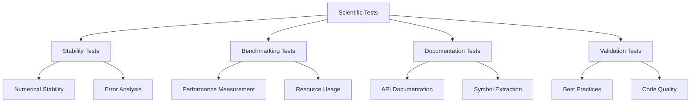

# Scientific Infrastructure Tests - Quick Reference

Comprehensive tests for scientific computing utilities.

## Overview

Tests for scientific module including numerical stability checking, performance benchmarking, documentation generation, and best practices validation.

## Quick Start

```bash
# Run all scientific tests
pytest tests/infrastructure/scientific/ -v

# Run specific test module
pytest tests/infrastructure/scientific/test_scientific_dev.py -v
```

## Test Modules

### Scientific Development Tests (`test_scientific_dev.py`)

Scientific computing utilities:

```bash
pytest tests/infrastructure/scientific/test_scientific_dev.py -v
```

**Test Coverage:**
- Numerical stability checking
- Performance benchmarking
- API documentation generation
- Best practices validation

## Test Categories

### Unit Tests

Individual function testing:

```bash
# Test stability checking
pytest tests/infrastructure/scientific/test_scientific_dev.py::test_check_stability -v
```

### Integration Tests

End-to-end scientific workflows:

```bash
# Full benchmarking workflow
pytest tests/infrastructure/scientific/test_scientific_dev.py::test_benchmark_function -v
```

## Common Test Patterns

### Stability Testing

```python
# test_scientific_dev.py pattern
def test_check_stability():
    stability = check_numerical_stability(function, test_inputs)
    assert stability["is_stable"]
```

### Benchmarking Testing

```python
# test_scientific_dev.py pattern
def test_benchmark_function():
    benchmark = benchmark_function(function, inputs)
    assert benchmark["execution_time"] > 0
```

## Running Tests

### All Scientific Tests

```bash
pytest tests/infrastructure/scientific/ -v
```

### With Coverage

```bash
pytest tests/infrastructure/scientific/ \
    --cov=infrastructure.scientific \
    --cov-report=term
```

## Architecture



## See Also

- [AGENTS.md](AGENTS.md) - Complete test documentation
- [../../infrastructure/scientific/README.md](../../infrastructure/scientific/README.md) - Scientific module overview
- [../../../tests/README.md](../../../tests/README.md) - Test suite overview